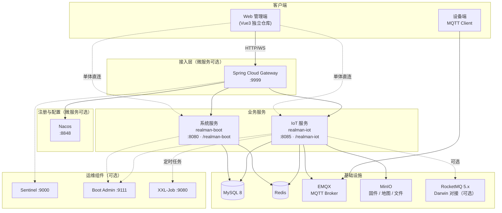

# Realman Boot

睿尔曼智能后端工程，基于 **[Jeecg Boot 3.x](https://help.jeecg.com)** 定制扩展。在保留企业级系统管理（用户、组织、权限、租户、字典等）能力的同时，提供 **IoT 设备接入与管理**（MQTT / EMQX、遥操、OTA、SLAM、工单、远程数采、WebRTC 等），支持 **单体双进程** 与 **Spring Cloud + Nacos 微服务** 两种部署形态。

| 项目 | 说明 |
|------|------|
| 版本 | **3.9.1**（`realman-boot-parent`） |
| JDK | **21**（亦支持 17 / 24，以 CI 为准） |
| 建设单位 | 睿尔曼智能科技（北京）有限公司 |
| 官网 | [https://www.realman-robotics.cn](https://www.realman-robotics.cn) |

[](https://www.apache.org/licenses/LICENSE-2.0)
[](https://spring.io/projects/spring-boot)
[](https://openjdk.org/)

---

## 目录

- [架构概览](#架构概览)
- [技术选型](#技术选型)
- [服务与模块划分](#服务与模块划分)
- [功能说明](#功能说明)
- [仓库结构](#仓库结构)
- [环境要求](#环境要求)
- [本地构建与启动](#本地构建与启动)
- [相关文档](#相关文档)

---

## 架构概览

### 设计目标

- **分层清晰**：API / Biz / Start 分层，业务与接入解耦，便于独立演进。
- **可拆分部署**：系统服务与 IoT 服务可独立进程；按需接入 Nacos 做注册发现与配置中心。
- **安全可控**：Web 端 Shiro + JWT；设备侧 EMQX HTTP Auth/ACL + 设备密钥 + 报文 AES 加密。
- **在线态可靠**：MQTT 连接以 EMQX `$SYS` 为权威，Redis 保活与启动对账辅助恢复（见 IoT 文档）。

### 逻辑架构



### 部署形态

| 形态 | 说明 | 典型进程 |
|------|------|----------|
| **单体（推荐）** | 系统 + IoT 两个 Spring Boot 进程，共享 MySQL / Redis；MQTT 可按 `mqtt.enabled` 开关 | `RealmanSystemApplication`（8080）、`RealmanDeviceApplication`（8085） |
| **微服务** | `jeecg-server-cloud` 目录单独构建：Nacos、Gateway、系统云启动包等；IoT 注册为 `realman-iot` | Nacos、Gateway、`JeecgSystemCloudApplication`、可选 `realman-boot-iot-start` |

> 微服务拓扑、默认端口与 Nacos 服务名对照见 [docs/realman-boot-microservices-architecture.md](docs/realman-boot-microservices-architecture.md)。

### IoT 消息流（简图）

```
设备端 ──MQTT──► EMQX ──订阅──► MqttConfig
                              └──► MqttMessageDispatcher ──► 各 Topic Handler
平台端 ──REST──► Controller ──► Service ──► MqttPublisher ──► EMQX ──► 设备端

连接鉴权：EMQX HTTP Auth/ACL ──POST──► MqttAuthController（/internal/mqtt/*）
业务报文：Per-Device AES-256-CBC（密钥由 deviceSecret 派生）
```

---

## 技术选型

以根目录 `pom.xml` 的 `properties` 为准，核心如下：

| 分类 | 技术 | 版本 / 说明 |
|------|------|-------------|
| 基础框架 | Spring Boot | 3.5.5 |
| 语言 | Java | 21 |
| 微服务 | Spring Cloud | 2025.0.0 |
| 微服务 | Spring Cloud Alibaba | 2023.0.3.3 |
| 注册 / 配置 | Nacos | 2.x（`jeecg-cloud-nacos`） |
| 网关 | Spring Cloud Gateway | `jeecg-cloud-gateway` |
| 限流 | Sentinel | 控制台 `jeecg-cloud-sentinel` |
| Web | Spring MVC、WebSocket | IoT 设备实时推送 |
| 安全 | Apache Shiro、java-jwt | 与 Jeecg 体系一致 |
| 持久层 | MyBatis-Plus、Druid、动态数据源 | 支持多库、国产库驱动 |
| 数据库 | MySQL | 8.0（主库） |
| 缓存 | Redis、shiro-redis | 会话、锁、设备在线态 |
| IoT 消息 | Eclipse Paho MQTT 5 | 对接 EMQX 5.x |
| 消息队列 | RocketMQ Spring | 2.3.1（Darwin / 远程数采，可开关） |
| 对象存储 | MinIO / 本地 | OTA 固件、SLAM 地图等 |
| 定时任务 | XXL-Job、内置 Quartz | IoT 侧设备调度任务 |
| API 文档 | Knife4j / SpringDoc | `/doc.html` |
| 链路追踪 | Micrometer Tracing + Zipkin | B3 传播；可选 Loki 日志 |
| 工具库 | Hutool、Fastjson2 | 通用工具 |

**前端**：管理端一般为独立仓库 **Vue3**（如 `realman-boot-vue3`），本仓库以 Java 后端为主。

---

## 服务与模块划分

### Maven 顶层模块（`pom.xml` `<modules>`）

```
realman-boot-parent (3.9.1)
├── realman-boot-base-core      # 公共核心：安全、MyBatis、Redis、统一响应、租户插件等
├── realman-boot-system       # 系统管理
│   ├── realman-system-api      # 接口契约（local-api / cloud-api）
│   ├── realman-system-biz      # 用户、组织、权限、租户、字典、日志、消息等
│   └── realman-system-start    # 单体入口：RealmanSystemApplication
└── realman-boot-iot            # IoT 设备管理
    ├── realman-boot-iot-api    # REST Controller、DTO/VO（HTTP 接入层）
    ├── realman-boot-iot-biz    # 领域实现：MQTT、OTA、工单、遥操、数采等
    └── realman-boot-iot-start  # 独立进程：RealmanDeviceApplication
```

### 微服务目录（独立构建，未纳入父 POM modules）

```
jeecg-server-cloud/
├── jeecg-cloud-gateway         # API 网关 :9999
├── jeecg-cloud-nacos           # 注册 / 配置中心 :8848
├── jeecg-system-cloud-start    # 系统微服务 :7001（注册名 jeecg-system）
└── jeecg-visual/
    ├── jeecg-cloud-sentinel    # 流控控制台 :9000
    ├── jeecg-cloud-monitor     # Spring Boot Admin :9111
    └── jeecg-cloud-xxljob      # XXL-Job 管理端 :9080
```

### 运行时服务对照

| 服务 | `spring.application.name` | 默认端口 | Context Path | 启动类 |
|------|---------------------------|----------|--------------|--------|
| 系统（单体） | `realman-boot` | 8080 | `/realman-boot`（dev） | `org.jeecg.RealmanSystemApplication` |
| IoT | `realman-iot` | 8085 | `/realman-iot` | `org.jeecg.modules.device.RealmanDeviceApplication` |
| 系统（微服务） | `jeecg-system` | 7001 | 见 Nacos 配置 | `org.jeecg.JeecgSystemCloudApplication` |
| 网关 | `jeecg-gateway` 等 | 9999 | — | `org.jeecg.JeecgGatewayApplication` |

> 生产 / Docker 等 profile 下 `context-path` 可能为 `/jeecg-boot`，以对应 `application-*.yml` 为准。

### 分层职责（简要）

| 模块 | 接入层 | 业务层 | 数据 / 中间件 |
|------|--------|--------|----------------|
| **base-core** | 过滤器、全局异常 | 通用 Service、工具 | MyBatis 配置、Redis、多租户 |
| **system** | 登录、用户、部门、权限 Controller | `modules.system.service` | MySQL、Redis、文件存储 |
| **iot-api** | 设备、OTA、工单、鉴权回调等 REST | 薄门面 / ApiServiceImpl | — |
| **iot-biz** | — | 设备生命周期、遥操、工单、数采 | MQTT Handler、Mapper、Redis、MinIO、RocketMQ |

IoT 模块分层说明与演进计划见 [realman-boot-iot/docs/IOT-MODULE-LAYERING.md](realman-boot-iot/docs/IOT-MODULE-LAYERING.md)。

---

## 功能说明

### 系统服务（realman-boot-system）

基于 Jeecg 平台能力，面向所有业务提供基础支撑：

- **身份与权限**：用户、角色、菜单、按钮权限、数据权限、在线用户。
- **组织与租户**：部门、岗位、多租户隔离（`MybatisPlusSaasConfig`）。
- **平台能力**：数据字典、系统公告、操作日志 / 数据日志、消息通知、定时任务、文件上传（本地 / MinIO / OSS 等可配置）。
- **运维支持**：Flyway 数据库升级、Actuator、可选 Nacos 服务发现。

### IoT 服务（realman-boot-iot）

面向机器人与主控设备的端到端管理，主要能力包括：

| 领域 | 能力摘要 |
|------|----------|
| **设备管理** | 机器人 / 主控设备 CRUD、状态（在线 / 离线 / 禁用 / 遥操中）、密钥重置、参数配置同步、远程重启、监控与 WebSocket 推送 |
| **设备授权** | 主控与机器人配套授权、生效 / 失效时间、租户 / 用户维度数据权限 |
| **MQTT 接入** | EMQX HTTP Auth/ACL；上行状态、配置 ACK、指令 ACK、OTA 进度、操作日志、主控 / 从机原始 Topic；下行配置、指令、OTA、遥操分配等 |
| **遥操** | 主控登录解析、遥操开始 / 结束、WebRTC 房间与信令、同步等待 ACK、指令下发审计（`iot_device_command_record`） |
| **OTA** | 固件分片上传、合并发布、升级任务创建与执行、进度上报 |
| **SLAM / 导航** | 建图、定位、导航相关 MQTT 指令与 REST 封装（见专题文档） |
| **工单** | 工单生命周期、合规校验、与 Darwin 平台同步（RocketMQ） |
| **远程数采** | 采集指令、文件地址上报、OSS 授权请求转发等（RocketMQ 链路，可配置关闭） |
| **安全** | 设备连接密码校验、Payload AES 加解密、内部 MQTT 回调接口 |
| **调度** | XXL-Job：指令 ACK 超时、设备状态清理、工单调度等 |

需求与接口细节见 [realman-boot-iot/docs/IOT-REQUIREMENTS.md](realman-boot-iot/docs/IOT-REQUIREMENTS.md)、[realman-boot-iot/docs/API接口文档-设备管理.md](realman-boot-iot/docs/API接口文档-设备管理.md)。

---

## 仓库结构

```
realman-boot/
├── realman-boot-base-core/       # 公共核心
├── realman-boot-system/       # 系统管理（api / biz / start）
├── realman-boot-iot/             # IoT（api / biz / start / sql / docs）
├── jeecg-server-cloud/          # 微服务组件（独立 Maven 工程）
├── db/                          # Nacos、XXL-Job 等初始化 SQL
├── docs/                        # 架构、部署、设计文档
├── docker-compose.yml           # 中间件 Compose（MySQL、Redis、Nacos、EMQX、MinIO 等）
└── pom.xml                      # 父 POM，统一依赖版本
```

---

## 环境要求

| 依赖 | 说明 |
|------|------|
| JDK | 21（推荐与 CI 一致） |
| Maven | 3.8+ |
| MySQL | 8.0+ |
| Redis | 6+ |
| EMQX | 5.x（IoT 启用 MQTT 时必需，需配置 HTTP Auth/ACL） |
| MinIO | OTA / 地图等对象存储（可按配置使用本地存储） |
| Nacos | 微服务模式或 IoT 远程配置时使用 |
| RocketMQ | 与 Darwin / 数采对接时按需启用 |
| XXL-Job | IoT 定时任务调度（可选，见 Compose 示例） |

本地中间件可参考根目录 [docker-compose.yml](docker-compose.yml) 启动 MySQL、Redis、Nacos、EMQX、MinIO、XXL-Job 等（应用服务镜像需自行构建后取消注释）。

---

## 本地构建与启动

### 全量编译

```bash
mvn clean package -DskipTests
```

执行测试：

```bash
mvn test -DskipTests=false
```

### 仅构建单体系统服务

```bash
mvn clean package -pl realman-boot-system/realman-system-start -am -DskipTests
```

### 仅构建 IoT 服务

```bash
mvn clean package -pl realman-boot-iot/realman-boot-iot-start -am -DskipTests
```

### 启动示例（开发 profile）

```bash
# 系统服务（默认 dev，端口 8080，context-path /realman-boot）
java -jar realman-boot-system/realman-system-start/target/realman-system-start-3.9.1.jar

# IoT 服务（端口 8085，context-path /realman-iot）
# 需配置 MySQL、Redis、MQTT、DEVICE_ENCRYPT_MASTER_KEY 等，见 application-dev.yml
java -DDEVICE_ENCRYPT_MASTER_KEY=<32字节主密钥> \
     -jar realman-boot-iot/realman-boot-iot-start/target/realman-boot-iot-start-3.9.1.jar
```

### IoT 数据库初始化

```bash
mysql -u root -p < realman-boot-iot/sql/iot_init.sql
```

### 访问地址（开发环境示例）

| 服务 | 地址 |
|------|------|
| 系统 API 文档 | http://localhost:8080/realman-boot/doc.html |
| IoT API 文档 | http://localhost:8085/realman-iot/doc.html |
| IoT 设备 WebSocket | `ws://localhost:8085/realman-iot/ws/device/{deviceCode}` |
| EMQX Dashboard | http://localhost:18083（默认 admin / public） |

### 默认账号（仅开发）

常见管理账号为 `admin` / `123456`，**生产环境必须修改**。

### 微服务构建（可选）

```bash
cd jeecg-server-cloud
mvn clean package -DskipTests
# 按运维顺序启动：Nacos → Gateway → System Cloud → IoT（注册 realman-iot）
```

---

## 相关文档

| 文档 | 内容 |
|------|------|
| [docs/软件架构设计.md](docs/软件架构设计.md) | 软件架构、分层、安全与数据设计 |
| [docs/realman-boot-microservices-architecture.md](docs/realman-boot-microservices-architecture.md) | 微服务拓扑与端口 |
| [docs/deploy/realman-boot-aliyun-deploy.md](docs/deploy/realman-boot-aliyun-deploy.md) | 阿里云 ECS + Docker Compose 部署 |
| [docs/design/rocketmq-usage-guide.md](docs/design/rocketmq-usage-guide.md) | RocketMQ 使用与版本对齐 |
| [docs/远程数采功能设计方案及规划.md](docs/远程数采功能设计方案及规划.md) | 远程数采方案 |
| [realman-boot-iot/README.md](realman-boot-iot/README.md) | IoT 快速启动、EMQX 鉴权配置 |
| [realman-boot-iot/docs/IOT-REQUIREMENTS.md](realman-boot-iot/docs/IOT-REQUIREMENTS.md) | IoT 需求与实现对照 |
| [realman-boot-iot/docs/IOT-DEVICE-ONLINE-STATE.md](realman-boot-iot/docs/IOT-DEVICE-ONLINE-STATE.md) | 设备在线态设计 |
| [realman-boot-iot/docs/建图-定位-导航流程上下行topic交互文档.md](realman-boot-iot/docs/建图-定位-导航流程上下行topic交互文档.md) | SLAM 相关 MQTT Topic |
| [Jeecg 官方文档](https://help.jeecg.com) | 代码生成、平台通用能力 |

---

## 许可证

本项目基于 [Apache License 2.0](https://www.apache.org/licenses/LICENSE-2.0) 发布。Jeecg 相关组件遵循其原有开源协议，使用前请阅读各模块 LICENSE 说明。
