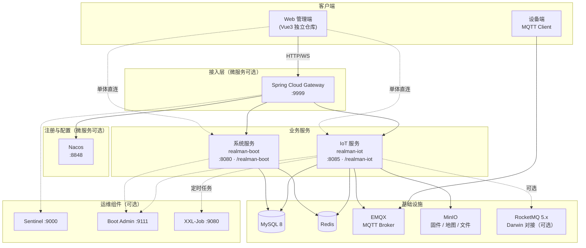
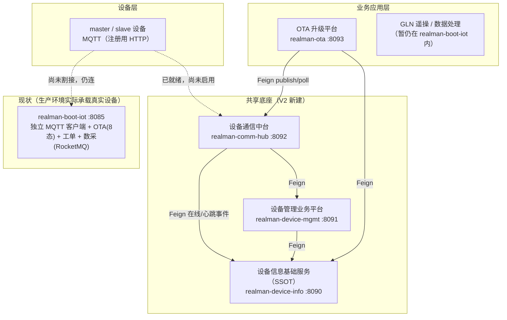

# Realman Boot

睿尔曼智能后端工程，基于 **[Jeecg Boot 3.x](https://help.jeecg.com)** 定制扩展。在保留企业级系统管理（用户、组织、权限、租户、字典等）能力的同时，提供 **IoT 设备接入与管理**（MQTT / EMQX、遥操、OTA、SLAM、工单、远程数采、WebRTC 等），支持 **单体双进程** 与 **Spring Cloud + Nacos 微服务** 两种部署形态。

> **架构升级中（V2）**：仓库正在从 `realman-boot-iot` 单体逐步拆分为**设备信息基础服务 / 设备管理业务平台 / 设备通信中台 / OTA 升级平台**四个独立服务（见下方[《平台架构升级（V2）》](#平台架构升级v2)）。`realman-boot-iot` 目前仍是**生产环境实际承载真实设备连接的模块**，新四个服务已完整实现但尚未完成生产割接，两套系统当前并行存在，迁移状态见该章节。

| 项目 | 说明 |
|------|------|
| 版本 | **1.0.0**（`realman-boot-parent`，Maven `groupId`: `org.realmanframework.boot`） |
| Jeecg 基线 | **3.9.1**（固定，见 `jeecg-boot.version`） |
| JDK | **21**（亦支持 17 / 24，以 CI 为准） |
| 建设单位 | 睿尔曼智能科技（北京）有限公司 |
| 官网 | [https://www.realman-robotics.cn](https://www.realman-robotics.cn) |

[](https://www.apache.org/licenses/LICENSE-2.0)
[](https://spring.io/projects/spring-boot)
[](https://openjdk.org/)

---

## 目录

- [架构概览](#架构概览)
- [技术选型](#技术选型)
- [服务与模块划分](#服务与模块划分)
- [功能说明](#功能说明)
- [平台架构升级（V2）](#平台架构升级v2)
- [仓库结构](#仓库结构)
- [环境要求](#环境要求)
- [本地构建与启动](#本地构建与启动)
- [相关文档](#相关文档)

---

## 架构概览

### 设计目标

- **分层清晰**：API / Biz / Start 分层，业务与接入解耦，便于独立演进。
- **可拆分部署**：系统服务与 IoT 服务可独立进程；按需接入 Nacos 做注册发现与配置中心。
- **安全可控**：Web 端 Shiro + JWT；设备侧 EMQX HTTP Auth/ACL + 设备密钥 + 报文 AES 加密。
- **在线态可靠**：MQTT 连接以 EMQX `$SYS` 为权威，Redis 保活与启动对账辅助恢复（见 IoT 文档）。

### 逻辑架构



### 部署形态

| 形态 | 说明 | 典型进程 |
|------|------|----------|
| **单体（推荐）** | 系统 + IoT 两个 Spring Boot 进程，共享 MySQL / Redis；MQTT 可按 `mqtt.enabled` 开关 | `RealmanSystemApplication`（8080）、`RealmanDeviceApplication`（8085） |
| **微服务** | `realman-server-cloud` 目录单独构建：Nacos、Gateway、系统云启动包等；IoT 注册为 `realman-iot` | Nacos、Gateway、`RealmanSystemCloudApplication`、可选 `realman-boot-iot-start` |

> 微服务拓扑、默认端口与 Nacos 服务名对照见 [docs/realman-boot-microservices-architecture.md](docs/realman-boot-microservices-architecture.md)。

### IoT 消息流（简图）

```
设备端 ──MQTT──► EMQX ──订阅──► MqttConfig
                              └──► MqttMessageDispatcher ──► 各 Topic Handler
平台端 ──REST──► Controller ──► Service ──► MqttPublisher ──► EMQX ──► 设备端

连接鉴权：EMQX HTTP Auth/ACL ──POST──► MqttAuthController（/internal/mqtt/*）
业务报文：Per-Device AES-256-CBC（密钥由 SHA256(deviceCode) 派生，见 `CommandEncryptService`）
```

---

## 技术选型

以根目录 `pom.xml` 的 `properties` 为准，核心如下：

| 分类 | 技术 | 版本 / 说明 |
|------|------|-------------|
| 基础框架 | Spring Boot | 3.5.5 |
| 语言 | Java | 21 |
| 微服务 | Spring Cloud | 2025.0.0 |
| 微服务 | Spring Cloud Alibaba | 2023.0.3.3 |
| 注册 / 配置 | Nacos | 2.x（`realman-cloud-nacos`） |
| 网关 | Spring Cloud Gateway | `realman-cloud-gateway` |
| 限流 | Sentinel | 控制台 `realman-cloud-sentinel` |
| Web | Spring MVC、WebSocket | IoT 设备实时推送 |
| 安全 | Apache Shiro、java-jwt | 与 Jeecg 体系一致 |
| 持久层 | MyBatis-Plus、Druid、动态数据源 | 支持多库、国产库驱动 |
| 数据库 | MySQL | 8.0（主库） |
| 缓存 | Redis、shiro-redis | 会话、锁、设备在线态 |
| IoT 消息 | Eclipse Paho MQTT 5 | 对接 EMQX 5.x |
| 消息队列 | RocketMQ Spring | 2.3.1（Darwin / 远程数采，可开关） |
| 对象存储 | MinIO / 本地 | OTA 固件、SLAM 地图等 |
| 定时任务 | XXL-Job、内置 Quartz | IoT 侧设备调度任务 |
| API 文档 | Knife4j / SpringDoc | `/doc.html` |
| 链路追踪 | Micrometer Tracing + Zipkin | B3 传播；可选 Loki 日志 |
| 工具库 | Hutool、Fastjson2 | 通用工具 |

**前端**：管理端一般为独立仓库 **Vue3**（如 `realman-boot-vue3`），本仓库以 Java 后端为主。

---

## 服务与模块划分

### Maven 顶层模块（`pom.xml` `<modules>`）

```
realman-boot-parent (1.0.0，基线 JeecgBoot 3.9.1)
├── realman-boot-base-core      # 公共核心：安全、MyBatis、Redis、统一响应、租户插件等
├── realman-boot-system       # 系统管理
│   ├── realman-system-api      # 接口契约（local-api / cloud-api）
│   ├── realman-system-biz      # 用户、组织、权限、租户、字典、日志、消息等
│   └── realman-system-start    # 单体入口：RealmanSystemApplication
├── realman-boot-iot            # IoT 设备管理（现状单体，生产环境实际承载真实设备）
│   ├── realman-boot-iot-api    # REST Controller、DTO/VO（HTTP 接入层）
│   ├── realman-boot-iot-biz    # 领域实现：MQTT、OTA、工单、遥操、数采等
│   └── realman-boot-iot-start  # 独立进程：RealmanDeviceApplication
│
│   # 以下四个模块是 V2 架构升级新建服务，详见「平台架构升级（V2）」章节
├── realman-boot-device-info    # 设备基座 · 设备信息基础服务（SSOT，只读为主）
│   ├── realman-boot-device-info-contract  # DTO / Feign 契约（供其余服务依赖）
│   ├── realman-boot-device-info-api       # REST Controller
│   ├── realman-boot-device-info-biz       # 领域实现
│   └── realman-boot-device-info-start     # 独立进程：RealmanDeviceInfoApplication
├── realman-boot-device-mgmt    # 设备管理业务平台（注册/Token/租户授权/四态/审计）
│   ├── realman-boot-device-mgmt-contract
│   ├── realman-boot-device-mgmt-api
│   ├── realman-boot-device-mgmt-biz
│   └── realman-boot-device-mgmt-start     # 独立进程：RealmanDeviceMgmtApplication
├── realman-boot-comm-hub       # 设备通信中台（独立 MQTT 客户端 + HTTP-MQTT 桥接 + Webhook）
│   ├── realman-boot-comm-hub-contract
│   ├── realman-boot-comm-hub-api
│   ├── realman-boot-comm-hub-biz
│   └── realman-boot-comm-hub-start        # 独立进程：RealmanCommHubApplication
└── realman-boot-ota            # OTA 升级平台（对齐《达尔文设备升级平台 PRD V1.0.0》）
    ├── realman-boot-ota-contract
    ├── realman-boot-ota-api
    ├── realman-boot-ota-biz
    └── realman-boot-ota-start             # 独立进程：RealmanOtaApplication
```

### 微服务目录（独立构建，未纳入父 POM modules）

```
realman-server-cloud/
├── realman-cloud-gateway         # API 网关 :9999
├── realman-cloud-nacos           # 注册 / 配置中心 :8848
├── realman-system-cloud-start    # 系统微服务 :7001（注册名 jeecg-system）
└── realman-visual/
    ├── realman-cloud-sentinel    # 流控控制台 :9000
    ├── realman-cloud-monitor     # Spring Boot Admin :9111
    └── realman-cloud-xxljob      # XXL-Job 管理端 :9080
```

### 运行时服务对照

| 服务 | `spring.application.name` | 默认端口 | Context Path | 启动类 |
|------|---------------------------|----------|--------------|--------|
| 系统（单体） | `realman-boot` | 8080 | `/realman-boot`（dev） | `org.jeecg.RealmanSystemApplication` |
| IoT（现状，生产实际承载设备） | `realman-iot` | 8085 | `/realman-iot` | `org.jeecg.modules.device.RealmanDeviceApplication` |
| 系统（微服务） | `jeecg-system` | 7001 | 见 Nacos 配置 | `org.jeecg.RealmanSystemCloudApplication` |
| 网关 | `jeecg-gateway` 等 | 9999 | — | `org.jeecg.RealmanGatewayApplication` |
| 设备信息基础服务（V2） | `realman-device-info` | 8090 | `/realman-device-info` | `org.jeecg.modules.deviceinfo.RealmanDeviceInfoApplication` |
| 设备管理业务平台（V2） | `realman-device-mgmt` | 8091 | `/realman-device-mgmt` | `org.jeecg.modules.devicemgmt.RealmanDeviceMgmtApplication` |
| 设备通信中台（V2） | `realman-comm-hub` | 8092 | `/realman-comm-hub` | `org.jeecg.modules.commhub.RealmanCommHubApplication` |
| OTA 升级平台（V2） | `realman-ota` | 8093 | `/realman-ota` | `org.jeecg.modules.ota.RealmanOtaApplication` |

> 生产 / Docker 等 profile 下 `context-path` 可能为 `/jeecg-boot`，以对应 `application-*.yml` 为准。V2 四个服务均依赖 Nacos 注册发现，经 Gateway 的 `spring.cloud.gateway.discovery.locator.enabled=true` 按服务名自动路由，未单独新建反向代理层。

### 分层职责（简要）

| 模块 | 接入层 | 业务层 | 数据 / 中间件 |
|------|--------|--------|----------------|
| **base-core** | 过滤器、全局异常 | 通用 Service、工具 | MyBatis 配置、Redis、多租户 |
| **system** | 登录、用户、部门、权限 Controller | `modules.system.service` | MySQL、Redis、文件存储 |
| **iot-api** | 设备、OTA、工单、鉴权回调等 REST | 薄门面 / ApiServiceImpl | — |
| **iot-biz** | — | 设备生命周期、遥操、工单、数采 | MQTT Handler、Mapper、Redis、MinIO、RocketMQ |

IoT 模块分层说明与演进计划见 [realman-boot-iot/docs/IOT-MODULE-LAYERING.md](realman-boot-iot/docs/IOT-MODULE-LAYERING.md)。

---

## 功能说明

### 系统服务（realman-boot-system）

基于 Jeecg 平台能力，面向所有业务提供基础支撑：

- **身份与权限**：用户、角色、菜单、按钮权限、数据权限、在线用户。
- **组织与租户**：部门、岗位、多租户隔离（`MybatisPlusSaasConfig`）。
- **平台能力**：数据字典、系统公告、操作日志 / 数据日志、消息通知、定时任务、文件上传（本地 / MinIO / OSS 等可配置）。
- **运维支持**：Flyway 数据库升级、Actuator、可选 Nacos 服务发现。

### IoT 服务（realman-boot-iot）

面向机器人与主控设备的端到端管理，主要能力包括：

| 领域 | 能力摘要 |
|------|----------|
| **设备管理** | 机器人 / 主控设备 CRUD、状态（在线 / 离线 / 禁用 / 遥操中）、密钥重置、参数配置同步、远程重启、监控与 WebSocket 推送 |
| **设备授权** | 主控与机器人配套授权、生效 / 失效时间、租户 / 用户维度数据权限 |
| **MQTT 接入** | EMQX HTTP Auth/ACL；上行状态、配置 ACK、指令 ACK、OTA 进度、操作日志、主控 / 从机原始 Topic；下行配置、指令、OTA、遥操分配等 |
| **遥操** | 主控登录解析、遥操开始 / 结束、WebRTC 房间与信令、同步等待 ACK、指令下发审计（`iot_device_command_record`） |
| **OTA** | 固件分片上传、合并发布、升级任务创建与执行、进度上报 |
| **SLAM / 导航** | 建图、定位、导航相关 MQTT 指令与 REST 封装（见专题文档） |
| **工单** | 工单生命周期、合规校验、与 Darwin 平台同步（RocketMQ） |
| **远程数采** | 采集指令、文件地址上报、OSS 授权请求转发等（RocketMQ 链路，可配置关闭） |
| **安全** | 设备连接密码校验、Payload AES 加解密、内部 MQTT 回调接口 |
| **调度** | XXL-Job：指令 ACK 超时、设备状态清理、工单调度等 |

需求与接口细节见 [realman-boot-iot/docs/IOT-REQUIREMENTS.md](realman-boot-iot/docs/IOT-REQUIREMENTS.md)、[realman-boot-iot/docs/API接口文档-设备管理.md](realman-boot-iot/docs/API接口文档-设备管理.md)。

### 设备信息基础服务（realman-boot-device-info）

设备域的**唯一数据源（SSOT）**，只读为主，供其余服务经 Feign 查询设备基础信息，不重复建设备表：

- 设备基础信息 CRUD（`device_info`）：设备码/类型/型号/固件版本/在线状态/占用四态（IDLE/SLEEP/OCCUPIED/OFFLINE，含 TELEOP/LOCAL/AUTONOMOUS 细分）
- 在线/离线/心跳事件写入、资源快照（`resourceSnapshot`，供 OTA 前置校验读取磁盘/内存/电源/网络数据）
- 批量查询（支持调用方传入 `limit`，OTA 等批量场景用于突破默认上限）、分页/条件查询、按设备码查询

### 设备管理业务平台（realman-boot-device-mgmt）

设备域的**写操作**层（注册、密钥、Token、租户授权、四态管理、审计），只读经 Feign 转发给设备信息基础服务：

- 设备注册（`device_registration_secret` 一次性凭证 + 双凭证签发）、离线批量注册
- Device Token 全生命周期：签发 / 续签（到期前 30 天，旧 Token 1 小时宽限期）/ 吊销，默认 365 天有效期
- 设备密钥（`device_credential`）生命周期、租户授权绑定（`device_tenant_auth`）、`is_test_device` 测试标记（二次确认防绕过，取消前回调 OTA 检查是否有进行中高风险任务）
- 注册 / 凭证生成频率限制（`ERR_REGISTER_RATE_LIMIT` 5 次/小时、`ERR_SECRET_GENERATE_RATE_LIMIT` 10 次/小时，Redis 固定窗口限流，Redis 故障时保守放行）
- 操作审计日志（`device_operation_audit_log`）全量写操作覆盖
- 存量设备一次性迁移工具（`iot_device` → `device_info`/`device_credential`，默认关闭，需显式配置启用）

### 设备通信中台（realman-boot-comm-hub）

独立 MQTT 客户端栈，设备端向统一走 MQTT（注册除外），WEB 端向提供 HTTP 统一网关：

- 独立连接 EMQX（不依赖 `realman-boot-iot`），EMQX HTTP Auth/ACL 回调鉴权
- 统一下行发布 API（`publish`/`publish-and-wait`，跨 Pod ACK 协调）+ HTTP-MQTT 桥接（供第三方业务后台不接触 MQTT 即可下发指令，API Key 鉴权 + 设备/Topic 授权范围 + 限流）
- 上行事件归一化为 `DeviceUplinkEvent`（心跳/OTA 进度/状态补传/上下线/Token 续签等），Webhook 订阅推送（HMAC 签名、指数退避重试、连续失败自动暂停 `resume`）+ 轮询兜底接口
- 设备端向 Topic 路由注册表落库可配置（`comm_hub_topic_route`，替代硬编码 switch，经 `/api/v1/topic-routes` 管理）
- 设备上电 HTTP 自注册转发（南向唯一的 HTTP 例外，转发至设备管理业务平台完成真实注册）

### OTA 升级平台（realman-boot-ota）

对齐《达尔文设备升级平台 PRD V1.0.0》逐字重写，独立于 `realman-boot-iot` 现状 OTA（8 态、无签名、无批量策略）：

- 固件包管理：本地磁盘 + OSS（MinIO）双存储、Ed25519 签名上传校验、本地盘/OSS 双向扫描
- 密钥生命周期（active / pending_activation / revoked）、签名吊销双重校验（创建时 + 下发前）
- 15 态升级状态机（`PENDING`→...→`COMPLETED`/`FAILED`/`ROLLED_BACK` 等），前置校验（设备状态/资源/版本兼容性双重校验），下发失败自动重试、URL 过期自动刷新重下发
- 批量升级策略（`by_sn`/`by_model`/`all`/`by_tenant_model`）、失败阈值暂停（`pause`/`stop_all`/`continue`）、高风险固件强制仅限测试设备下发
- 版本矩阵（群内落后/仓库落后双基准判定，阈值可配置）、17+ 项系统设置（`ota_system_setting`，管理端可配置校验联动）
- 主动资源探测（`ota/resource-probe`，任务创建前实时探测设备磁盘/内存/电源/网络，探测失败按心跳基础值回退降级）

三个模块的详细字段/接口对照见下方「相关文档」的设计文档，功能实现细节以代码与设计文档标注的"已实现/未实现"为准，不以此处摘要为准。

---

## 平台架构升级（V2）

仓库正在从 `realman-boot-iot` 单体拆分为四个独立服务（设备基座两层 + 设备通信中台 + OTA 升级平台），设计依据见 [docs/design/2026-07-07-darwin-platform-v2-capability-bus-and-comm-hub.md](docs/design/2026-07-07-darwin-platform-v2-capability-bus-and-comm-hub.md)（V2 主设计文档）。

### 目标架构



### 迁移状态（如实反映，不因"代码已写"而标记为"已完成"）

| 事项 | 状态 |
|------|------|
| 四个新服务代码实现 | **已完成**：契约、数据模型、REST API、状态机/前置校验、限流、审计等均已实现并有单元测试覆盖，详见各服务的设计文档"已实现"标注 |
| 生产设备实际连接的服务 | **仍是 `realman-boot-iot`**——`realman-comm-hub` 的独立 MQTT 客户端栈已就绪，但设备侧尚未从 `realman-boot-iot` 割接过来，两套 MQTT 客户端目前订阅重叠 Topic 并行存在 |
| 存量设备数据迁移 | 提供了默认关闭的一次性迁移工具（`realman.migration.legacy-iot.enabled=false`），需运维显式启用后执行，**未自动触发** |
| Darwin 数据处理 HTTP 直连 | 已实现双写开关（`darwin.integration.http-enabled=false` 默认关闭），**尚未与达尔文平台侧联调核实真实契约**，正式启用前必须先对接确认 |
| OTA 新旧数据 | 现状 `realman-boot-iot` 内 OTA（8 态、无签名）从未在生产实际使用，**无存量任务数据需要迁移** |
| `iot_device_auth`（租户/企业授权）→ `device_binding` 映射 | **未做**，需产品先确认两者语义是否等价 |

> **重要**：`realman-boot-iot` 的独立 MQTT 客户端目前仍在生产环境连接真实设备，任何下线/割接动作都需要运维排期评估，不应在未确认的情况下停用。

各服务的详细设计、已知限制、逐项"已实现/未实现"核对见下方「相关文档」。

---

## 仓库结构

```
realman-boot/
├── realman-boot-base-core/       # 公共核心
├── realman-boot-system/       # 系统管理（api / biz / start）
├── realman-boot-iot/             # IoT（api / biz / start / sql / docs，现状生产模块）
├── realman-boot-device-info/      # 设备信息基础服务（contract / api / biz / start / sql，V2）
├── realman-boot-device-mgmt/      # 设备管理业务平台（contract / api / biz / start / sql，V2）
├── realman-boot-comm-hub/         # 设备通信中台（contract / api / biz / start / sql，V2）
├── realman-boot-ota/              # OTA 升级平台（contract / api / biz / start / sql，V2）
├── realman-server-cloud/          # 微服务组件（独立 Maven 工程）
├── db/                          # Nacos、XXL-Job 等初始化 SQL
├── docs/                        # 架构、部署、设计文档（含 docs/design/ 下的 V2 详细设计）
├── docker-compose.yml           # 中间件 Compose（MySQL、Redis、Nacos、EMQX、MinIO 等）
└── pom.xml                      # 父 POM，统一依赖版本
```

---

## 环境要求

| 依赖 | 说明 |
|------|------|
| JDK | 21（推荐与 CI 一致） |
| Maven | 3.8+ |
| MySQL | 8.0+ |
| Redis | 6+ |
| EMQX | 5.x（IoT 启用 MQTT 时必需，需配置 HTTP Auth/ACL） |
| MinIO | OTA / 地图等对象存储（可按配置使用本地存储） |
| Nacos | 微服务模式或 IoT 远程配置时使用 |
| RocketMQ | 与 Darwin / 数采对接时按需启用 |
| XXL-Job | IoT 定时任务调度（可选，见 Compose 示例） |

本地中间件可参考根目录 [docker-compose.yml](docker-compose.yml) 启动 MySQL、Redis、Nacos、EMQX、MinIO、XXL-Job 等（应用服务镜像需自行构建后取消注释）。

---

## Maven 坐标（私服 / 对外依赖）

| 项 | 值 |
|----|-----|
| groupId | `org.realmanframework.boot` |
| 发布版本 | `${realman-boot.version}` → **1.0.0** |
| Jeecg 基线 | `${jeecg-boot.version}` → **3.9.1**（固定） |

下游项目引用示例：

```xml
<parent>
    <groupId>org.realmanframework.boot</groupId>
    <artifactId>realman-boot-parent</artifactId>
    <version>1.0.0</version>
</parent>
```

发布到私服：`mvn deploy -DskipTests`（需在 `settings.xml` 配置 `realman-releases` / `realman-snapshots` 账号，并按环境覆盖 `realman.maven.releases.url`）。

---

## 本地构建与启动

### 全量编译

```bash
mvn clean package -DskipTests
```

执行测试：

```bash
mvn test -DskipTests=false
```

### 仅构建单体系统服务

```bash
mvn clean package -pl realman-boot-system/realman-system-start -am -DskipTests
```

### 仅构建 IoT 服务

```bash
mvn clean package -pl realman-boot-iot/realman-boot-iot-start -am -DskipTests
```

### 仅构建 V2 新服务（各自独立，可单独构建）

```bash
mvn clean package -pl realman-boot-device-info/realman-boot-device-info-start -am -DskipTests
mvn clean package -pl realman-boot-device-mgmt/realman-boot-device-mgmt-start -am -DskipTests
mvn clean package -pl realman-boot-comm-hub/realman-boot-comm-hub-start -am -DskipTests
mvn clean package -pl realman-boot-ota/realman-boot-ota-start -am -DskipTests
```

### 启动示例（开发 profile）

```bash
# 系统服务（默认 dev，端口 8080，context-path /realman-boot）
java -jar realman-boot-system/realman-system-start/target/realman-system-start-1.0.0.jar

# IoT 服务（端口 8085，context-path /realman-iot，现状生产模块）
# 需配置 MySQL、Redis、MQTT 等，见 application-dev.yml / Nacos realman-iot.yaml
java -jar realman-boot-iot/realman-boot-iot-start/target/realman-boot-iot-start-1.0.0.jar

# V2 新服务（均依赖 Nacos 注册发现，需先启动 Nacos；设备通信中台还需配置 EMQX）
java -jar realman-boot-device-info/realman-boot-device-info-start/target/realman-boot-device-info-start-1.0.0.jar   # :8090
java -jar realman-boot-device-mgmt/realman-boot-device-mgmt-start/target/realman-boot-device-mgmt-start-1.0.0.jar   # :8091
java -jar realman-boot-comm-hub/realman-boot-comm-hub-start/target/realman-boot-comm-hub-start-1.0.0.jar            # :8092
java -jar realman-boot-ota/realman-boot-ota-start/target/realman-boot-ota-start-1.0.0.jar                           # :8093
```

### IoT 数据库初始化

```bash
mysql -u root -p < realman-boot-iot/sql/iot_init.sql
```

### V2 新服务数据库初始化

```bash
mysql -u root -p < realman-boot-device-info/sql/device_info_init.sql
mysql -u root -p < realman-boot-device-mgmt/sql/device_mgmt_init.sql
mysql -u root -p < realman-boot-comm-hub/sql/comm_hub_init.sql
mysql -u root -p < realman-boot-ota/sql/ota_init.sql
```

### 访问地址（开发环境示例）

| 服务 | 地址 |
|------|------|
| 系统 API 文档 | http://localhost:8080/realman-boot/doc.html |
| IoT API 文档 | http://localhost:8085/realman-iot/doc.html |
| IoT 设备 WebSocket | `ws://localhost:8085/realman-iot/ws/device/{deviceCode}` |
| 设备信息基础服务 API 文档 | http://localhost:8090/realman-device-info/doc.html |
| 设备管理业务平台 API 文档 | http://localhost:8091/realman-device-mgmt/doc.html |
| 设备通信中台 API 文档 | http://localhost:8092/realman-comm-hub/doc.html |
| OTA 升级平台 API 文档 | http://localhost:8093/realman-ota/doc.html |
| EMQX Dashboard | http://localhost:18083（默认 admin / public） |

### 默认账号（仅开发）

常见管理账号为 `admin` / `123456`，**生产环境必须修改**。

### 微服务构建（可选）

```bash
cd realman-server-cloud
mvn clean package -DskipTests
# 按运维顺序启动：Nacos → Gateway → System Cloud → IoT（注册 realman-iot）
```

---

## 相关文档

| 文档 | 内容 |
|------|------|
| [docs/软件架构设计.md](docs/软件架构设计.md) | 软件架构、分层、安全与数据设计 |
| [docs/realman-boot-microservices-architecture.md](docs/realman-boot-microservices-architecture.md) | 微服务拓扑与端口 |
| [docs/deploy/realman-boot-aliyun-deploy.md](docs/deploy/realman-boot-aliyun-deploy.md) | 阿里云 ECS + Docker Compose 部署 |
| [docs/design/rocketmq-usage-guide.md](docs/design/rocketmq-usage-guide.md) | RocketMQ 使用与版本对齐 |
| [docs/远程数采功能设计方案及规划.md](docs/远程数采功能设计方案及规划.md) | 远程数采方案 |
| [realman-boot-iot/README.md](realman-boot-iot/README.md) | IoT 快速启动、EMQX 鉴权配置 |
| [realman-boot-iot/docs/IOT-REQUIREMENTS.md](realman-boot-iot/docs/IOT-REQUIREMENTS.md) | IoT 需求与实现对照 |
| [realman-boot-iot/docs/IOT-DEVICE-ONLINE-STATE.md](realman-boot-iot/docs/IOT-DEVICE-ONLINE-STATE.md) | 设备在线态设计 |
| [realman-boot-iot/docs/建图-定位-导航流程上下行topic交互文档.md](realman-boot-iot/docs/建图-定位-导航流程上下行topic交互文档.md) | SLAM 相关 MQTT Topic |
| [Jeecg 官方文档](https://help.jeecg.com) | 代码生成、平台通用能力 |

**平台架构升级（V2）设计文档**（架构决策 → 主设计 → 各服务详细设计 → 能力清单，按此顺序阅读）：

| 文档 | 内容 |
|------|------|
| [docs/adr/0001-iot-platform-split-device-mqtt-ota.md](docs/adr/0001-iot-platform-split-device-mqtt-ota.md) | ADR-0001：IoT 平台拆分为设备/MQTT/OTA 的最初架构决策 |
| [docs/adr/0002-device-foundation-comm-hub-capability-bus.md](docs/adr/0002-device-foundation-comm-hub-capability-bus.md) | ADR-0002：设备基座两层拆分 + 设备通信中台 + 平台能力总线决策 |
| [docs/design/2026-07-07-darwin-platform-v2-capability-bus-and-comm-hub.md](docs/design/2026-07-07-darwin-platform-v2-capability-bus-and-comm-hub.md) | **V2 主设计文档**：目标架构总览、迁移路线图、Darwin/RocketMQ 退役方案 |
| [docs/design/2026-07-08-device-foundation-detailed-design.md](docs/design/2026-07-08-device-foundation-detailed-design.md) | 设备基座详细设计（设备信息基础服务 + 设备管理业务平台字段/接口） |
| [docs/design/2026-07-08-device-comm-hub-detailed-design.md](docs/design/2026-07-08-device-comm-hub-detailed-design.md) | 设备通信中台详细设计（MQTT 路由、HTTP-MQTT 桥接、Webhook、迁移落地计划） |
| [docs/design/2026-07-09-ota-platform-detailed-design.md](docs/design/2026-07-09-ota-platform-detailed-design.md) | OTA 升级平台详细设计（对齐《达尔文设备升级平台 PRD V1.0.0》逐章核对） |
| [docs/design/capability-catalog.md](docs/design/capability-catalog.md) | 平台能力清单：按打包场景（S1 全量/S2 纯设备管理/S3 私有化数据处理/S4 独立 OTA）标注每条能力的依赖等级 |
| [docs/design/2026-04-27-darwin-rocketmq-integration.md](docs/design/2026-04-27-darwin-rocketmq-integration.md) | 现状 Darwin RocketMQ 对接方案（已被 HTTP 直连方案取代，见 V2 主设计第六章） |
| [docs/design/2026-06-30-iot-platform-architecture-upgrade.md](docs/design/2026-06-30-iot-platform-architecture-upgrade.md) | v1.0 架构升级草案（ADR-0001 的前身，历史参考） |

> 各设计文档内均以"**已实现**/未实现/已知限制"逐项标注当前真实状态，不同文档发布时间不同，如有冲突以最新提交、且标注为"已实现"的描述为准。

---

## 许可证

本项目基于 [Apache License 2.0](https://www.apache.org/licenses/LICENSE-2.0) 发布。Jeecg 相关组件遵循其原有开源协议，使用前请阅读各模块 LICENSE 说明。
