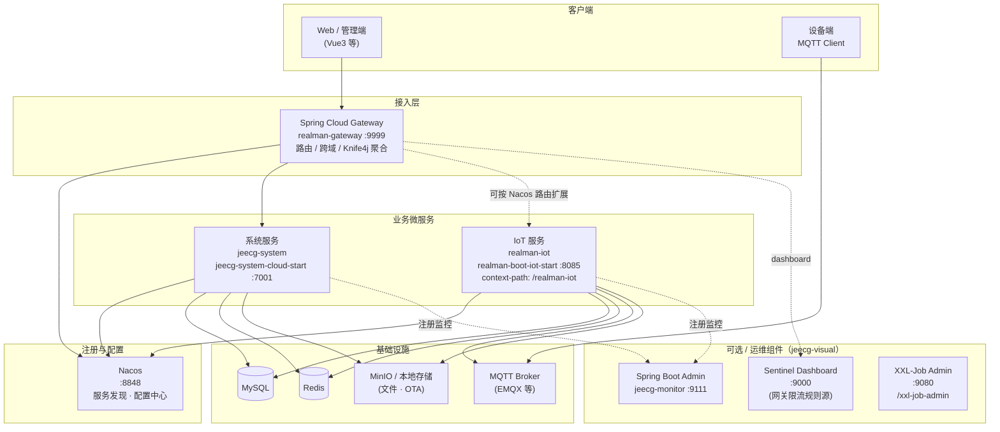

# Realman Boot

基于 **Jeecg Boot 3.x** 扩展的睿尔曼智能后端工程：在保留低代码与系统管理能力的基础上，集成 **IoT 设备接入**（MQTT / EMQX、OTA、SLAM、WebRTC 等）与业务模块。支持 **单体** 与 **Spring Cloud + Nacos** 微服务两种部署形态。

[](https://www.realman-robotics.cn/)
[](https://www.realman-robotics.cn/)
[](https://www.realman-robotics.cn/)
[](https://www.realman-robotics.cn/)
[](https://www.realman-robotics.cn/)

---

## 仓库结构（后端）

```
realman-boot/
├── realman-boot-base-core/     # 公共核心（工具、配置、安全基座等）
├── realman-module-system/      # 系统管理：system-biz / system-api / system-start（单体入口）
├── realman-boot-module/        # 扩展业务子模块（含 demo、airag 等）
├── realman-boot-iot/           # IoT：设备、MQTT、工单、流媒体等（api / biz / start）
├── jeecg-server-cloud/         # 微服务：网关、Nacos、XXL-Job、Sentinel、监控等
├── db/                         # 数据库脚本（如 XXL-Job、Nacos 等）
└── docs/                       # 架构说明、部署手册等
```

单体默认启动模块：`realman-module-system/realman-system-start`（开发环境 `context-path` 多为 `/realman-boot`，以各 `application-*.yml` 为准）。  
微服务拓扑与端口说明见 **[docs/realman-boot-microservices-architecture.md](docs/realman-boot-microservices-architecture.md)**。



---

## 技术栈摘要

- **框架**：Spring Boot 3、Spring Cloud Alibaba（Nacos、Gateway、Sentinel 等）
- **持久层**：MyBatis-Plus、动态数据源、Druid
- **安全**：Apache Shiro、JWT（与 Jeecg 体系一致）
- **IoT 侧**：MQTT（Paho）、与 EMQX HTTP 认证联动、MinIO、Redis 等（详见 `realman-boot-iot`）

更完整依赖版本以根 `pom.xml` 的 `properties` 为准。

---

## 环境要求


| 依赖    | 说明                                 |
| ----- |------------------------------------|
| JDK   | 21（推荐与 CI 一致）                      |
| Maven | 3.8+                               |
| 数据库   | MySQL 8                            |
| 可选    | Redis、Nacos、EMQX、MinIO（按运行模式与模块启用） |


前端工程若使用官方配套的 **Vue3**，一般为独立仓库目录 `realman-boot-vue3`（本仓库若未包含，请从团队制品库或文档获取）。

---

## 本地构建

```bash
# 全量编译（默认跳过测试，与父 POM 配置一致）
mvn clean package -DskipTests

# 仅构建单体 System 可执行包（示例）
mvn clean package -pl realman-module-system/realman-system-start -am -DskipTests
```

生产镜像与 Docker 说明见部署文档。

---

## 部署与文档


| 文档                                                                                                 | 内容                                                |
| -------------------------------------------------------------------------------------------------- | ------------------------------------------------- |
| [docs/deploy/realman-boot-aliyun-deploy.md](docs/deploy/realman-boot-aliyun-deploy.md)             | 阿里云 ECS + Docker Compose 部署（含中间件、Nacos、IoT 环境变量等） |
| [docs/realman-boot-microservices-architecture.md](docs/realman-boot-microservices-architecture.md) | 微服务组件与端口                                          |
| [docs/软件架构设计.md](docs/软件架构设计.md)                                                                   | 软件架构说明                                            |
| [realman-boot-iot/README.md](realman-boot-iot/README.md)                                           | IoT 模块结构与 MQTT 鉴权说明                               |


通用开发环境、IDE 配置、代码生成与 Jeecg 平台能力说明可参考官方文档：**[https://help.jeecg.com](https://help.jeecg.com)**。

---

## 默认账号（开发）

以各环境配置为准；常见开发账号为 `admin` / `123456`，**生产环境请务必修改**。

---

