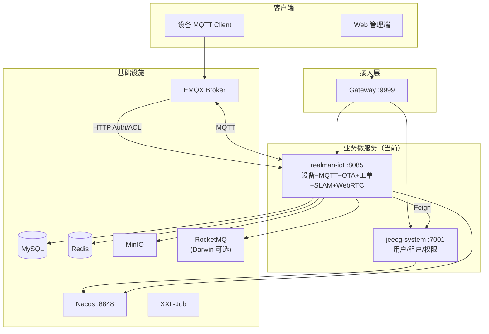
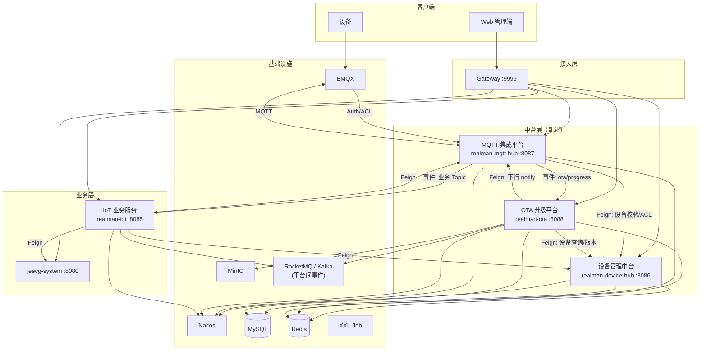
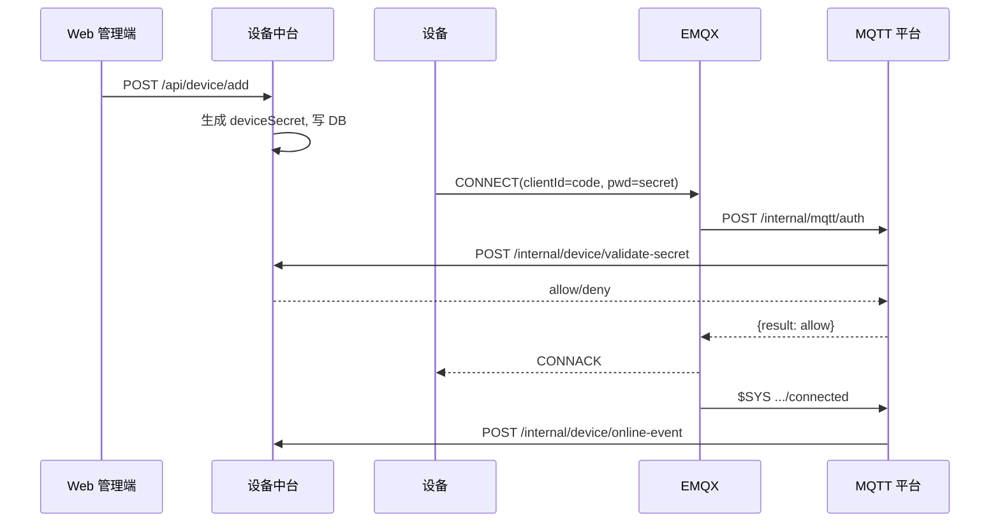
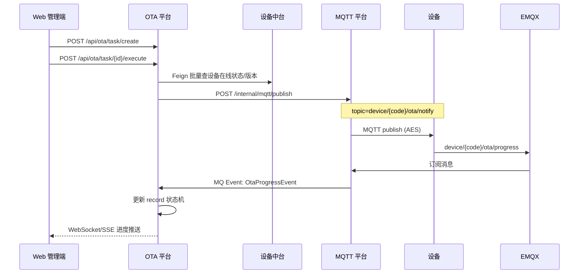
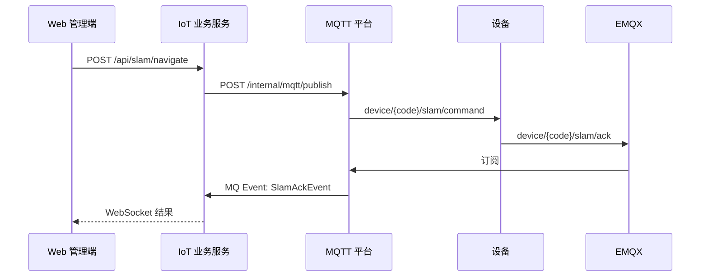

# IoT 平台架构升级设计：设备中台 / MQTT 集成平台 / OTA 平台拆分


| 项        | 内容                                                            |
| -------- | ------------------------------------------------------------- |
| **文档版本** | v1.0                                                          |
| **日期**   | 2026-06-30                                                    |
| **状态**   | 提议 / 待评审                                                      |
| **ADR**  | [ADR-0001](../adr/0001-iot-platform-split-device-mqtt-ota.md) |


---

## 一、背景与目标

### 1.1 现状

当前 `realman-iot`（端口 **8085**，context-path `/realman-iot`）为 **单体 IoT 微服务**，内聚以下能力：


| 能力域     | 关键组件                                               | 数据表（示例）                                            |
| ------- | -------------------------------------------------- | -------------------------------------------------- |
| 设备生命周期  | `IotDeviceLifecycleService`、`DeviceSecretService`  | `iot_device`、`iot_device_auth`、`iot_device_config` |
| 设备在线状态  | `DeviceOnlineOfflineHandler`、`DeviceStatusHandler` | `iot_device.status` + Redis presence               |
| MQTT 集成 | `MqttConfig`、`MqttMessageDispatcher`、17 个 Handler  | —                                                  |
| EMQX 管理 | `EmqxManagementClient`、`MqttAuthController`        | —                                                  |
| OTA 升级  | `IotOtaServiceImpl`、`OtaProgressHandler`           | `iot_ota_firmware/task/record`                     |
| 场景业务    | 工单、SLAM、WebRTC、Darwin 数采                           | 各自业务表                                              |


模块分层见 `realman-boot-iot`：`api`（Controller）→ `biz`（领域实现）→ `start`（Boot）。

### 1.2 问题

- 设备管理、MQTT 路由、OTA 强耦合在同一进程，无法独立扩缩容与发版。
- 新增设备类型或 MQTT Topic 需修改同一服务，变更风险集中。
- OTA 进度处理与 MQTT Handler、WebSocket 推送绑定，难以作为独立产品演进。
- 设备密钥校验（`MqttAuthController`）与设备 CRUD 同服务，职责边界模糊。

### 1.3 升级目标

将 IoT 能力拆分为 **三个中台/平台** + **一个瘦身的 IoT 业务服务**：


| 新服务       | 应用名                  | 端口（建议） | 定位                          |
| --------- | -------------------- | ------ | --------------------------- |
| 设备管理中台    | `realman-device-hub` | 8086   | 设备主数据与生命周期 SSOT             |
| MQTT 集成平台 | `realman-mqtt-hub`   | 8087   | 协议接入与消息总线                   |
| OTA 升级平台  | `realman-ota`        | 8088   | 固件与升级编排                     |
| IoT 业务服务  | `realman-iot`        | 8085   | 工单、SLAM、WebRTC、Darwin（瘦身保留） |


---

## 二、现状架构（As-Is）

### 2.1 云服务组成




### 2.2 模块内部分层

```
realman-boot-iot-start
  ├── realman-boot-iot-api   (REST Controller + ApiServiceImpl)
  └── realman-boot-iot-biz   (领域、MQTT、持久化、WebSocket、Scheduler)
```

### 2.3 关键交互（现状）

- **设备鉴权**：设备 → EMQX → `POST /realman-iot/internal/mqtt/auth` → `DeviceSecretService`
- **OTA 下发**：管理端 → `OtaController` → `MqttPublisher` → `device/{code}/ota/notify`
- **OTA 进度**：设备 → EMQX → `OtaProgressHandler` → DB + `DeviceWebSocketServer`
- **系统依赖**：IoT → Feign → `jeecg-system`（租户、用户、角色等）

---

## 三、目标架构（To-Be）

### 3.1 拆分原则


| 平台            | 定位                           | 拆分边界                                              |
| ------------- | ---------------------------- | ------------------------------------------------- |
| **设备管理中台**    | 设备主数据 Single Source of Truth | 注册/密钥/租户授权/在线状态/配置/元数据/操作审计                       |
| **MQTT 集成平台** | 统一 MQTT 协议接入层                | EMQX Auth/ACL、订阅分发、下行发布、集群 ACK 协调、Topic 路由        |
| **OTA 升级平台**  | 固件与升级编排                      | 固件存储、任务编排、进度状态机、超时调度                              |
| **IoT 业务服务**  | 场景业务                         | 工单、SLAM、WebRTC、Darwin、WebSocket（OTA 进度可订阅 OTA 事件） |


### 3.2 目标云服务拓扑




### 3.3 各平台职责详表

#### A. 设备管理中台 `realman-device-hub`


| 功能模块      | 说明                                      | 迁移来源                                                                         |
| --------- | --------------------------------------- | ---------------------------------------------------------------------------- |
| 设备注册/CRUD | 机器人/主控注册、启停、导出                          | `IotDeviceLifecycleService`、`RobotDeviceController`、`MasterDeviceController` |
| 设备密钥      | MD5 生成、Redis 缓存、校验 API                  | `DeviceSecretService`                                                        |
| 租户授权      | 设备-租户绑定、有效期                             | `IotDeviceAuth`、`DeviceAuthController`                                       |
| 设备配置      | KV 配置管理                                 | `IotDeviceConfig` 存储层                                                        |
| 在线状态      | `$SYS` 事件写入、Redis presence、启动 reconcile | `DeviceOnlineOfflineHandler` 状态写入、`DeviceOnlineReconcileService`             |
| 设备元数据     | 型号、固件版本、地理位置                            | `IotDevice`、`DeviceOnlineReportHandler` 元数据部分                                |
| 操作审计      | 设备操作日志                                  | `IDeviceOperationLogService`                                                 |


**不负责**：MQTT 连接、消息路由、OTA 任务、SLAM/WebRTC。

#### B. MQTT 集成平台 `realman-mqtt-hub`


| 功能模块          | 说明                                  | 迁移来源                                            |
| ------------- | ----------------------------------- | ----------------------------------------------- |
| EMQX Auth/ACL | HTTP 回调，调用设备中台校验                    | `MqttAuthController`                            |
| MQTT 客户端      | 双 Client 订阅/发布、Watchdog、集群 `$share` | `MqttConfig`、`MqttClientWatchdog`               |
| 消息路由          | Topic → Handler / 事件转发              | `MqttMessageDispatcher`、`MqttDeviceTopicRouter` |
| 下行发布          | AES 加密、统一 Publish API               | `MqttPublisher`、`CommandEncryptService`         |
| 集群 ACK 协调     | Redis Pub/Sub 跨 Pod 完成 Future       | `RedisPendingListenerConfig`                    |
| EMQX 管理       | 连接列表、reconcile 触发                   | `EmqxManagementClient`                          |
| Topic 注册表     | 可配置路由规则（Plugin 化）                   | **新增**                                          |


**消息路由策略（目标）：**


| Topic 模式                          | 处理方式              |
| --------------------------------- | ----------------- |
| `device/{code}/ota/`*             | 转发事件 → OTA 平台（MQ） |
| `device/{code}/slam/*`            | 转发事件 → IoT 业务服务   |
| `device/{code}/status/report`     | 调用设备中台刷新 presence |
| `$SYS/.../connected|disconnected` | 通知设备中台更新 status   |
| 其他业务 Topic                        | 按注册表路由至对应消费者      |


#### C. OTA 升级平台 `realman-ota`


| 功能模块  | 说明                                          | 迁移来源                                 |
| ----- | ------------------------------------------- | ------------------------------------ |
| 固件管理  | 分片上传、MinIO、MD5、预签名 URL                      | `IotOtaServiceImpl` 固件部分             |
| 升级任务  | 创建/执行/取消、批量设备                               | `IotOtaServiceImpl` 任务部分             |
| 进度状态机 | NOTIFIED→CONFIRMED→…→SUCCESS/FAILED/TIMEOUT | `OtaProgressHandler`                 |
| 断点续传  | Redis `downloadedBytes`                     | OTA progress Redis key               |
| 超时调度  | XXL-Job 扫描                                  | `DeviceSchedulerJob.checkOtaTimeout` |
| 实时推送  | WebSocket / SSE                             | 可独立或 IoT 订阅 OTA 事件代理                 |


**对外依赖：**

- 设备中台：设备列表、固件版本、在线状态
- MQTT 平台：下发 `device/{code}/ota/notify`
- MinIO：固件对象存储（bucket `iot-firmware`）

#### D. IoT 业务服务 `realman-iot`（瘦身）


| 保留能力           | 说明                |
| -------------- | ----------------- |
| 工单管理           | Darwin 同步、合规检查    |
| SLAM           | 建图/定位/导航 Topic 处理 |
| WebRTC 遥操      | 房间、视频流、主控关联       |
| Darwin 数据采集    | RocketMQ 双向集成     |
| WebSocket 前端推送 | 设备状态、遥操事件         |


---

## 四、平台间交互关系

### 4.1 链路 1：设备注册 → MQTT 连接




### 4.2 链路 2：OTA 升级全流程




### 4.3 链路 3：SLAM 命令（业务经 MQTT 平台代理）




### 4.4 通信方式选型


| 场景              | 方式                    | 说明                                     |
| --------------- | --------------------- | -------------------------------------- |
| 同步查询（设备信息、密钥校验） | OpenFeign             | 低延迟；沿用 `SysAuthFeignClient` 模式         |
| MQTT 上行 → 业务处理  | RocketMQ/Kafka 事件     | 解耦、削峰、多消费者                             |
| 跨 Pod ACK 等待    | Redis Pub/Sub         | 保留现有 `RedisPendingListenerConfig` 方案   |
| 前端实时推送          | WebSocket             | 保留 `DeviceWebSocketServer` 模式或独立 WS 网关 |
| 平台间契约           | `*-contract` Maven 模块 | DTO + Feign + 事件 Schema                |


---

## 五、接口设计

### 5.1 设备管理中台

#### 对外 REST（经 Gateway，`/realman-device-hub`）


| 方法   | 路径                                    | 说明     | 现状对应                    |
| ---- | ------------------------------------- | ------ | ----------------------- |
| POST | `/api/device/add`                     | 注册设备   | `RobotDeviceController` |
| PUT  | `/api/device/{id}`                    | 更新设备   | 同上                      |
| GET  | `/api/device/list`                    | 分页查询   | 同上                      |
| POST | `/api/device/{id}/enable`             | 启用/禁用  | 同上                      |
| POST | `/api/device/auth`                    | 租户授权   | `DeviceAuthController`  |
| GET  | `/api/device/{code}/detail`           | 设备详情   | **新增**                  |
| GET  | `/api/device/batch`                   | 批量查询   | **新增**（OTA 用）           |
| PUT  | `/api/device/{code}/firmware-version` | 更新固件版本 | **新增**（OTA 成功后回调）       |


#### 内部 API（集群内）


| 方法   | 路径                                  | 说明           | 调用方         |
| ---- | ----------------------------------- | ------------ | ----------- |
| POST | `/internal/device/validate-secret`  | 校验 MQTT 密码   | MQTT 平台     |
| GET  | `/internal/device/{code}/acl-rules` | Topic ACL 规则 | MQTT 平台     |
| POST | `/internal/device/online-event`     | 上下线事件        | MQTT 平台     |
| POST | `/internal/device/presence/refresh` | keepalive 刷新 | MQTT 平台     |
| GET  | `/internal/device/{code}`           | 设备基础信息       | OTA / IoT   |
| GET  | `/internal/device/{code}/secret`    | 获取密钥         | MQTT 平台（内网） |


#### Feign Contract 示例

```java
@FeignClient(value = "realman-device-hub", path = "/realman-device-hub")
public interface DeviceHubFeignClient {

    @GetMapping("/internal/device/{deviceCode}")
    DeviceInfoDTO getDevice(@PathVariable String deviceCode);

    @PostMapping("/internal/device/batch-query")
    List<DeviceInfoDTO> batchQuery(@RequestBody DeviceBatchQueryDTO query);

    @PostMapping("/internal/device/validate-secret")
    ValidateSecretResult validateSecret(@RequestBody ValidateSecretRequest req);

    @PostMapping("/internal/device/online-event")
    void reportOnlineEvent(@RequestBody DeviceOnlineEvent event);
}
```

### 5.2 MQTT 集成平台

#### 内部 API


| 方法   | 路径                                  | 说明          | 调用方              |
| ---- | ----------------------------------- | ----------- | ---------------- |
| POST | `/internal/mqtt/auth`               | EMQX 认证     | EMQX             |
| POST | `/internal/mqtt/acl`                | EMQX ACL    | EMQX             |
| POST | `/internal/mqtt/publish`            | 统一下行发布      | OTA / IoT / 设备中台 |
| POST | `/internal/mqtt/publish-and-wait`   | 发布并等待 ACK   | IoT              |
| GET  | `/internal/mqtt/clients/connected`  | 在线客户端列表     | 设备中台 reconcile   |
| POST | `/internal/mqtt/subscribe/register` | 注册 Topic 路由 | 各业务平台启动时         |


#### 下行发布请求 DTO

```java
public class MqttPublishRequest {
    private String deviceCode;
    private String topicSuffix;       // 如 "ota/notify", "config/push"
    private Object payload;           // 明文，平台负责 AES
    private boolean encrypt = true;
    private Integer qos = 1;
    private Long waitAckTimeoutMs;    // 可选
    private String ackTopicPattern;   // 如 "device/{code}/command/restart/ack"
}
```

#### 事件输出（MQ）


| 事件                  | Topic（建议）                     | 生产者     | 消费者        |
| ------------------- | ----------------------------- | ------- | ---------- |
| `OtaProgressEvent`  | `platform.mqtt.ota.progress`  | MQTT 平台 | OTA 平台     |
| `DeviceOnlineEvent` | `platform.mqtt.device.online` | MQTT 平台 | 设备中台、IoT   |
| `SlamAckEvent`      | `platform.mqtt.slam.ack`      | MQTT 平台 | IoT 业务     |
| `CommandAckEvent`   | `platform.mqtt.command.ack`   | MQTT 平台 | IoT / 设备中台 |


**部署注意**：EMQX Auth/ACL 建议 **直连 MQTT 平台**（Nginx IP 白名单），不经 Gateway，降低延迟与单点风险。

### 5.3 OTA 升级平台

#### 对外 REST（迁移 `OtaController`）


| 方法   | 路径                                | 说明     |
| ---- | --------------------------------- | ------ |
| POST | `/api/ota/firmware/upload/chunk`  | 分片上传   |
| GET  | `/api/ota/firmware/upload/chunks` | 断点续传查询 |
| POST | `/api/ota/firmware/upload/merge`  | 合并发布   |
| GET  | `/api/ota/firmware/list`          | 固件列表   |
| POST | `/api/ota/task/create`            | 创建任务   |
| POST | `/api/ota/task/{id}/execute`      | 执行任务   |
| POST | `/api/ota/task/{id}/cancel`       | 取消任务   |
| GET  | `/api/ota/task/{id}/records`      | 任务明细   |
| GET  | `/api/ota/device/{code}/history`  | 设备升级历史 |


#### 内部 API


| 方法   | 路径                                   | 说明                    |
| ---- | ------------------------------------ | --------------------- |
| POST | `/internal/ota/progress`             | MQTT 平台投递进度（Feign 备选） |
| GET  | `/internal/ota/device/{code}/active` | 查询进行中任务               |


#### Feign Contract 示例

```java
@FeignClient(value = "realman-ota", path = "/realman-ota")
public interface OtaFeignClient {

    @GetMapping("/internal/ota/device/{deviceCode}/firmware-version")
    String getCurrentFirmwareVersion(@PathVariable String deviceCode);

    @GetMapping("/api/ota/device/{deviceCode}/history")
    List<OtaRecordVO> getUpgradeHistory(@PathVariable String deviceCode);
}
```

### 5.4 MQTT 平台 Feign Contract 示例

```java
@FeignClient(value = "realman-mqtt-hub", path = "/realman-mqtt-hub")
public interface MqttHubFeignClient {

    @PostMapping("/internal/mqtt/publish")
    MqttPublishResult publish(@RequestBody MqttPublishRequest request);

    @PostMapping("/internal/mqtt/publish-and-wait")
    MqttPublishResult publishAndWait(@RequestBody MqttPublishRequest request);

    @GetMapping("/internal/mqtt/clients/connected")
    List<String> listConnectedDeviceCodes();
}
```

### 5.5 IoT 业务服务依赖调整


| 原实现                       | 目标                             |
| ------------------------- | ------------------------------ |
| `IotDeviceMapper` 直接查库    | `DeviceHubFeignClient`         |
| `MqttPublisher.publish()` | `MqttHubFeignClient.publish()` |
| `OtaProgressHandler`      | 删除；IoT 如需展示则订阅 OTA 事件          |
| `DeviceSecretService`     | 删除；改调设备中台                      |
| `MqttAuthController`      | 删除；迁移至 MQTT 平台                 |


---

## 六、数据与存储拆分


| 平台      | 数据库                                                                                               | Redis              | 对象存储                 |
| ------- | ------------------------------------------------------------------------------------------------- | ------------------ | -------------------- |
| 设备中台    | `iot_device`、`iot_device_auth`、`iot_device_config`、`iot_device_operation_log`、`iot_device_status` | 密钥缓存、presence、在线状态 | —                    |
| MQTT 平台 | 可选：`mqtt_route_rule`、`mqtt_publish_log`                                                           | ACK 协调、节流、幂等锁      | —                    |
| OTA 平台  | `iot_ota_firmware`、`iot_ota_upgrade_task`、`iot_ota_upgrade_record`                                | 分片上传、断点进度          | MinIO `iot-firmware` |
| IoT 业务  | 工单、SLAM、WebRTC、Darwin 表                                                                           | 业务缓存               | MinIO `iot-slam`     |


**分库策略：**

- **Phase 1–3**：共用 MySQL 实例，逻辑隔离（schema 或表前缀不变）。
- **Phase 4+**：OTA、设备中台可按负载独立分库。

---

## 七、Maven 模块规划

```
realman-boot/
├── realman-boot-device-hub/              # 新建
│   ├── realman-boot-device-hub-contract/
│   ├── realman-boot-device-hub-biz/
│   └── realman-boot-device-hub-start/       # :8086
├── realman-boot-mqtt-hub/                # 新建
│   ├── realman-boot-mqtt-hub-contract/
│   ├── realman-boot-mqtt-hub-biz/
│   └── realman-boot-mqtt-hub-start/         # :8087
├── realman-boot-ota/                     # 新建
│   ├── realman-boot-ota-contract/
│   ├── realman-boot-ota-biz/
│   └── realman-boot-ota-start/              # :8088
├── realman-boot-iot/                     # 瘦身
│   ├── realman-boot-iot-contract/        # 新建
│   ├── realman-boot-iot-api/
│   ├── realman-boot-iot-biz/
│   └── realman-boot-iot-start/           # :8085
└── realman-server-cloud/
    └── gateway 路由扩展
```

**Contract 模块规范：**

- DTO / VO / Event POJO
- Feign Client 接口
- 常量（Topic 模板、Redis Key、MQ Topic）
- 不含 Spring 实现类

---

## 八、Gateway 路由扩展

在 `jeecg-gateway-router.json` 中新增：

```json
{
  "id": "realman-device-hub",
  "uri": "lb://realman-device-hub",
  "predicates": [{"name": "Path", "args": {"pattern": "/realman-device-hub/**"}}]
},
{
  "id": "realman-ota",
  "uri": "lb://realman-ota",
  "predicates": [{"name": "Path", "args": {"pattern": "/realman-ota/**"}}]
}
```

MQTT 平台 `/internal/mqtt/**` 建议 EMQX 直连，不暴露公网 Gateway。

---

## 九、分阶段迁移路线

### Phase 0：契约先行（约 2 周）

- 新建各 `*-contract` 模块
- 定义 Feign 接口与 MQ Event Schema
- Gateway 路由与 Nacos 配置模板预留
- 编写各服务 `application.yml` 骨架

### Phase 1：OTA 平台独立（约 4 周）

- 迁移 `OtaController`、`IotOtaServiceImpl`、OTA 表、MinIO 配置
- `OtaProgressHandler` 改为 MQTT 平台 → MQ → OTA 平台
- IoT 保留 OTA 接口 **兼容代理**（Deprecated）
- 回归：分片上传 → 任务执行 → 进度 → 超时

### Phase 2：MQTT 集成平台（约 4 周）

- 迁移 `MqttConfig`、Dispatcher、Publisher、Auth Controller
- 引入 Topic 路由注册表
- 设备中台提供 `validate-secret` API
- EMQX 回调 URL 切换至 MQTT 平台
- 回归：集群 `$share`、Redis ACK、全量 Handler 分流

### Phase 3：设备管理中台（约 4 周）

- 迁移设备 CRUD、密钥、租户授权、在线状态写入
- IoT 改 Feign 调用设备中台
- reconcile 迁至设备中台
- 回归：注册 → 连接 → 上下线全链路

### Phase 4：IoT 瘦身与清理（约 2 周）

- 删除已迁移代码
- 统一 traceId 跨平台传播
- 更新部署文档与 Runbook

---

## 十、关键设计决策


| 决策点           | 结论                         | 理由                                                                                        |
| ------------- | -------------------------- | ----------------------------------------------------------------------------------------- |
| MQTT 上行到 OTA  | MQ 事件，非 Feign 同步           | 高频、可削峰、OTA 独立扩缩                                                                           |
| 设备密钥存储        | 仅设备中台 DB + Redis           | SSOT                                                                                      |
| AES 加解密       | MQTT 平台统一处理                | 避免各业务重复实现                                                                                 |
| OTA 进度推前端     | OTA 平台 WS 或 IoT 订阅事件       | 解耦；短期可 IoT 代理                                                                             |
| 在线状态权威源       | EMQX `$SYS` → 设备中台         | 与 [IOT-DEVICE-ONLINE-STATE.md](../../realman-boot-iot/docs/IOT-DEVICE-ONLINE-STATE.md) 一致 |
| 平台间 MQ        | RocketMQ（优先）               | 已有 Darwin 集成实践                                                                            |
| 跨平台事务（OTA 执行） | Saga：本地事务 + 异步 notify + 补偿 | 避免分布式强一致                                                                                  |


---

## 十一、风险与缓解


| 风险             | 缓解措施                       |
| -------------- | -------------------------- |
| 拆分期间双写不一致      | 兼容代理 + Feature Flag        |
| MQTT Auth 延迟增加 | 设备中台密钥短 TTL 本地缓存（MQTT 平台）  |
| EMQX 回调切换窗口    | 蓝绿：新 URL 并行验证后再切           |
| 集群 ACK 跨服务     | Phase 2 前 ACK 协调仍放 MQTT 平台 |
| 前端路由变更         | Gateway 路径兼容期 + 版本公告       |


---

## 十二、现状 vs 目标对照


| 维度       | 现状            | 目标                                         |
| -------- | ------------- | ------------------------------------------ |
| 业务微服务数   | System + IoT  | System + Device Hub + MQTT Hub + OTA + IoT |
| IoT 服务职责 | 全栈 IoT        | 场景业务（工单/SLAM/WebRTC）                       |
| MQTT     | 内嵌 IoT        | 独立协议中台                                     |
| OTA      | 内嵌 IoT        | 独立平台                                       |
| 设备数据     | 与 MQTT/OTA 混合 | 设备中台 SSOT                                  |
| 扩展方式     | 改 monolith    | 注册 Topic Route + 消费 MQ Event               |


---

## 十三、附录

### A. 代码迁移对照（Phase 1 OTA）


| 源路径（realman-boot-iot）                          | 目标                     |
| ---------------------------------------------- | ---------------------- |
| `api/.../controller/OtaController.java`        | `realman-boot-ota-api` |
| `biz/.../service/IIotOtaService.java`          | `realman-boot-ota-biz` |
| `biz/.../service/impl/IotOtaServiceImpl.java`  | `realman-boot-ota-biz` |
| `biz/.../mqtt/handler/OtaProgressHandler.java` | 逻辑迁至 OTA；MQTT 平台仅转发事件  |
| `biz/.../entity/IotOta*.java`                  | `realman-boot-ota-biz` |
| `biz/.../mapper/IotOta*.java`                  | `realman-boot-ota-biz` |
| `biz/.../scheduler/DeviceSchedulerJob`（OTA 部分） | `realman-boot-ota-biz` |


### B. Nacos 配置拆分（建议文件名）


| 服务      | Data ID                    |
| ------- | -------------------------- |
| 设备中台    | `realman-device-hub.yaml`  |
| MQTT 平台 | `realman-mqtt-hub.yaml`    |
| OTA 平台  | `realman-ota.yaml`         |
| IoT 业务  | `realman-iot.yaml`（瘦身后的配置） |


---

