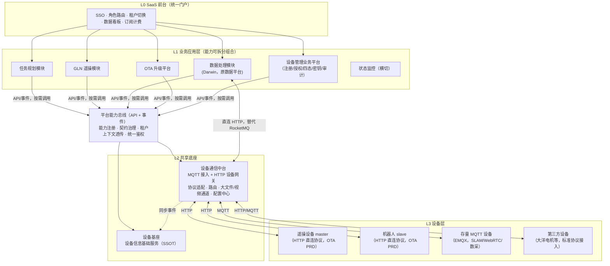
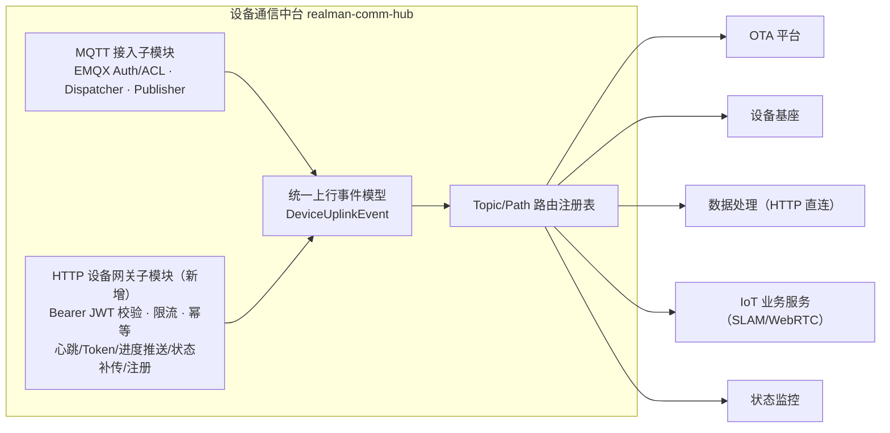

# 睿尔曼达尔文软件平台 V2 架构升级设计：设备基座 / 设备通信中台 / 平台能力总线

| 项 | 内容 |
| --- | --- |
| **文档版本** | v2.0 |
| **日期** | 2026-07-07 |
| **状态** | 提议 / 待评审 |
| **依据输入** | 《睿尔曼达尔文软件平台·业务架构 v1.2》（产品）、《达尔文设备升级平台 PRD V1.0.0》（OTA）|
| **关联 ADR** | [ADR-0001](../adr/0001-iot-platform-split-device-mqtt-ota.md)（历史决策）、[ADR-0002](../adr/0002-device-foundation-comm-hub-capability-bus.md)（本次决策，修订/扩展 ADR-0001）|
| **前序文档** | [IoT 平台架构升级设计 v1.0](./2026-06-30-iot-platform-architecture-upgrade.md)（2026-06-30，仅设备中台/MQTT 平台/OTA 平台三分）|

---

## 一、背景

2026-06-30 的 ADR-0001 / 设计 v1.0 已提出把单体 `realman-iot` 拆为「设备管理中台 / MQTT 集成平台 / OTA 平台 / 瘦身 IoT」。此后产品侧输出了两份更完整的输入：

1. **业务架构 v1.2**（`睿尔曼达尔文软件平台·业务架构.html`）：明确了六大业务模块（任务规划、GLN、**数据处理**、设备管理、OTA、状态监控）+ **平台能力总线** + **共享底座**（**设备通信中台** + **设备信息基础服务**）的分层视角，并指出设备管理应"分两层"——底层 SSOT 与前端业务操作分离。
2. **《达尔文设备升级平台 PRD V1.0.0》**：把 OTA 需求做到了可实施粒度（15 状态机、Ed25519 签名/密钥生命周期、master/slave 双通道、**设备端与后台之间是一套独立的 HTTP 接口**——心跳、Token 签发/续签/吊销、进度推送、状态补传，**不是** MQTT 报文）。

这两份输入与 v1.0 设计存在三处需要修订的落差，也是本次升级的触发点：

- v1.0 把"设备管理"当作一个中台；业务架构 v1.2 要求进一步拆成 **设备基座（SSOT）** 与 **设备管理业务平台**（注册/授权/四态/密钥/审计）两层。
- v1.0 假设 OTA 下发/进度全部走 MQTT + RocketMQ 事件；OTA V1.0.0 PRD 定义的却是设备直接调用的 HTTP 接口族（`POST /api/v1/devices/heartbeat`、`POST /api/v1/ota/tasks/{id}/progress-push` 等），且带有 Bearer JWT 设备鉴权、限流、幂等等 HTTP 语义。
- v1.0 没有"平台能力总线"这一层；业务架构 v1.2 把它列为业务应用层与共享底座之间的显式分层，是"能力解耦可组合"（即可按客户/项目拆包售卖）的关键。

另外，用户侧提出一个明确的简化点：**数据处理模块（Darwin）是已有能力，在 SaaS 平台化之后不再是需要跨网络域桥接的外部系统，原来为此搭建的 RocketMQ 桥接可以去掉，直接用 HTTP 调用**。本文档第六章给出具体的退役方案。

本文档在 v1.0 基础上补齐这三处，形成 V2 目标架构，并给出能力盘点、深度设计与迁移路线。

---

## 二、现状能力盘点：已实现 vs 待拆分/待补齐

对照口径：业务架构 v1.2（六大模块 + 能力总线 + 共享底座）与 OTA V1.0.0 PRD。代码依据：`realman-boot-iot` 现状（单体，`org.jeecg.modules.device` 包）。

### 2.1 总体対照

| 业务架构 v1.2 中的模块 | 当前代码落点 | 状态 |
| --- | --- | --- |
| 任务规划模块 | 不存在（数采任务下发目前挂在 `realman-iot` 工单/数采链路里，过渡期由"数据处理暂发"）| **未拆分**，仍与 IoT 业务耦合 |
| GLN（遥操） | `realman-iot` 内 WebRTC/SLAM 相关 handler | 在同一进程内，未独立 |
| 数据处理（Darwin） | 不在本仓库，通过 RocketMQ 与 `realman-iot` 对接（`device.datacollect` 包） | 外部系统，桥接方式待升级（见第六章） |
| 设备管理 | `realman-iot` 内 `RobotDeviceController` / `MasterDeviceController` / `DeviceProvisionController` / `DeviceSecretService` | **未分层**，SSOT 与业务操作混在一起，且未启用租户隔离（`软件架构设计.md` 8.2 节：IoT 模块当前排除 `MybatisPlusSaasConfig`）|
| OTA | `realman-iot` 内 `OtaController` / `IotOtaServiceImpl` / `OtaProgressHandler` | **MVP 级实现**，与 V1.0.0 PRD 差距很大（见 2.3）|
| 状态监控 | 无独立模块，散落在各业务日志里 | 未建设 |
| 平台能力总线 | 不存在 | 需新建（治理层，非新中间件，见第五章）|
| 设备通信中台 | MQTT 部分能力已存在（`MqttAuthController`、`MqttMessageDispatcher`、各 Handler），但内嵌在 `realman-iot`，且只有 MQTT 一种协议 | **未独立**，且缺 HTTP 设备接入通道 |
| 设备信息基础服务 | 不存在独立分层；设备基础信息与 `IotDevice` 实体混在设备管理业务表里 | 需从设备管理中拆出 |

**结论**：ADR-0001 v1.0 的 Phase 0-4 尚未实际执行（代码库仍是 `realman-boot-iot` 单体 + `realman-boot-system` + Gateway/Nacos 三个可运行单元），只完成了设计文档与一小部分"提前量"——设备 HTTP 自注册（`DeviceProvisionController`，MD5 签名版）。这部分提前量与 OTA 新 PRD 的注册协议（`device_registration_secret` + 租户校验 + Bearer JWT）字段不一致，需要在 Phase 3 收敛时对齐，不能直接复用。

### 2.2 设备管理能力盘点

| 能力项 | PRD/业务架构要求 | 现状 | 差距 |
| --- | --- | --- | --- |
| 设备基础信息 SSOT | 独立"设备信息基础服务"层，供全部应用查询 IP/MAC/型号/固件版本 | `IotDevice` 实体与注册/授权/在线状态逻辑同库同服务 | 需要拆出只读基础信息层 |
| 注册与密钥 | `device_registration_secret`（一次性、有效期、频控 5次/h）+ Bearer JWT Token（签发/续签/吊销）| `DeviceProvisionController`：MD5(deviceCode) 签名自注册；`DeviceSecretService`：MQTT 密钥（用于 EMQX 认证）| 两套鉴权模型并存且都不满足新 PRD；需统一为 Token 体系，MQTT 密钥保留给存量 MQTT 设备做兼容 |
| 租户隔离 | tenant_id 创建时绑定不可变更；超管跨租户操作需 `X-Operator-Tenant-Id` + 双 tenant_id 审计 | IoT 模块未接入 `MybatisPlusSaasConfig`（现状按单租户处理）| **明确缺口**，需要补齐，且是 OTA 批量升级（`by_tenant_model`）的前置依赖 |
| 四态/测试标记 | `is_test_device`，超管专属，二次确认防绕过 | 未见实现 | 缺失 |
| 操作审计 | `IDeviceOperationLogService`（已存在）| 已有基础实现 | 需要扩展审计字段（`operator_tenant_id`/`target_tenant_id`/`audit_level`）|
| 在线状态同步 | 由设备通信中台同步至设备管理 | `DeviceOnlineOfflineHandler` 直接写本地 DB/Redis | 逻辑对，但耦合在同一服务里，需要拆分为"中台产生事件 → 设备基座消费"|

### 2.3 OTA 能力盘点（对照 PRD V1.0.0，逐项从严）

| PRD 能力域 | 现状（`OtaController`/`IotOtaServiceImpl`/`OtaProgressHandler`）| 差距 |
| --- | --- | --- |
| 固件包模型 | 仅 `firmwareName/version/productId/description`，无 `.sig` 签名文件、`min_version`、`compatible_models`、`risk_level`、`cancelable_in_executing` | **需要重构固件实体与上传接口** |
| SHA-256 / Ed25519 签名 | 无 | **缺失**，需新建密钥生命周期管理（active/pending_activation/revoked）|
| master/slave 双通道 | `deviceType` 仅区分 1=机器人/2=主控，未做成独立升级链路、互不干扰的任务隔离 | 需要在任务创建/前置校验层面显式区分 |
| 升级方式 | 仅"指定 deviceIds 列表" | 缺 `by_sn`/`by_model`/`all`/`by_tenant_model` 四种模式 |
| 前置校验 | 无 | 缺状态检查、资源检查、版本兼容性（双重校验）、签名吊销校验（双重校验）|
| 状态机 | 8 态：`NOTIFIED→CONFIRMED→DOWNLOADING→DOWNLOADED→INSTALLING→SUCCESS/FAILED/TIMEOUT` | PRD 要求 15 态（含 `PENDING_ONLINE`/`EXECUTING` 三子阶段/`ROLLING_BACK`/`PAUSED`/`CANCELLED` 等），**需要重新建模** |
| 设备通信协议 | 下发走 MQTT publish（`device/{code}/ota/notify`）；进度经 `OtaProgressHandler` 订阅 MQTT 得到 | PRD 定义纯 HTTP 设备协议（心跳/Token/进度推送/状态补传均为 `POST /api/v1/...`）| **协议路线冲突，是本次升级的核心议题之一**（见第四、五章）|
| 断点续传 | 仅服务端"固件分片上传"支持断点续传（MinIO 侧） | 缺设备侧 HTTP Range 下载续传、OSS 预签名 URL 自动刷新 |
| 批量策略 | 无 | 缺 `fail_threshold`/`pause`/`stop_all`/`continue` |
| 错误码体系 | 无细粒度错误码，仅通用成功/失败 | 缺 PRD 定义的 40+ 错误码 |
| 版本矩阵/版本落后判定 | 无 | 缺失 |
| 系统设置（17 项可配置联动校验）| 无配置中心 | 缺失 |

**结论**：当前 OTA 只覆盖了 PRD 里"固件存储 + 极简任务下发"的一角，且下发/回传通道（MQTT）与 PRD 选型（HTTP）不一致。这是拆分 OTA 平台时必须一并解决的问题，不能只做"代码搬家"。

### 2.4 数据处理（Darwin）桥接盘点

现状：`realman-iot` 与 Darwin 数采平台通过独立 RocketMQ Broker（`daily_GLN_PLATFORM` 主题）对接 4 条链路（详见 `docs/design/2026-04-27-darwin-rocketmq-integration.md`）：

1. OSS 上传授权申请/响应（Darwin 不能直连 MinIO）
2. OSS 文件地址上报
3. 设备上下线状态推送（`realman-iot` → Darwin）
4. Darwin 工单下发（Darwin → `realman-iot`）

设计初衷写得很清楚："达尔文数采平台" 是**独立部署、不同网络域**的外部系统，MinIO 不可直连、也不共享信任域，所以要用 RocketMQ 异步解耦 + Token 中转。这个前提在 SaaS 平台化之后已经不成立——数据处理模块与设备通信中台现在同属一个 SaaS 平台的内部服务网格，处于同一信任域，可以直接同步 HTTP 调用。第六章给出具体退役方案。

---

## 三、V2 目标架构总览

### 3.1 与 v1.0（ADR-0001）的差异对照

| 维度 | v1.0（2026-06-30）| V2（本次） |
| --- | --- | --- |
| 设备管理 | 单一"设备管理中台" | 拆两层：**设备基座**（SSOT，只读基础信息）+ **设备管理业务平台**（注册/授权/四态/密钥/审计，写操作）|
| 能力总线 | 无显式分层，靠 Feign + Gateway 隐式串联 | 显式新增"平台能力总线"治理层：能力注册目录、契约版本治理、租户上下文统一透传 |
| 设备通信 | 只有 MQTT 集成平台 | **设备通信中台**：MQTT + **HTTP 设备网关双协议**，服务新 OTA 协议与未来第三方设备 |
| OTA 与通信层关系 | OTA 进度经 MQTT 平台转发 MQ 事件 | OTA 设备侧 HTTP 接口由通信中台网关承接、按 path 前缀转发（见 5.3），设备只认一个域名/证书 |
| 数据处理对接 | 未提及（仍隐含走现状 RocketMQ）| **明确退役 RocketMQ 桥接，改为通信中台直连 HTTP**（第六章）|
| 迁移阶段 | 4 个 Phase | 在 4 个 Phase 基础上插入 Phase 1.5（数据处理 HTTP 化）与设备管理二次拆分（见第七章）|

---

## 四、设备基座深度设计（设备信息基础服务 + 设备管理业务平台）

### 4.1 分层原则

业务架构 v1.2 明确要求"设备管理拆两层"，理由是：**基础信息查询**（高频、只读、被 GLN/数据处理/OTA/状态监控共同依赖）与**业务操作**（低频、有权限校验、有审计要求）的变更节奏和读写特征完全不同，合并在一起会导致"改审计逻辑要重新部署一个所有人都在查的只读接口"的耦合问题。

| 子层 | 定位 | 读写特征 | 内容 |
| --- | --- | --- | --- |
| **设备信息基础服务**（`realman-device-info`）| 唯一设备数据源（SSOT）| 读多写少，强调低延迟、高可用 | 设备静态元数据（SN、MAC、型号、名称）+ 由通信中台同步的准实时状态（在线/离线、固件版本）；只读 API + 内部事件消费（接收中台的 online-event）|
| **设备管理业务平台**（`realman-device-mgmt`）| 面向运维/租户的业务操作 | 写少但需强一致 + 审计 | 注册（含 PRD 的 `device_registration_secret` 生命周期）、Token 签发/续签/吊销、租户授权与隔离、四态测试标记、操作审计 |

两者的调用关系：**设备管理业务平台是设备信息基础服务的一个写入方**（注册成功后把静态元数据写入 SSOT），**其余业务应用（GLN/数据处理/OTA/状态监控）只读 SSOT，不经过设备管理业务平台**。这样第三方项目（如大洋电机）如果只需要"查设备基础信息"，可以只对接设备信息基础服务，不必接入完整的设备管理业务平台。

### 4.2 对外能力清单

**设备信息基础服务（只读为主）**

| 能力 | 说明 |
| --- | --- |
| `GET /internal/device-info/{device_id}` | 基础信息 + 最新在线状态/固件版本 |
| `POST /internal/device-info/batch` | 批量查询（供 OTA 批量升级、版本矩阵使用）|
| `POST /internal/device-info/online-event`（消费）| 由设备通信中台推送在线/离线事件，更新状态字段 |
| `PUT /internal/device-info/{device_id}/firmware-version`（消费）| 由 OTA 平台在升级成功后回调，更新固件版本，作为版本矩阵的数据来源 |

**设备管理业务平台（写操作 + 审计）**

对齐 OTA PRD 9.7.5-9.8.6 与 9.0 鉴权规范，直接把新 PRD 的这几组接口的归属定为设备管理业务平台（而不是 OTA 平台自身），因为它们本质是"设备身份与租户授权"问题，OTA 只是消费方之一（GLN、数据处理未来也需要同一套设备身份体系）：

- `POST /api/v1/devices/register`、`POST /api/v1/admin/devices/registration-secret`、`GET .../registration-secret/status`
- `POST /api/v1/devices/token/issue`、`/token/refresh`、`PUT /{device_id}/token/revoke`
- `PUT /api/v1/devices/{device_id}/test-flag`、`POST /test-flag/batch`
- 租户隔离与超管跨租户审计（`X-Operator-Tenant-Id`，双 `tenant_id` 审计字段）落在这一层统一实现，OTA/GLN/数据处理都复用，不用各自重复造轮子。

### 4.3 与现状代码的映射

| 现状 | 迁移去向 |
| --- | --- |
| `RobotDeviceController`/`MasterDeviceController` CRUD | 拆分：只读列表/详情 → 设备信息基础服务；启停/授权等写操作 → 设备管理业务平台 |
| `DeviceProvisionController`（MD5 签名自注册）| 重做为符合 PRD 的 `POST /api/v1/devices/register`（`device_registration_secret` + 租户校验 + Token 签发），MD5 方案降级为"存量 MQTT 设备"的兼容分支，不再是主路径 |
| `DeviceSecretService`（MQTT 密钥）| 保留，供设备通信中台的 MQTT 接入子模块调用（EMQX Auth 校验），与新 Token 体系并存，按设备类型路由 |
| `IDeviceOperationLogService` | 扩展字段后原样保留在设备管理业务平台 |
| `DeviceOnlineOfflineHandler` 直接写 DB | 改为发布 `online-event` 给设备信息基础服务消费，服务本身移交设备通信中台 |

---

## 五、设备通信中台 + 通信总线深度设计

### 5.1 定位与边界

设备通信中台是**设备层与云端所有通信的唯一通道**：业务应用（GLN、数据处理、OTA、状态监控）都不直连设备，统一通过中台下发指令、查询状态、接收上行数据。这一点在 v1.0 已经是"MQTT 集成平台"的核心职责；V2 的变化是**协议范围从单一 MQTT 扩展为 MQTT + HTTP 双模**，因为 OTA 新 PRD 的设备协议是纯 HTTP。

### 5.2 双协议接入层

- **MQTT 接入子模块**：原样承接 v1.0 已规划的 `MqttAuthController`/`MqttMessageDispatcher`/`MqttPublisher`/`RedisPendingListenerConfig`（集群 ACK 协调），服务存量 master/slave（尚未升级 SDK）与 SLAM/WebRTC/数采指令等长期保留在 MQTT 上的场景。
- **HTTP 设备网关子模块（新增）**：直接落地 OTA PRD 第九章的设备侧接口——`/api/v1/devices/heartbeat`、`/token/issue|refresh`、`/register`、`/ota/tasks/{id}/progress-push`、`/ota/tasks/{id}/status-report`、`/devices/{id}/resource-probe`。这些接口对设备暴露时统一挂在通信中台的域名/证书之下，内部再按 path 前缀转发到 OTA 平台或设备管理业务平台的 Feign 接口（见 5.3），**设备侧永远只对接通信中台一个入口**，符合"任何应用不直连设备、设备也不需要感知后端拆了几个服务"的原则。
- **统一上行事件模型**：无论报文来自 MQTT 报文体还是 HTTP 请求体，接入层都归一化为同一个 `DeviceUplinkEvent`（`deviceId`/`deviceType`/`tenantId`/`eventKind`/`payload`/`reportedAt`），下游路由规则、审计埋点、状态监控埋点只写一套逻辑，不用区分协议来源。

### 5.3 路由注册表（更新）

| 来源 | 匹配规则 | 目标 | 传输方式 |
| --- | --- | --- | --- |
| MQTT `device/{code}/ota/*` | 存量 MQTT 设备的 OTA 上报（兼容期）| OTA 平台 | 内部事件/Feign |
| HTTP `POST /api/v1/ota/tasks/{id}/progress-push`、`/status-report` | 新 HTTP 协议设备 | OTA 平台 | 网关反向代理 + 附加设备身份 |
| HTTP `POST /api/v1/devices/heartbeat`、`/token/*`、`/register` | 所有 HTTP 协议设备 | 设备基座（设备管理业务平台）| 网关反向代理 |
| MQTT `device/{code}/slam/*` | GLN 遥操 | IoT 业务服务 | 内部事件 |
| MQTT `device/{code}/datacollect/*` | 数采指令/OSS 回传 | 数据处理模块 | **HTTP 直连（见第六章，替代原 RocketMQ）** |
| MQTT `$SYS/.../connected|disconnected` | 设备上下线 | 设备基座（online-event）| 内部事件 |
| 其他业务 Topic/Path | 按能力总线注册表动态匹配 | 对应消费方 | 可插拔 |

### 5.4 同步 / 异步选型矩阵（沿用 ADR-0001 原则，补充 HTTP 场景）

| 场景 | 方式 | 理由 |
| --- | --- | --- |
| 设备信息查询、密钥/Token 校验 | 同步 Feign/HTTP | 低延迟、强一致，且现在都在同一信任域内 |
| MQTT 上行 → 业务处理（SLAM/WebRTC 等长期保留 MQTT 的场景）| 异步事件（RocketMQ，中台内部使用）| 高频、需要削峰与多消费者 |
| HTTP 设备协议上行（OTA 心跳/进度）| 同步转发 + 内部立即处理 | PRD 本身要求接口同步返回 `accepted`/`server_time`，且状态机需要立刻可查，不适合异步 |
| 通信中台 ↔ 数据处理（Darwin）| **同步 HTTP（不再用 RocketMQ）** | 已同域，无需跨系统解耦，见第六章 |
| 跨 Pod MQTT ACK 等待 | Redis Pub/Sub | 沿用 v1.0 方案，未变 |
| 前端实时进度展示 | WebSocket / SSE，由业务平台自行订阅内部事件 | 沿用 v1.0 方案 |

### 5.5 大文件与视频通道

沿用业务架构 v1.2 对通信中台的定位——大文件传输、实时操控与视频通道也归口在这里（WebRTC 信令、断点续传的底层能力），OTA 的 HTTP Range 断点续传、固件大文件下发同样复用这条能力，不在 OTA 平台内部重复实现传输层逻辑。

---

## 六、数据处理模块解耦：RocketMQ → HTTP 直连

### 6.1 为什么现在可以去掉 RocketMQ 桥接

2026-04-27 的桥接设计（`docs/design/2026-04-27-darwin-rocketmq-integration.md`）明确写了原因："达尔文数采平台不能直连 MinIO"、"通过独立 RocketMQ Broker 实现异步消息交换"——前提是达尔文数采平台是一个**独立部署、跨网络域**的外部系统。SaaS 平台化之后，数据处理模块（Darwin）已经是六大业务模块之一，与设备通信中台同属一个平台的内部服务网格，可以直接同步调用彼此的内部 HTTP API，不再需要 MQ 这层网络边界解耦，也不需要为此维护一套独立 RocketMQ Broker、NameServer 互联、DLQ 告警等运维面。

### 6.2 现状 4 条链路 → HTTP 直连方案

| 链路 | 现状（RocketMQ）| V2 方案（HTTP 直连）|
| --- | --- | --- |
| ① 采集授权（OSS STS 凭证）| 机器人→通信中台(MQTT)→`MQ_TOPIC_OSS_AUTH_REQUEST`→数据处理→`MQ_TOPIC_OSS_AUTH_RESPONSE`→通信中台→机器人(MQTT) | 机器人→通信中台(MQTT) 不变；通信中台**同步 HTTP** 调用数据处理 `POST /internal/data-processing/oss-auth`，拿到 STS 凭证后直接下发给设备，去掉一来一回两个 MQ Topic |
| ② OSS 文件地址上报 | 机器人→通信中台(MQTT)→`MQ_TOPIC_FILE_REPORT`→数据处理 | 通信中台收到 MQTT 上报后，**同步 HTTP** 调用 `POST /internal/data-processing/file-report` |
| ③ 设备上下线状态推送 | `DeviceOnlineOfflineHandler`→`MQ_TOPIC_DEVICE_STATUS`→数据处理 | 通信中台在处理 `online-event` 时**同步/异步二选一**均可（此链路允许短暂延迟，可选保留为中台内部事件，但对数据处理的最终投递改为 HTTP webhook 而非跨系统 MQ）|
| ④ Darwin 工单下发 | 数据处理→`MQ_TOPIC_WORK_ORDER_IN`→`realman-iot` 消费创建工单 | 数据处理**直接调用**任务规划模块/通信中台暴露的 `POST /internal/task/data-collect-task` 同步创建，返回结果里带 `taskId`，去掉消费端的幂等去重表依赖 MQ 语义 |

去掉 MQ 之后，原来依赖"消费幂等"的设计（`darwin_workorder_mapping` 唯一键、`darwin:file:report:` Redis 去重 Key、Token 一次性校验）大部分可以保留，因为它们本质是"业务幂等"而不是"消息去重"，只是触发方式从"消费消息"变成"处理 HTTP 请求"，用请求参数里的业务唯一键（`darwinOrderId`/`darwinFileId`）做同样的幂等校验即可，不需要重新设计。

### 6.3 需要下线/改造的现有代码

| 现有文件（`device.datacollect` 包）| 处理方式 |
| --- | --- |
| `MqSendHelper.java`、`producer/*`（`OssAuthRequestProducer`/`FileAddressReportProducer`/`DeviceStatusProducer`）| 下线，替换为 HTTP Client 调用（复用通信中台内的 Feign/RestTemplate 封装）|
| `consumer/*`（`OssAuthResponseConsumer`/`WorkOrderCreateConsumer`/`FileReportConsumer`）| 下线，替换为暴露给数据处理调用的 Controller |
| `MqConsumerLogAspect`/`MqMessageLogService` | 保留其"消息可观测性"设计思路，改造为 HTTP 请求/响应审计日志（复用现有 Micrometer 指标命名）|
| `DataCollectConstant` 中的 `MQ_TOPIC_*`/`MQ_TAG_*`/`MQ_GROUP_*` 常量 | 标记 Deprecated，替换为 HTTP 路径常量 |
| `docs/design/2026-04-27-darwin-rocketmq-integration.md` | 保留作为历史记录，文档头部加"已被 HTTP 直连方案取代"提示（不删除，便于追溯）|

### 6.4 何时仍需要异步事件

如果未来出现真正需要"削峰填谷 + 多消费者广播"的场景（例如心跳量级增长到需要多个下游同时消费做实时分析），可以在**通信中台内部**保留一条事件总线（沿用现有 RocketMQ Broker），但这条边界要卡清楚：**它只服务于平台内部的多消费者广播需求，不再作为"设备通信中台 ↔ 数据处理"这种同域内两个业务模块之间的桥接手段**。同域内模块间调用一律走平台能力总线的同步契约（Feign/HTTP）。

### 6.5 迁移方式

采用双写过渡（不是一刀切）：

1. 通信中台新增 HTTP 直连 Client，与现有 RocketMQ Producer 并行运行，功能开关（`darwin.integration.http-enabled`）控制走哪条路径。
2. 灰度验证 HTTP 路径的正确性与延迟指标（对比 MQ 路径的现有 Micrometer 指标）。
3. 验证通过后关闭 RocketMQ 路径开关，观察一个完整业务周期无异常。
4. 下线 RocketMQ 相关生产者/消费者代码与独立 Broker 部署（若该 Broker 没有其他用途）。

---

## 七、平台能力总线设计

### 7.1 它解决什么问题

业务架构 v1.2 的原话："应用 → 能力总线 → 共享底座，五个业务模块按需调用底座，能力解耦可组合"。这句话背后的真实需求是**产品化/可拆包**：像大洋电机这样的项目只需要设备管理 + 设备通信能力，不需要 GLN/数据处理；私有化客户只需要部分模块随包部署。要做到"按需组合"，业务应用与共享底座之间就不能有隐式的、写死的调用关系，必须有一层显式的契约与治理。

### 7.2 落地方式（治理规范 + 现有设施组合，而非新中间件）

平台能力总线**不是**一个需要单独部署的物理组件，而是由以下四件事组成的治理层，全部基于现有技术栈（Spring Cloud Gateway + Nacos + OpenFeign + 现有 RocketMQ）：

| 组成 | 具体内容 |
| --- | --- |
| **能力注册与发现** | Nacos 服务注册 + 每个共享底座服务发布一个 `*-contract` Maven 模块（DTO + Feign 接口 + 事件 Schema），`*-contract` 即"能力目录"的机器可读形式 |
| **能力清单文档** | 新增 `docs/design/capability-catalog.md`（后续文档，Phase 0 产出），列出所有可被业务应用调用的底座 API/事件，标注哪些能力是"可选打包"的、哪些是"强依赖" |
| **统一鉴权与租户上下文透传** | Gateway 层解析 JWT 得到 `operator`/`tenant_id`，通过请求头（含 PRD 要求的 `X-Operator-Tenant-Id`）透传到下游 Feign 调用，下游服务不用各自重新鉴权，只需校验请求头 |
| **契约版本治理** | `*-contract` 模块语义化版本（SemVer），废弃字段走公告期，业务应用按版本锁定依赖，避免底座升级导致业务应用被动破坏 |

### 7.3 与设备通信中台的关系

设备通信中台是能力总线之下"设备侧能力"这一类目的具体实现者；能力总线本身不关心设备协议细节，只关心"业务应用如何发现、调用、鉴权访问通信中台暴露的契约"。换句话说：**通信中台是被总线治理的众多底座服务之一**，两者不是同一层。

---

## 八、迁移路线图（在 ADR-0001 五阶段基础上修订）

| 阶段 | 目标 | 关键动作 | 周期（估算）|
| --- | --- | --- | --- |
| Phase 0 契约先行 | 定规矩 | 新建 `*-contract` 模块；产出能力清单文档；Gateway 路由与 Nacos 配置模板预留 | 2 周（不变）|
| Phase 1 OTA 平台独立 + 协议对齐 | OTA 成为独立平台，**并同步把设备协议从 MQTT 切到 HTTP** | 迁移固件/任务/状态机代码到新服务；**重建 15 态状态机、密钥生命周期、批量升级策略、错误码体系**（对齐 PRD，而不是照搬现有 8 态）；新增 HTTP 设备协议实现 | 6-8 周（比 v1.0 估算的 4 周更长，因为要补的能力远超"搬家"）|
| Phase 1.5（新增）数据处理 HTTP 化 | 退役 RocketMQ 桥接 | 按第六章方案双写过渡、灰度、下线 | 2-3 周，可与 Phase 1 并行（依赖对象不同）|
| Phase 2 设备通信中台独立（双协议） | 通信层独立，新增 HTTP 设备网关 | 迁移 MQTT 相关代码；新增 HTTP 设备网关子模块承接 OTA 新协议；建路由注册表 | 5-6 周（比 v1.0 估算的 4 周增加 HTTP 网关工作量）|
| Phase 3 设备基座二次拆分 | 设备管理拆两层 | 先落设备信息基础服务（只读 SSOT），再迁移设备管理业务平台（注册/Token/租户/四态/审计）；补齐租户隔离（IoT 模块当前缺失）| 5-6 周 |
| Phase 4 能力总线治理落地 + IoT 瘦身 | 收尾 | 发布能力清单文档、契约版本策略；删除已迁移旧代码；统一 traceId 跨平台传播 | 2-3 周 |

**总周期预估 22-28 周**（较 v1.0 的 14-18 周有所延长，主要因为 OTA 能力差距远比预想大，且新增了 HTTP 设备协议与数据处理 HTTP 化两块工作）。迁移原则不变：旧入口保留兼容代理，全部验证通过后再删除旧代码，客户无感知。

---

## 九、关键决策与风险

| 决策点 | 结论 | 理由 |
| --- | --- | --- |
| 设备侧 HTTP 接口挂在谁的域名下 | 挂在设备通信中台，内部转发到 OTA/设备基座 | 保证"设备只认一个入口"，符合业务架构对通信中台"唯一通道"的定位 |
| OTA 状态机是否照搬现有 8 态 | 否，按 PRD 重建 15 态 | 现有 8 态缺失 `PENDING_ONLINE`/`EXECUTING` 子阶段/回滚/暂停等关键语义，照搬会导致 Phase 1 交付后仍需二次返工 |
| 数据处理桥接是否保留任何异步能力 | 平台内部可保留事件总线，但不跨越到数据处理这条边界 | 明确"同域内用同步契约、跨域/削峰才用异步"的选型原则，避免退化回过度设计 |
| MQTT 是否完全废弃 | 否，长期与 HTTP 并存 | 存量设备 SDK、SLAM/WebRTC 等强实时场景仍适合 MQTT；只是 OTA 新协议走 HTTP |
| 设备管理租户隔离缺失 | 必须在 Phase 3 前补齐 | OTA 的 `by_tenant_model` 批量升级、超管跨租户审计均依赖此能力，是阻塞项而非可选项 |

**主要风险**：

- OTA 能力差距被低估会导致 Phase 1 排期严重超期——建议 Phase 1 启动前先做一次独立的 OTA 详细设计评审（状态机、密钥管理、错误码），单独排期，不与"搬家"混在一起估算。
- 数据处理 HTTP 化涉及对端（Darwin 团队）配合改造调用方式，需要提前对齐排期，避免单方面切换导致联调阻塞。
- 设备管理引入租户隔离是存量数据的一次结构性变更，需要评估现有 `iot_device` 等表的数据迁移/回填方案（不在本文档范围，需单独出数据迁移方案）。

---

## 十、后续需要跟进的文档

- [ ] `docs/design/capability-catalog.md`（能力清单，Phase 0 产出）
- [ ] OTA 平台详细设计（状态机、密钥管理、错误码、系统设置的完整技术方案，对照本文档 2.3 差距表逐项设计）
- [ ] 设备管理数据迁移方案（租户隔离补齐、SSOT 与业务表拆分的数据迁移脚本）
- [ ] 数据处理 HTTP 直连接口契约（`*-contract` 模块，双方评审）
