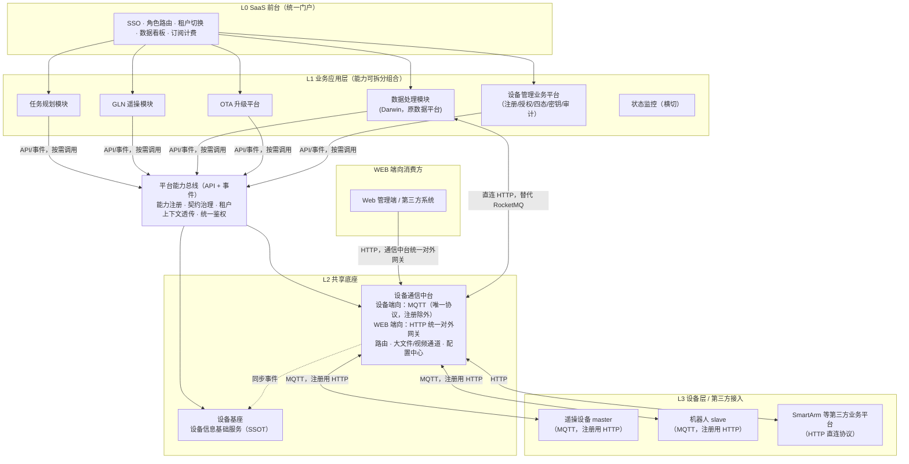

# 睿尔曼达尔文软件平台 V2 架构升级设计：设备基座 / 设备通信中台 / 平台能力总线

| 项 | 内容 |
| --- | --- |
| **文档版本** | v2.2 |
| **日期** | 2026-07-07（2026-07-08 修订）|
| **状态** | 提议 / 待评审 |
| **依据输入** | 《睿尔曼达尔文软件平台·业务架构 v1.2》（产品）、《达尔文设备升级平台 PRD V1.0.0》（OTA）|
| **关联 ADR** | [ADR-0001](../adr/0001-iot-platform-split-device-mqtt-ota.md)（历史决策）、[ADR-0002](../adr/0002-device-foundation-comm-hub-capability-bus.md)（本次决策，修订/扩展 ADR-0001）|
| **前序文档** | [IoT 平台架构升级设计 v1.0](./2026-06-30-iot-platform-architecture-upgrade.md)（2026-06-30，仅设备中台/MQTT 平台/OTA 平台三分）|
| **详细设计（配套）** | [设备基座详细设计](./2026-07-08-device-foundation-detailed-design.md)、[设备通信中台详细设计](./2026-07-08-device-comm-hub-detailed-design.md) |

> 本文档为**总览**：背景、能力盘点、目标架构、迁移路线与关键决策。设备基座与设备通信中台的完整数据模型、接口清单、时序图统一收在配套的两份详细设计文档中，本文档第四、五章只保留结论性内容并指向对应章节，避免同一内容维护两份。

---

## 一、背景

2026-06-30 的 ADR-0001 / 设计 v1.0 已提出把单体 `realman-iot` 拆为「设备管理中台 / MQTT 集成平台 / OTA 平台 / 瘦身 IoT」。此后产品侧输出了两份更完整的输入：

1. **业务架构 v1.2**（`睿尔曼达尔文软件平台·业务架构.html`）：明确了六大业务模块（任务规划、GLN、**数据处理**、设备管理、OTA、状态监控）+ **平台能力总线** + **共享底座**（**设备通信中台** + **设备信息基础服务**）的分层视角，并指出设备管理应"分两层"——底层 SSOT 与前端业务操作分离。
2. **《达尔文设备升级平台 PRD V1.0.0》**：把 OTA 需求做到了可实施粒度（15 状态机、Ed25519 签名/密钥生命周期、master/slave 双通道、以及一套心跳/Token 签发续签吊销/进度推送/状态补传的接口契约）。

这两份输入与 v1.0 设计存在三处需要修订的落差，也是本次升级的触发点：

- v1.0 把"设备管理"当作一个中台；业务架构 v1.2 要求进一步拆成 **设备基座（SSOT）** 与 **设备管理业务平台**（注册/授权/四态/密钥/审计）两层。
- v1.0 只规划了 MQTT 一种协议；产品明确**系统与设备之间的通信协议维持 MQTT 不变**（设备上电自动注册接口除外），但需要新增一层**对外统一输出的 HTTP 接口协议**——服务把各自的能力经由通信中台统一以 REST 形式对外提供，同时为 SmartArm 等后续第三方业务平台预留 HTTP 直连协议入口。OTA PRD 第九章定义的心跳/Token/进度推送接口契约，正是这层 HTTP 协议要承接的逻辑契约——现有 MQTT 设备通过协议适配在设备端向仍走 MQTT 报文，语义上对齐同一套契约。
- v1.0 没有"平台能力总线"这一层；业务架构 v1.2 把它列为业务应用层与共享底座之间的显式分层，是"能力解耦可组合"（即可按客户/项目拆包售卖）的关键。

另外，用户侧提出一个明确的简化点：**数据处理模块（Darwin）是已有能力，在 SaaS 平台化之后不再是需要跨网络域桥接的外部系统，原来为此搭建的 RocketMQ 桥接可以去掉，直接用 HTTP 调用**。本文档第六章给出具体的退役方案。

本文档在 v1.0 基础上补齐这三处，形成 V2 目标架构，并给出能力盘点、目标架构与迁移路线；设备基座与设备通信中台的详细设计见配套文档。

---

## 二、现状能力盘点：已实现 vs 待拆分/待补齐

对照口径：业务架构 v1.2（六大模块 + 能力总线 + 共享底座）与 OTA V1.0.0 PRD。代码依据：`realman-boot-iot` 现状（单体，`org.jeecg.modules.device` 包）。

### 2.1 总体对照

| 业务架构 v1.2 中的模块 | 当前代码落点 | 状态 |
| --- | --- | --- |
| 任务规划模块 | 不存在（数采任务下发目前挂在 `realman-iot` 工单/数采链路里，过渡期由"数据处理暂发"）| **未拆分**，仍与 IoT 业务耦合 |
| GLN（遥操） | `realman-iot` 内 WebRTC/SLAM 相关 handler | 在同一进程内，未独立 |
| 数据处理（Darwin） | 不在本仓库，通过 RocketMQ 与 `realman-iot` 对接（`device.datacollect` 包） | 外部系统，桥接方式待升级（见第六章） |
| 设备管理 | `realman-iot` 内 `RobotDeviceController` / `MasterDeviceController` / `DeviceProvisionController` / `DeviceSecretService` | **未分层**，SSOT 与业务操作混在一起，且未启用租户隔离（`软件架构设计.md` 8.2 节：IoT 模块当前排除 `MybatisPlusSaasConfig`）|
| OTA | `realman-iot` 内 `OtaController` / `IotOtaServiceImpl` / `OtaProgressHandler` | **MVP 级实现**，与 V1.0.0 PRD 差距很大（见 2.3）|
| 状态监控 | 无独立模块，散落在各业务日志里 | 未建设 |
| 平台能力总线 | 不存在 | 需新建（治理层，非新中间件，见第七章）|
| 设备通信中台 | MQTT 部分能力已存在（`MqttAuthController`、`MqttMessageDispatcher`、各 Handler），但内嵌在 `realman-iot`，且只有 MQTT 一种协议 | **未独立**，且缺 HTTP 对外网关（见第五章、[通信中台详细设计](./2026-07-08-device-comm-hub-detailed-design.md)）|
| 设备信息基础服务 | 不存在独立分层；设备基础信息与 `IotDevice` 实体混在设备管理业务表里 | 需从设备管理中拆出（见第四章、[设备基座详细设计](./2026-07-08-device-foundation-detailed-design.md)）|

**结论**：ADR-0001 v1.0 的 Phase 0-4 尚未实际执行（代码库仍是 `realman-boot-iot` 单体 + `realman-boot-system` + Gateway/Nacos 三个可运行单元），只完成了设计文档与一小部分"提前量"——设备 HTTP 自注册（`DeviceProvisionController`，MD5 签名版）。这部分提前量与 OTA 新 PRD 的注册协议（`device_registration_secret` + 租户校验 + Bearer JWT）字段不一致，需要在设备基座落地时对齐，不能直接复用。

### 2.2 设备管理能力盘点

| 能力项 | PRD/业务架构要求 | 现状 | 差距 |
| --- | --- | --- | --- |
| 设备基础信息 SSOT | 独立"设备信息基础服务"层，供全部应用查询 IP/MAC/型号/固件版本 | `IotDevice` 实体与注册/授权/在线状态逻辑同库同服务 | 需要拆出只读基础信息层 |
| 注册与密钥 | `device_registration_secret`（一次性、有效期、频控 5次/h）+ Bearer JWT Token（签发/续签/吊销）| `DeviceProvisionController`：MD5(deviceCode) 签名自注册；`DeviceSecretService`：MQTT 密钥（用于 EMQX 认证）| 两套鉴权模型并存且都不满足新 PRD；需统一为 Token 体系，MQTT 密钥保留给存量 MQTT 设备做兼容 |
| 租户隔离 | tenant_id 创建时绑定不可变更；超管跨租户操作需 `X-Operator-Tenant-Id` + 双 tenant_id 审计 | IoT 模块未接入 `MybatisPlusSaasConfig`（现状按单租户处理）| **明确缺口**，需要补齐，且是 OTA 批量升级（`by_tenant_model`）的前置依赖 |
| 四态/测试标记 | `is_test_device`，超管专属，二次确认防绕过 | 未见实现 | 缺失 |
| 操作审计 | `IDeviceOperationLogService`（已存在）| 已有基础实现 | 需要扩展审计字段（`operator_tenant_id`/`target_tenant_id`/`audit_level`）|
| 在线状态同步 | 由设备通信中台同步至设备管理 | `DeviceOnlineOfflineHandler` 直接写本地 DB/Redis | 逻辑对，但耦合在同一服务里，需要拆分为"中台产生事件 → 设备基座消费"|

### 2.3 OTA 能力盘点（对照 PRD V1.0.0，逐项从严）

| PRD 能力域 | 现状（`OtaController`/`IotOtaServiceImpl`/`OtaProgressHandler`）| 差距 |
| --- | --- | --- |
| 固件包模型 | 仅 `firmwareName/version/productId/description`，无 `.sig` 签名文件、`min_version`、`compatible_models`、`risk_level`、`cancelable_in_executing` | **需要重构固件实体与上传接口** |
| SHA-256 / Ed25519 签名 | 无 | **缺失**，需新建密钥生命周期管理（active/pending_activation/revoked）|
| master/slave 双通道 | `deviceType` 仅区分 1=机器人/2=主控，未做成独立升级链路、互不干扰的任务隔离 | 需要在任务创建/前置校验层面显式区分 |
| 升级方式 | 仅"指定 deviceIds 列表" | 缺 `by_sn`/`by_model`/`all`/`by_tenant_model` 四种模式 |
| 前置校验 | 无 | 缺状态检查、资源检查、版本兼容性（双重校验）、签名吊销校验（双重校验）|
| 状态机 | 8 态：`NOTIFIED→CONFIRMED→DOWNLOADING→DOWNLOADED→INSTALLING→SUCCESS/FAILED/TIMEOUT` | PRD 要求 15 态（含 `PENDING_ONLINE`/`EXECUTING` 三子阶段/`ROLLING_BACK`/`PAUSED`/`CANCELLED` 等），**需要重新建模** |
| 设备通信协议 | 下发走 MQTT publish（`device/{code}/ota/notify`）；进度经 `OtaProgressHandler` 订阅 MQTT 得到 | 现有 master/slave 设备协议维持 MQTT，需要把 PRD 第九章的心跳/Token/进度推送/状态补传语义映射为对应 MQTT Topic；同时通信中台 WEB 端向网关按同一套契约暴露 HTTP 版本，供未来 HTTP 原生设备/第三方业务平台（如 SmartArm）使用 | 需要做**协议等价映射**（MQTT Topic ↔ HTTP Path），而不是把现有 MQTT 设备直接切到 HTTP（见[通信中台详细设计](./2026-07-08-device-comm-hub-detailed-design.md)第五章）|
| 断点续传 | 仅服务端"固件分片上传"支持断点续传（MinIO 侧） | 缺设备侧 HTTP Range 下载续传、OSS 预签名 URL 自动刷新 |
| 批量策略 | 无 | 缺 `fail_threshold`/`pause`/`stop_all`/`continue` |
| 错误码体系 | 无细粒度错误码，仅通用成功/失败 | 缺 PRD 定义的 40+ 错误码 |
| 版本矩阵/版本落后判定 | 无 | 缺失 |
| 系统设置（17 项可配置联动校验）| 无配置中心 | 缺失 |

**结论**：当前 OTA 只覆盖了 PRD 里"固件存储 + 极简任务下发"的一角，且下发/回传通道（MQTT）与 PRD 字面选型（HTTP）需要做协议等价映射才能对齐。这是拆分 OTA 平台时必须一并解决的问题，不能只做"代码搬家"。

### 2.4 数据处理（Darwin）桥接盘点

现状：`realman-iot` 与 Darwin 数采平台通过独立 RocketMQ Broker（`daily_GLN_PLATFORM` 主题）对接 4 条链路（详见 `docs/design/2026-04-27-darwin-rocketmq-integration.md`）：

1. OSS 上传授权申请/响应（Darwin 不能直连 MinIO）
2. OSS 文件地址上报
3. 设备上下线状态推送（`realman-iot` → Darwin）
4. Darwin 工单下发（Darwin → `realman-iot`）

设计初衷写得很清楚："达尔文数采平台" 是**独立部署、不同网络域**的外部系统，MinIO 不可直连、也不共享信任域，所以要用 RocketMQ 异步解耦 + Token 中转。这个前提在 SaaS 平台化之后已经不成立——数据处理模块与设备通信中台现在同属一个 SaaS 平台的内部服务网格，处于同一信任域，可以直接同步 HTTP 调用。第六章给出具体退役方案。

---

## 三、V2 目标架构总览

### 3.1 与 v1.0（ADR-0001）的差异对照

| 维度 | v1.0（2026-06-30）| V2（本次） |
| --- | --- | --- |
| 设备管理 | 单一"设备管理中台" | 拆两层：**设备基座**（SSOT，只读基础信息）+ **设备管理业务平台**（注册/授权/四态/密钥/审计，写操作）|
| 能力总线 | 无显式分层，靠 Feign + Gateway 隐式串联 | 显式新增"平台能力总线"治理层：能力注册目录、契约版本治理、租户上下文统一透传 |
| 设备通信 | 只有 MQTT 集成平台 | **设备通信中台**：设备端向仍是 MQTT 单协议（注册除外）；新增 **WEB 端向 HTTP 统一对外网关**，服务对外 API 输出 + SmartArm 等第三方业务平台接入 |
| OTA 与通信层关系 | OTA 进度经 MQTT 平台转发 MQ 事件 | 现有 master/slave 设备的 OTA 心跳/进度仍经 MQTT 上行，由通信中台归一化后转发给 OTA 平台；OTA PRD 第九章的 HTTP 契约作为 WEB 端向网关的等价协议对外暴露（详见[通信中台详细设计](./2026-07-08-device-comm-hub-detailed-design.md)协议等价映射表）|
| 数据处理对接 | 未提及（仍隐含走现状 RocketMQ）| **明确退役 RocketMQ 桥接，改为通信中台直连 HTTP**（第六章）|
| 迁移阶段 | 4 个 Phase | 拆为 6 个 Phase，且顺序调整为**先立底座（通信中台 + 设备基座）、再建 OTA**（见第九章）|

---

## 四、设备基座概览（设备信息基础服务 + 设备管理业务平台）

> 本章为概览，**完整的数据模型、内外部接口清单、双凭证体系、业务流程时序图见 [设备基座详细设计](./2026-07-08-device-foundation-detailed-design.md)**，本章不重复列出接口细节，只给出结论性的分层原则与现状映射。

### 4.1 分层原则

业务架构 v1.2 明确要求"设备管理拆两层"，理由是：**基础信息查询**（高频、只读、被 GLN/数据处理/OTA/状态监控共同依赖）与**业务操作**（低频、有权限校验、有审计要求）的变更节奏和读写特征完全不同，合并在一起会导致"改审计逻辑要重新部署一个所有人都在查的只读接口"的耦合问题。

| 子层 | 定位 | 读写特征 |
| --- | --- | --- |
| **设备信息基础服务**（`realman-device-info`）| 唯一设备数据源（SSOT），只读为主 | 读多写少，强调低延迟、高可用 |
| **设备管理业务平台**（`realman-device-mgmt`）| 面向运维/租户的业务操作 + 对外 REST + 台账 UI | 写少但需强一致 + 审计 |

两者的调用关系：**设备管理业务平台是 SSOT 的写入方之一**（注册成功后把静态元数据写入 SSOT，密钥/Token/四态/绑定变更后同步投影），此外通信中台（在线态/四态同步）、OTA（固件版本回写）、SmartArm 等第三方业务平台（自有设备的注册写入）也是 SSOT 的独立写入方；**其余业务应用只读 SSOT，不必接入设备管理业务平台**。这是"设备基础信息可以单独对第三方项目输出"的关键设计。

### 4.2 与现状代码的映射

| 现状 | 迁移去向 |
| --- | --- |
| `RobotDeviceController`/`MasterDeviceController` CRUD | 拆分：只读列表/详情 → 设备信息基础服务；启停/授权等写操作 → 设备管理业务平台 |
| `DeviceProvisionController`（MD5 签名自注册）| 重做为符合 PRD 的 `POST /api/v1/devices/register`（`device_registration_secret` + 租户校验 + 双凭证签发），MD5 方案降级为兼容分支，不再是主路径 |
| `DeviceSecretService`（MQTT 密钥）| 保留，供设备通信中台的 MQTT 接入子模块调用（EMQX Auth 校验），与新增的 Device Token 并存，构成双凭证体系（见详细设计 3.3）|
| `IDeviceOperationLogService` | 扩展字段后原样保留在设备管理业务平台 |
| `DeviceOnlineOfflineHandler` 直接写 DB | 改为发布 `online-event` 给设备信息基础服务消费，服务本身移交设备通信中台 |

---

## 五、设备通信中台概览

> 本章为概览，**完整的设备端向/WEB 端向系统设计、Topic/Path 规范、协议等价映射表、部署方案见 [设备通信中台详细设计](./2026-07-08-device-comm-hub-detailed-design.md)**，本章只给出结论性的定位边界；同步/异步选型矩阵作为跨模块的通用决策原则保留于此。

### 5.1 定位与边界

设备通信中台是**设备层与云端所有通信的唯一通道**，分设备端向、WEB 端向两侧看：

- **设备端向（对设备）**：协议维持 **MQTT 一种**，与现状一致，不改变现有设备 SDK。唯一例外是**设备上电后、建立 MQTT 连接前的一次性 HTTP 自注册**（现状 `DeviceProvisionController` 的定位，V2 里完善为对齐设备基座的注册协议；新版本 SDK 需支持此 HTTP 自注册流程，存量设备可由设备管理平台走手动注册兼容）。
- **WEB 端向（对外/服务间）**：新增 **HTTP 统一对外网关**，职责有两个，且互不冲突：① 各业务服务（OTA、设备管理业务平台等）的对外 REST API 经此统一路由输出（而不是各自裸露端口）；② 为 SmartArm 等**后续**第三方业务平台预留 HTTP 直连协议入口，涵盖设备注册、设备信息查询及管理等操作。

OTA PRD 第九章定义的心跳/Token/进度推送/状态补传接口契约，理解为：**现有 MQTT 设备通过设备端向 MQTT Topic 传递同样语义的数据，由通信中台归一化为统一的 `DeviceUplinkEvent` 后转发给 OTA 平台；这套契约同时以 HTTP 形式在 WEB 端向网关对外暴露**，两侧共用同一套内部处理逻辑，只是传输介质不同。完整的 Topic ↔ Path 协议等价映射表见详细设计文档第五章。

### 5.2 同步 / 异步选型矩阵（沿用 ADR-0001 原则，跨模块通用决策，故保留在主文档）

| 场景 | 方式 | 理由 |
| --- | --- | --- |
| 设备信息查询、密钥/Token 校验 | 同步 Feign/HTTP | 低延迟、强一致，且现在都在同一信任域内 |
| 设备端向 MQTT 上行 → 业务处理（心跳/OTA/SLAM/WebRTC）| 内部归一化后同步转发 | 状态机需要立刻可查，不适合异步排队 |
| WEB 端向 HTTP 请求（外部系统 / 第三方业务平台）| 同步处理并即时响应 | 与设备端向共用同一套内部处理逻辑，只是入口协议不同 |
| 通信中台 ↔ 数据处理（Darwin）| **同步 HTTP（不再用 RocketMQ）** | 已同域，无需跨系统解耦，见第六章 |
| 跨 Pod MQTT ACK 等待 | Redis Pub/Sub | 沿用 v1.0 方案，未变 |
| 前端实时进度展示 | WebSocket / SSE，由业务平台自行订阅内部事件 | 沿用 v1.0 方案 |

---

## 六、数据处理模块解耦：RocketMQ → HTTP 直连

### 6.1 为什么现在可以去掉 RocketMQ 桥接

2026-04-27 的桥接设计（`docs/design/2026-04-27-darwin-rocketmq-integration.md`）明确写了原因："达尔文数采平台不能直连 MinIO"、"通过独立 RocketMQ Broker 实现异步消息交换"——前提是达尔文数采平台是一个**独立部署、跨网络域**的外部系统。SaaS 平台化之后，数据处理模块（Darwin）已经是六大业务模块之一，与设备通信中台同属一个平台的内部服务网格，可以直接同步调用彼此的内部 HTTP API，不再需要 MQ 这层网络边界解耦，也不需要为此维护一套独立 RocketMQ Broker、NameServer 互联、DLQ 告警等运维面。

### 6.2 现状 4 条链路 → HTTP 直连方案

| 链路 | 现状（RocketMQ）| V2 方案（HTTP 直连）|
| --- | --- | --- |
| ① 采集授权（OSS STS 凭证）| 机器人→通信中台(MQTT)→`MQ_TOPIC_OSS_AUTH_REQUEST`→数据处理→`MQ_TOPIC_OSS_AUTH_RESPONSE`→通信中台→机器人(MQTT) | 机器人→通信中台(MQTT) 不变；通信中台**同步 HTTP** 调用数据处理 `POST /internal/data-processing/oss-auth`，拿到 STS 凭证后直接下发给设备，去掉一来一回两个 MQ Topic |
| ② OSS 文件地址上报 | 机器人→通信中台(MQTT)→`MQ_TOPIC_FILE_REPORT`→数据处理 | 通信中台收到 MQTT 上报后，**同步 HTTP** 调用 `POST /internal/data-processing/file-report` |
| ③ 设备上下线状态推送 | `DeviceOnlineOfflineHandler`→`MQ_TOPIC_DEVICE_STATUS`→数据处理 | 通信中台在处理 `online-event` 时**同步/异步二选一**均可（此链路允许短暂延迟，可选保留为中台内部事件，但对数据处理的最终投递改为 HTTP webhook 而非跨系统 MQ）|
| ④ Darwin 工单下发 | 数据处理→`MQ_TOPIC_WORK_ORDER_IN`→`realman-iot` 消费创建工单 | 数据处理**直接调用**任务规划模块/通信中台暴露的 `POST /internal/task/data-collect-task` 同步创建，返回结果里带 `taskId`，去掉消费端的幂等去重表依赖 MQ 语义 |

去掉 MQ 之后，原来依赖"消费幂等"的设计（`darwin_workorder_mapping` 唯一键、`darwin:file:report:` Redis 去重 Key、Token 一次性校验）大部分可以保留，因为它们本质是"业务幂等"而不是"消息去重"，只是触发方式从"消费消息"变成"处理 HTTP 请求"，用请求参数里的业务唯一键（`darwinOrderId`/`darwinFileId`）做同样的幂等校验即可，不需要重新设计。

### 6.3 需要下线/改造的现有代码

| 现有文件（`device.datacollect` 包）| 处理方式 |
| --- | --- |
| `MqSendHelper.java`、`producer/*`（`OssAuthRequestProducer`/`FileAddressReportProducer`/`DeviceStatusProducer`）| 下线，替换为 HTTP Client 调用（复用通信中台内的 Feign/RestTemplate 封装）|
| `consumer/*`（`OssAuthResponseConsumer`/`WorkOrderCreateConsumer`/`FileReportConsumer`）| 下线，替换为暴露给数据处理调用的 Controller |
| `MqConsumerLogAspect`/`MqMessageLogService` | 保留其"消息可观测性"设计思路，改造为 HTTP 请求/响应审计日志（复用现有 Micrometer 指标命名）|
| `DataCollectConstant` 中的 `MQ_TOPIC_*`/`MQ_TAG_*`/`MQ_GROUP_*` 常量 | 标记 Deprecated，替换为 HTTP 路径常量 |
| `docs/design/2026-04-27-darwin-rocketmq-integration.md` | 保留作为历史记录，文档头部加"已被 HTTP 直连方案取代"提示（不删除，便于追溯）|

### 6.4 何时仍需要异步事件

如果未来出现真正需要"削峰填谷 + 多消费者广播"的场景（例如心跳量级增长到需要多个下游同时消费做实时分析），可以在**通信中台内部**保留一条事件总线（沿用现有 RocketMQ Broker），但这条边界要卡清楚：**它只服务于平台内部的多消费者广播需求，不再作为"设备通信中台 ↔ 数据处理"这种同域内两个业务模块之间的桥接手段**。同域内模块间调用一律走平台能力总线的同步契约（Feign/HTTP）。

### 6.5 迁移方式

采用双写过渡（不是一刀切）：

1. 通信中台新增 HTTP 直连 Client，与现有 RocketMQ Producer 并行运行，功能开关（`darwin.integration.http-enabled`）控制走哪条路径。
2. 灰度验证 HTTP 路径的正确性与延迟指标（对比 MQ 路径的现有 Micrometer 指标）。
3. 验证通过后关闭 RocketMQ 路径开关，观察一个完整业务周期无异常。
4. 下线 RocketMQ 相关生产者/消费者代码与独立 Broker 部署（若该 Broker 没有其他用途）。

---

## 七、平台能力总线设计

### 7.1 它解决什么问题

业务架构 v1.2 的原话："应用 → 能力总线 → 共享底座，五个业务模块按需调用底座，能力解耦可组合"。这句话背后的真实需求是**产品化/可拆包**：第三方项目只需要设备管理 + 设备通信能力，不需要 GLN/数据处理；私有化客户只需要部分模块随包部署。要做到"按需组合"，业务应用与共享底座之间就不能有隐式的、写死的调用关系，必须有一层显式的契约与治理。

### 7.2 落地方式（治理规范 + 现有设施组合，而非新中间件）

平台能力总线**不是**一个需要单独部署的物理组件，而是由以下四件事组成的治理层，全部基于现有技术栈（Spring Cloud Gateway + Nacos + OpenFeign + 现有 RocketMQ）：

| 组成 | 具体内容 |
| --- | --- |
| **能力注册与发现** | Nacos 服务注册 + 每个共享底座服务发布一个 `*-contract` Maven 模块（DTO + Feign 接口 + 事件 Schema），`*-contract` 即"能力目录"的机器可读形式 |
| **能力清单文档** | 新增 `docs/design/capability-catalog.md`（后续文档，Phase 0 产出），列出所有可被业务应用调用的底座 API/事件，标注哪些能力是"可选打包"的、哪些是"强依赖" |
| **统一鉴权与租户上下文透传** | Gateway 层解析 JWT 得到 `operator`/`tenant_id`，通过请求头（含 PRD 要求的 `X-Operator-Tenant-Id`）透传到下游 Feign 调用，下游服务不用各自重新鉴权，只需校验请求头 |
| **契约版本治理** | `*-contract` 模块语义化版本（SemVer），废弃字段走公告期，业务应用按版本锁定依赖，避免底座升级导致业务应用被动破坏 |

### 7.3 与设备通信中台的关系

设备通信中台是能力总线之下"设备侧能力"这一类目的具体实现者；能力总线本身不关心设备协议细节，只关心"业务应用如何发现、调用、鉴权访问通信中台暴露的契约"。通信中台的 WEB 端向 HTTP 网关（见[通信中台详细设计](./2026-07-08-device-comm-hub-detailed-design.md)第四章）正是"设备域能力"通过能力总线对外/对第三方输出的具体承载——**通信中台是被总线治理的众多底座服务之一**，两者不是同一层。

---

## 八、其他模块的调整说明（基于设备基座 + 通信中台基线的修订）

设备基座与通信中台的详细设计确定后，其余模块的设计需要按以下几点收敛，避免各自再对"设备怎么连、数据怎么来"做重复假设：

| 模块 | 调整点 |
| --- | --- |
| **OTA 平台** | 设备侧协议维持 MQTT，不是切到 HTTP；OTA PRD 第九章的心跳/Token/进度推送契约通过通信中台的"协议等价映射表"（[详见](./2026-07-08-device-comm-hub-detailed-design.md#五统一上行事件模型与协议等价映射表核心交付)）以 `DeviceUplinkEvent` 形式消费，OTA 平台只需实现一套业务逻辑，不用区分协议来源。OTA 自身的管理端 API（固件管理、任务管理）经通信中台 WEB 端向网关统一对外输出。`is_test_device` 等前置校验字段一律只读设备基座 SSOT，不自建设备表。|
| **数据处理模块（Darwin）** | 与通信中台之间走服务间直连 HTTP（第六章），这与"设备端向 MQTT 不变"无关——是两个后端服务的相互调用，不经过设备协议适配层，也不经过 WEB 端向对外网关。 |
| **GLN（遥操）/ 任务规划** | 遥操指令、视频信令、SLAM 数据继续走通信中台设备端向 MQTT，不受本次修订影响；下发任务前对设备状态（在线态/四态/主控-机器人绑定）的查询一律走设备基座 SSOT 只读接口，不再各自维护设备表或直连设备确认状态。 |
| **状态监控** | 作为横切能力，统一订阅通信中台归一化后的 `DeviceUplinkEvent` 与设备基座的操作审计事件，不需要单独适配 MQTT/HTTP 两种协议——协议差异已经在通信中台内部被抹平。 |
| **平台能力总线** | 治理层设计不变（第七章）；新增的强调点是"设备域"能力的对外契约输出具体由通信中台 WEB 端向网关承载，总线的其余部分（Nacos 注册、`*-contract` 模块、契约版本治理）覆盖全部业务应用与底座之间的调用，不只是设备相关的。 |

---

## 九、迁移路线图（在 ADR-0001 五阶段基础上修订，顺序调整为先立底座再建 OTA）

| 阶段 | 目标 | 关键动作 | 周期 |
| --- | --- | --- | --- |
| Phase 0 契约先行 | 定规矩 | 新建 `*-contract` 模块；产出能力清单文档；Gateway 路由与 Nacos 配置模板预留 | 1 周 |
| Phase 1 设备通信中台独立 | 通信层独立，设备端向 MQTT 不变 + 新增 WEB 端向 HTTP 网关 | 迁移 MQTT 相关代码（设备端向不变）；新增 WEB 端向 HTTP 网关子模块（服务对外 API 输出 + 为 SmartArm 等第三方业务平台预留协议扩展点）；建协议等价映射表与路由注册表 | 2 周 |
| Phase 2 设备基座二次拆分 | 设备管理拆两层 | 先落设备信息基础服务（只读 SSOT），再迁移设备管理业务平台（注册/Token/租户/四态/审计）；补齐租户隔离（IoT 模块当前缺失）| 2 周 |
| Phase 3 OTA 平台独立 + 能力对齐 | OTA 成为独立平台，**设备侧协议维持 MQTT**，按 PRD 补齐能力 | 迁移固件/任务/状态机代码到新服务；**重建 15 态状态机、密钥生命周期、批量升级策略、错误码体系**（对齐 PRD，而不是照搬现有 8 态）；心跳/进度/Token 等语义映射为 MQTT Topic | 2 周 |
| Phase 4 数据处理 HTTP 化 | 退役 RocketMQ 桥接 | 按第六章方案双写过渡、灰度、下线 | 2 周 |
| Phase 5 能力总线治理落地 + IoT 瘦身 | 收尾 | 发布能力清单文档、契约版本策略；删除已迁移旧代码；统一 traceId 跨平台传播 | 2 周 |

**总周期预估 11 周 / 4 人**。相比 v1.0 把 OTA 排在最先，V2 把设备通信中台与设备基座提到前两个 Phase——这两块是整个架构的基线，业务应用（尤其是 OTA）依赖它们提供的设备身份、在线状态、协议路由能力，先立底座能让 OTA 少返工一次。迁移原则不变：旧入口保留兼容代理，全部验证通过后再删除旧代码，客户无感知。

---

## 十、关键决策与风险

| 决策点 | 结论 | 理由 |
| --- | --- | --- |
| 现有设备（master/slave）是否需要支持 HTTP 协议 | **是**，维持 MQTT 的同时，要支持设备上电自注册调用 HTTP 协议 | 设备上电自动注册为新增能力，存量设备 SDK 可不支持（设备管理平台支持手动注册兼容），新版本 SDK 需支持 |
| OTA PRD 第九章的 HTTP 接口契约放在哪里 | 作为通信中台 WEB 端向网关对外暴露的逻辑契约；现有 MQTT 设备通过协议等价映射复用同一套内部处理逻辑 | 一套契约、两种传输介质，避免 OTA 平台自己再维护一套"MQTT 版"和"HTTP 版"两份业务逻辑 |
| OTA 状态机是否照搬现有 8 态 | 否，按 PRD 重建 15 态 | 现有 8 态缺失 `PENDING_ONLINE`/`EXECUTING` 子阶段/回滚/暂停等关键语义，照搬会导致交付后仍需二次返工 |
| 数据处理桥接是否保留任何异步能力 | 平台内部可保留事件总线，但不跨越到数据处理这条边界 | 明确"同域内用同步契约、跨域/削峰才用异步"的选型原则，避免退化回过度设计 |
| 设备管理租户隔离缺失 | 必须在设备基座落地时补齐 | OTA 的 `by_tenant_model` 批量升级、超管跨租户审计均依赖此能力，是阻塞项而非可选项 |
| 迁移顺序：OTA 先行还是底座先行 | **底座（通信中台 + 设备基座）先行**，OTA 排在其后 | OTA 依赖底座提供的设备身份/在线状态/协议路由能力；底座先行可避免 OTA 交付后因底座接口变化而返工 |

**主要风险**：

- OTA 能力差距被低估会导致 Phase 3 排期超期——建议 Phase 3 启动前先做一次独立的 OTA 详细设计评审（状态机、密钥管理、错误码），单独排期，不与"搬家"混在一起估算。
- 数据处理 HTTP 化涉及对端（Darwin 团队）配合改造调用方式，需要提前对齐排期，避免单方面切换导致联调阻塞。
- 设备管理引入租户隔离是存量数据的一次结构性变更，需要评估现有 `iot_device` 等表的数据迁移/回填方案（不在本文档范围，需单独出数据迁移方案）。

---

## 十一、后续需要跟进的文档

- [x] 设备基座详细设计（[已产出](./2026-07-08-device-foundation-detailed-design.md)）
- [x] 设备通信中台详细设计（[已产出](./2026-07-08-device-comm-hub-detailed-design.md)）
- [ ] `docs/design/capability-catalog.md`（能力清单，Phase 0 产出）
- [ ] OTA 平台详细设计（状态机、密钥管理、错误码、系统设置的完整技术方案，对照本文档 2.3 差距表逐项设计；设备侧协议按通信中台的协议等价映射表对齐）
- [ ] 设备管理数据迁移方案（租户隔离补齐、SSOT 与业务表拆分的数据迁移脚本，见设备基座详细设计第五章）
- [ ] 数据处理 HTTP 直连接口契约（`*-contract` 模块，双方评审）
