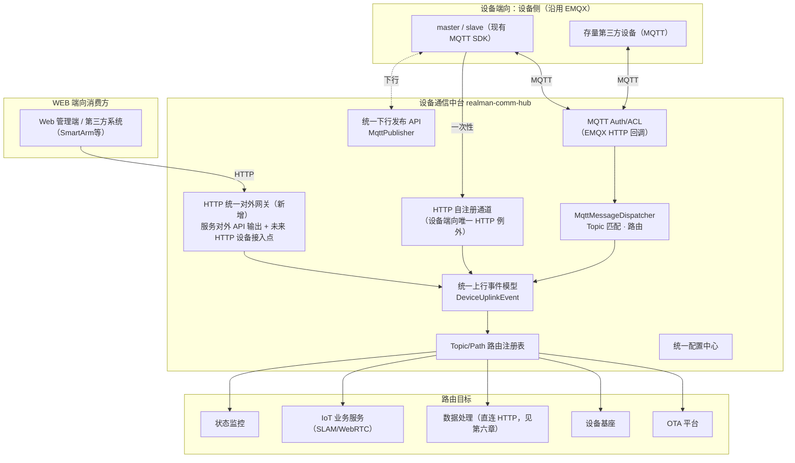

# 设备通信中台详细设计：设备端向 MQTT（协议不变）+ WEB 端向 HTTP 统一对外网关

| 项 | 内容 |
| --- | --- |
| **文档版本** | v1.0 |
| **日期** | 2026-07-08 |
| **状态** | 提议 / 待评审 |
| **上级文档** | [睿尔曼达尔文软件平台 V2 架构升级设计](./2026-07-07-darwin-platform-v2-capability-bus-and-comm-hub.md) 第五章（本文档是该章的详细展开）|
| **姊妹文档** | [设备基座详细设计](./2026-07-08-device-foundation-detailed-design.md) |

## 先决说明

设备通信中台支持 **MQTT + HTTP** 双协议：

- **系统与设备之间的通信协议维持 MQTT 一种**，与现状（EMQX + `MqttAuthController`/`MqttMessageDispatcher`）完全一致，不需要现有设备 SDK 做任何协议改造。
- **唯一例外**：设备上电后、建立 MQTT 连接之前的一次性 HTTP 自注册（现状 `DeviceProvisionController` 的定位），因为此时设备还没有 MQTT 连接凭证，必须先用 HTTP 换取凭证。
- 新增的**HTTP**能力是**WEB 端向**——通信中台对外统一输出的接口协议，服务两件事：① 各业务服务（OTA、设备管理业务平台等）的对外 REST API 统一经此输出；② 为 SmartArm 等**后续**不采用现有 MQTT SDK 的设备类型，预留一条可选的 HTTP 直连协议入口。这两件事都不影响现有设备的通信方式。

本文档下文的"设备端向"专指现有设备通信（MQTT + 注册例外），"WEB 端向"专指对外 HTTP 网关。

---

## 一、总体架构



---

## 二、设备端向设计：MQTT 接入层（协议不变，梳理现状 + 补充规范）

### 2.1 现状能力延用清单

以下能力原样保留，架构上从 `realman-boot-iot` 单体迁移为独立服务 `realman-comm-hub`，逻辑不变：

| 组件 | 职责 | 现状文件 |
| --- | --- | --- |
| MQTT Auth/ACL | EMQX 连接鉴权/权限回调 | `MqttAuthController` |
| Dispatcher | Topic 匹配、节流、分发 | `MqttMessageDispatcher` |
| Publisher | 统一下行发布 | `MqttPublisher` |
| Watchdog | MQTT 客户端健康自检 | `MqttClientWatchdog`（`iot-platform/heartbeat` 自检 Topic）|
| 集群 ACK 协调 | 跨 Pod 完成 Future | `RedisPendingListenerConfig` |
| 设备密钥校验 | EMQX 密码即 `deviceSecret` | `DeviceSecretService`（迁移后由设备基座提供校验能力，见设备基座详细设计 3.3）|

### 2.2 Topic 规范（现状梳理 + 补充）

现状 Topic 命名遵循 `device/{deviceCode}/{子路径}` 模式（`MqttMessageDispatcher.DEVICE_TOPIC` 正则），另有历史遗留的 `{code}/master|slave/...` 与 `master/{code}/command/{cmd}/ack` 形式（兼容保留，不新增）。V2 统一新增 Topic 一律采用 `device/{deviceCode}/{子路径}` 规范：

| Topic 模式 | 方向 | 说明 |
| --- | --- | --- |
| `device/{code}/status/report` | 上行 | 设备状态上报 |
| `device/{code}/ota/notify` | 下行 | OTA 升级通知 |
| `device/{code}/ota/progress` | 上行 | OTA 升级进度（现状 8 态，V2 升级为对齐 PRD 的 15 态语义）|
| `device/{code}/ota/heartbeat`（新增，语义对齐 OTA PRD 心跳接口）| 上行 | 心跳 + 资源信息，替代/补充现状轮询方式 |
| `device/{code}/ota/token-refresh`（新增）| 上行/下行 | MQTT 设备的 Device Token 续签（见设备基座详细设计 3.3）|
| `device/{code}/slam/*` | 上行/下行 | SLAM 建图/定位/导航 |
| `device/{code}/datacollect/*` | 上行/下行 | 数采指令与 OSS 回传（详见 `DataCollectConstant`）|
| `$SYS/brokers/+/clients/+/connected`、`.../disconnected` | 上行（EMQX 系统事件）| 设备上下线，驱动 `online-event` |
| `iot-platform/heartbeat` | 内部 | 平台自检，非设备报文 |

### 2.3 设备鉴权（连接层，不变）

设备使用 `deviceCode` 作为 MQTT `clientId`，`deviceSecret`（由设备基座在注册时签发，见设备基座详细设计 3.3）作为连接密码；EMQX 通过 HTTP 回调 `POST /internal/mqtt/auth`、`POST /internal/mqtt/acl` 向通信中台校验，通信中台再经 Feign 调用设备基座核对密钥。这条链路完全不变。

### 2.4 消息路由注册表（设备端向部分）

| 来源 Topic | 目标 | 传输方式 |
| --- | --- | --- |
| `device/{code}/ota/*` | OTA 平台 | 归一化为 `DeviceUplinkEvent` 后 Feign 转发 |
| `device/{code}/slam/*` | IoT 业务服务 | 内部事件 |
| `device/{code}/datacollect/*` | 数据处理模块 | **HTTP 直连（见第六章，替代原 RocketMQ）** |
| `device/{code}/status/report` | 设备基座（heartbeat-snapshot）| Feign 转发 |
| `$SYS/.../connected` \| `disconnected` | 设备基座（online-event）| Feign 转发 |

---

## 三、设备端向唯一例外：设备上电 HTTP 自注册

### 3.1 接口

沿用现状 `DeviceProvisionController` 的定位（`POST /internal/device/provision`），但内部处理逻辑对齐设备基座的注册流程（`device_registration_secret` + 双凭证签发），不再是现状的 MD5 签名方案：

| 属性 | 说明 |
| --- | --- |
| 接口路径 | `POST /internal/device/provision`（对设备暴露的地址不变，仍是通信中台的内网地址；建议 Nginx IP 白名单限制仅设备网段可达）|
| 请求体 | `device_sn`、`device_type`、`tenant_id`、`device_registration_secret`、`mac_address`、`device_model` |
| 处理 | 通信中台**只做转发**，不做业务校验；实际校验/签发逻辑在设备基座（设备管理业务平台），见设备基座详细设计 3.4/3.5 |
| 响应 | `device_id`、`deviceSecret`（用于后续 MQTT CONNECT）、（如适用）Device Token |

### 3.2 为什么这一步必须是 HTTP

MQTT 连接本身需要 `clientId`/`password`（即 `deviceSecret`），而这个凭证正是注册流程要签发的东西——设备在拿到凭证之前无法建立 MQTT 连接，所以引导步骤天然只能是 HTTP（或其他无需预先凭证的协议），这是行业通用做法，不是本次新增的架构决策，只是把它明确纳入通信中台的职责范围并对齐设备基座的凭证模型。

---

## 四、WEB 端向设计：HTTP 统一对外网关（新增）

### 4.1 定位：不是设备协议，是两件事的统一出口

| 用途 | 说明 |
| --- | --- |
| ① 服务对外 API 统一输出 | OTA、设备管理业务平台等服务的对外 REST API，不各自裸露端口，而是经通信中台WEB 端向网关统一路由、统一鉴权、统一限流、统一审计后输出。好处：外部系统/第三方项目只需要对接一个网关地址和一套鉴权模型，不用关心后端具体拆了几个服务。 |
| ② 未来 HTTP 原生设备的协议适配点 | 为 SmartArm 等**后续**不采用现有 MQTT SDK 的设备类型，预留标准化 HTTP 接入协议（心跳、进度上报等，语义对齐 OTA PRD 第九章），落地时机由产品排期决定，架构上先把网关能力建好。 |

### 4.2 与 `realman-gateway`（Spring Cloud Gateway）的边界

平台已有一个面向 Web 管理端的通用网关 `realman-gateway`（详见 `docs/realman-boot-microservices-architecture.md`）。两者不是竞争关系，边界如下：

| 维度 | `realman-gateway`（既有）| 通信中台WEB 端向网关（新增）|
| --- | --- | --- |
| 服务对象 | Web 管理端、内部前端调用 | 设备域相关的外部系统集成（大洋电机等）、未来 HTTP 原生设备（SmartArm）|
| 路由范围 | 全平台所有对外业务 API（用户、权限、任务规划 UI、数据处理 UI 等）| 仅"设备/通信"相关能力（设备心跳、进度上报、Token 生命周期、以及 OTA/设备管理业务平台里明确需要对外暴露的设备协议契约）|
| 鉴权模型 | Shiro + JWT（管理端用户身份）| Device Token（JWT，设备身份）+ 服务级 API Key（第三方系统）|
| 典型请求方 | 浏览器 / 管理后台 | 设备固件 / 第三方平台服务端 |

实际部署上，通信中台WEB 端向网关可以是 `realman-gateway` 之下的一组独立路由前缀（如 `/comm-hub/**`），也可以是独立部署的轻量网关——具体部署形态在 Phase 2 落地时按运维便利性决定，本文档只固定"职责边界"，不强制物理拓扑。

### 4.3 对外 API 清单（按后端服务分组，通信中台仅做路由/鉴权，不承载业务逻辑）

| 路径前缀 | 真实后端 | 说明 |
| --- | --- | --- |
| `/api/v1/ota/**` | OTA 平台 | 固件管理、任务管理、进度查询等（对齐 OTA PRD 9.1-9.6）|
| `/api/v1/devices/heartbeat`、`/token/**`、`/register` | 设备基座（设备管理业务平台）| 对齐 OTA PRD 9.7-9.8；现有 MQTT 设备的等价语义走设备端向 Topic，此处主要服务外部系统与未来 HTTP 设备 |
| `/api/v1/admin/devices/**` | 设备基座（设备管理业务平台）| 注册凭证管理、批量离线注册 |
| `/api/v1/devices` (查询类) | 设备基座（只读代理 SSOT + 业务层聚合）| 台账查询 |

### 4.4 鉴权模型

- **设备身份**：Device Token（JWT），校验规则与设备端向 MQTT 报文里携带的 Token 完全一致（见设备基座详细设计 3.3），保证"同一份逻辑契约，不管走哪条通道，鉴权规则不重复实现"。
- **第三方系统身份**：API Key + 租户上下文（`X-Operator-Tenant-Id` 等，对齐平台能力总线的统一鉴权规范），用于大洋电机等项目集成场景。
- **限流与幂等**：复用 OTA PRD 定义的频控规则（如注册 5 次/小时、凭证生成 10 次/小时），在网关层统一实现，避免每个后端服务各自实现一遍。

---

## 五、统一上行事件模型与协议等价映射表（核心交付）

### 5.1 `DeviceUplinkEvent`

无论数据来自设备端向 MQTT 报文体、设备端向 HTTP 自注册请求，还是WEB 端向网关收到的 HTTP 请求，接入层都归一化为同一个内部事件对象：

```json
{
  "deviceId": "uuid",
  "deviceCode": "RM-2026000123",
  "deviceType": "MASTER | SLAVE | SMART_ARM",
  "tenantId": "tenant-001",
  "eventKind": "HEARTBEAT | OTA_PROGRESS | OTA_STATUS_REPORT | ONLINE | OFFLINE | REGISTER | TOKEN_REFRESH",
  "transport": "MQTT | HTTP",
  "payload": { "...": "..." },
  "reportedAt": "2026-07-08T10:00:00Z"
}
```

下游（OTA 平台、设备基座等）消费这个统一事件对象，**不需要关心 `transport` 字段之外的协议差异**，路由规则、审计埋点、状态监控埋点只写一套逻辑。

### 5.2 协议等价映射表

这张表回答"同一个逻辑操作，MQTT 设备怎么发、HTTP 设备/外部系统怎么发、内部怎么统一处理"：

| 逻辑操作 | 设备端向 MQTT（现有 master/slave）| WEB 端向 HTTP（外部系统 / 未来 SmartArm）| 内部归一化后 `eventKind` |
| --- | --- | --- | --- |
| 设备心跳（含资源信息）| `device/{code}/ota/heartbeat`（上行）| `POST /api/v1/devices/heartbeat` | `HEARTBEAT` |
| OTA 下发通知 | `device/{code}/ota/notify`（下行，由 OTA 平台经统一发布 API 下发）| WEB 端向暂无对应下行接口（HTTP 设备场景下改为设备定时轮询或平台侧 Webhook 回调，视 SmartArm 接入方案确定）| — |
| OTA 进度上报 | `device/{code}/ota/progress`（上行）| `POST /api/v1/ota/tasks/{id}/progress-push` | `OTA_PROGRESS` |
| OTA 状态补传（离线缓存）| `device/{code}/ota/status-report`（上行）| `POST /api/v1/ota/tasks/{id}/status-report` | `OTA_STATUS_REPORT` |
| 资源探测（后台主动询问）| `device/{code}/ota/resource-probe`（下行）| （WEB 端向暂不适用，HTTP 设备可用同步请求-响应模型替代）| — |
| Device Token 续签 | `device/{code}/ota/token-refresh`（上行携带旧 Token，下行返回新 Token）| `POST /api/v1/devices/token/refresh` | `TOKEN_REFRESH` |
| 设备注册（唯一无 MQTT 等价的设备端向操作，因为此时还没有 MQTT 连接）| `POST /internal/device/provision`（设备端向 HTTP 例外）| `POST /api/v1/devices/register`（WEB 端向，供未来 HTTP 原生设备使用）| `REGISTER` |
| 设备上下线 | `$SYS/.../connected` \| `disconnected`（EMQX 系统事件，非设备主动 payload）| HTTP 设备无常连概念，通过心跳超时推断离线，或显式 `POST /api/v1/devices/{id}/offline`（预留，视 SmartArm 方案确定）| `ONLINE` / `OFFLINE` |
| 数采指令下发/回传 | `device/{code}/datacollect/*`| 不涉及（数据处理模块与通信中台之间走服务间直连 HTTP，与设备协议无关，见第六章）| — |

**结论**：现有 master/slave 设备的 OTA 相关行为，语义上完全对齐 OTA PRD 第九章定义的契约，只是传输介质是 MQTT Topic 而不是 PRD 字面写的 HTTP Path；WEB 端向网关把同一套契约以 HTTP 形式对外暴露，服务外部系统与未来的 HTTP 原生设备。OTA 平台内部只实现一套业务逻辑（消费 `DeviceUplinkEvent`），不需要为两种协议各写一遍状态机。

---

## 六、与数据处理模块的 HTTP 直连集成（复述并细化 ADR-0002 第六章）

通信中台与数据处理模块（Darwin）之间是**服务间直连**，与本文档第四章的"WEB 端向对外网关"是两回事——这是同一信任域内两个后端服务的相互调用，不经过网关的设备协议适配层。

| 接口 | 方向 | 说明 |
| --- | --- | --- |
| `POST /internal/data-processing/oss-auth` | 通信中台 → 数据处理 | 替代原 `MQ_TOPIC_OSS_AUTH_REQUEST`/`RESPONSE`，同步获取 OSS STS 凭证后直接下发给设备 |
| `POST /internal/data-processing/file-report` | 通信中台 → 数据处理 | 替代原 `MQ_TOPIC_FILE_REPORT` |
| `POST /internal/data-processing/device-status` | 通信中台 → 数据处理 | 替代原 `MQ_TOPIC_DEVICE_STATUS`（可选保留短暂延迟，见 ADR-0002）|
| `POST /internal/task/data-collect-task` | 数据处理 → 通信中台/任务规划 | 替代原 `MQ_TOPIC_WORK_ORDER_IN`，同步创建采集任务并返回 `taskId` |

详细的迁移方式、幂等设计、下线清单见 [V2 主设计文档第六章](./2026-07-07-darwin-platform-v2-capability-bus-and-comm-hub.md#六数据处理模块解耦rocketmq--http-直连)，本文档不重复。

---

## 七、部署与扩缩容注意事项

- **设备端向 MQTT 与WEB 端向 HTTP 建议分离部署**（不同端口/不同 Pod 副本组），因为两者的流量特征不同：设备端向是长连接、高并发心跳，WEB 端向是短连接、突发请求；分离后可以独立扩缩容，互不影响。
- **EMQX Auth/ACL 回调**建议继续直连通信中台（Nginx IP 白名单），不经过WEB 端向网关或 `realman-gateway`，保持现状的低延迟路径不变。
- **WEB 端向网关**可以复用 `realman-gateway` 的基础设施（同一 Nacos 注册、同一套限流组件），但路由规则和鉴权模型独立配置。
- **统一配置中心**（场景等全局配置）与南WEB 端向解耦，任何一侧的协议扩展都不影响配置中心的读写路径。

---

## 八、迁移落地计划（细化 V2 主设计文档 Phase 2）

| 步骤 | 内容 |
| --- | --- |
| 1 | 迁移现有 MQTT 相关代码（`MqttAuthController`/`MqttMessageDispatcher`/`MqttPublisher`/`MqttClientWatchdog`/`RedisPendingListenerConfig`）到独立服务 `realman-comm-hub`，协议与逻辑不变，只是换个进程运行 |
| 2 | 补充 `device/{code}/ota/heartbeat`、`/token-refresh` 等新增 Topic 的 Handler，落地 `DeviceUplinkEvent` 归一化模型 |
| 3 | 新建WEB 端向 HTTP 网关子模块，先落地"服务对外 API 统一输出"这一用途（OTA/设备基座 API 反向代理），SmartArm 的 HTTP 原生设备接入点作为可选扩展点先预留路由骨架，不强制本阶段实现 |
| 4 | 按第六章方案，新增与数据处理模块的 HTTP 直连 Client，双写过渡后下线 RocketMQ 相关代码 |
| 5 | 路由注册表落地为可配置项（数据库或 Nacos 配置），支持新增 Topic/Path 无需改动核心分发逻辑 |


