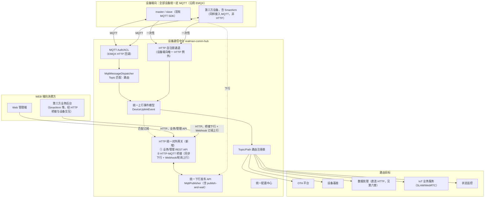

# 设备通信中台详细设计：设备端向 MQTT（协议不变）+ WEB 端向 HTTP 统一对外网关

| 项 | 内容 |
| --- | --- |
| **文档版本** | v1.0 |
| **日期** | 2026-07-08 |
| **状态** | 提议 / 待评审 |
| **上级文档** | [睿尔曼达尔文软件平台 V2 架构升级设计](./2026-07-07-darwin-platform-v2-capability-bus-and-comm-hub.md) 第五章（本文档是该章的详细展开）|
| **姊妹文档** | [设备基座详细设计](./2026-07-08-device-foundation-detailed-design.md) |

## 先决说明

设备通信中台**只有一种设备协议：MQTT**。包括 SmartArm 等第三方设备在内，任何实体设备与通信中台之间的持续通信（心跳、指令、进度、数据）都走 MQTT——不存在"部分设备走 HTTP"的情况：

- **系统与设备之间的通信协议维持 MQTT 一种**，与现状（EMQX + `MqttAuthController`/`MqttMessageDispatcher`）完全一致，不需要现有设备 SDK 做任何协议改造，也不需要 SmartArm 等新设备类型改用 HTTP 接入。
- **唯一例外**：设备上电后、建立 MQTT 连接之前的一次性 HTTP 自注册（现状 `DeviceProvisionController` 的定位），因为此时设备还没有 MQTT 连接凭证，必须先用 HTTP 换取凭证。
- 新增的 **WEB 端向 HTTP** 能力**不是设备协议**，服务两件事：① 各业务服务（OTA、设备管理业务平台等）的对外 REST API 统一经此输出（业务/管理查询类）；② **HTTP-MQTT 桥接**——供 SmartArm 等第三方的**业务后台系统**（不是设备本身）通过标准 HTTP 请求/响应与设备交互（下发指令、查询/订阅设备数据），由通信中台在内部转译为 MQTT 发布/订阅，第三方后台无需自行实现 MQTT 客户端。桥接的详细设计见第四章 4.3。

本文档下文的"设备端向"专指设备通信（MQTT + 注册例外），"WEB 端向"专指对外 HTTP 网关（业务 API + HTTP-MQTT 桥接）。

---

## 一、总体架构



---

## 二、设备端向设计：MQTT 接入层（协议不变，梳理现状 + 补充规范）

### 2.1 现状能力延用清单

以下能力原样保留，架构上从 `realman-boot-iot` 单体迁移为独立服务 `realman-comm-hub`，逻辑不变：

| 组件 | 职责 | 现状文件 |
| --- | --- | --- |
| MQTT Auth/ACL | EMQX 连接鉴权/权限回调 | `MqttAuthController` |
| Dispatcher | Topic 匹配、节流、分发 | `MqttMessageDispatcher` |
| Publisher | 统一下行发布 | `MqttPublisher` |
| Watchdog | MQTT 客户端健康自检 | `MqttClientWatchdog`（`iot-platform/heartbeat` 自检 Topic）|
| 集群 ACK 协调 | 跨 Pod 完成 Future | `RedisPendingListenerConfig` |
| 设备密钥校验 | EMQX 密码即 `deviceSecret` | `DeviceSecretService`（迁移后由设备基座提供校验能力，见设备基座详细设计 3.3）|

### 2.2 Topic 规范（现状梳理 + 补充）

现状 Topic 命名遵循 `device/{deviceCode}/{子路径}` 模式（`MqttMessageDispatcher.DEVICE_TOPIC` 正则），另有历史遗留的 `{code}/master|slave/...` 与 `master/{code}/command/{cmd}/ack` 形式（兼容保留，不新增）。V2 统一新增 Topic 一律采用 `device/{deviceCode}/{子路径}` 规范：

| Topic 模式 | 方向 | 说明 |
| --- | --- | --- |
| `device/{code}/status/report` | 上行 | 设备状态上报 |
| `device/{code}/ota/notify` | 下行 | OTA 升级通知 |
| `device/{code}/ota/progress` | 上行 | OTA 升级进度（现状 8 态，V2 升级为对齐 PRD 的 15 态语义）|
| `device/{code}/ota/heartbeat`（新增，语义对齐 OTA PRD 心跳接口）| 上行 | 心跳 + 资源信息，替代/补充现状轮询方式 |
| `device/{code}/ota/token-refresh`（新增）| 上行/下行 | MQTT 设备的 Device Token 续签（见设备基座详细设计 3.3）|
| `device/{code}/slam/*` | 上行/下行 | SLAM 建图/定位/导航 |
| `device/{code}/datacollect/*` | 上行/下行 | 数采指令与 OSS 回传（详见 `DataCollectConstant`）|
| `$SYS/brokers/+/clients/+/connected`、`.../disconnected` | 上行（EMQX 系统事件）| 设备上下线，驱动 `online-event` |
| `iot-platform/heartbeat` | 内部 | 平台自检，非设备报文 |

### 2.3 设备鉴权（连接层，不变）

设备使用 `deviceCode` 作为 MQTT `clientId`，`deviceSecret`（由设备基座在注册时签发，见设备基座详细设计 3.3）作为连接密码；EMQX 通过 HTTP 回调 `POST /internal/mqtt/auth`、`POST /internal/mqtt/acl` 向通信中台校验，通信中台再经 Feign 调用设备基座核对密钥。这条链路完全不变。

### 2.4 消息路由注册表（设备端向部分）

| 来源 Topic | 目标 | 传输方式 |
| --- | --- | --- |
| `device/{code}/ota/*` | OTA 平台 | 归一化为 `DeviceUplinkEvent` 后 Feign 转发 |
| `device/{code}/slam/*` | IoT 业务服务 | 内部事件 |
| `device/{code}/datacollect/*` | 数据处理模块 | **HTTP 直连（见第六章，替代原 RocketMQ）** |
| `device/{code}/status/report` | 设备基座（heartbeat-snapshot）| Feign 转发 |
| `$SYS/.../connected` \| `disconnected` | 设备基座（online-event）| Feign 转发 |

---

## 三、设备端向唯一例外：设备上电 HTTP 自注册

### 3.1 接口

沿用现状 `DeviceProvisionController` 的定位（`POST /internal/device/provision`），但内部处理逻辑对齐设备基座的注册流程（`device_registration_secret` + 双凭证签发），不再是现状的 MD5 签名方案：

| 属性 | 说明 |
| --- | --- |
| 接口路径 | `POST /internal/device/provision`（对设备暴露的地址不变，仍是通信中台的内网地址；建议 Nginx IP 白名单限制仅设备网段可达）|
| 请求体 | `device_sn`、`device_type`、`tenant_id`、`device_registration_secret`、`mac_address`、`device_model` |
| 处理 | 通信中台**只做转发**，不做业务校验；实际校验/签发逻辑在设备基座（设备管理业务平台），见设备基座详细设计 3.4/3.5 |
| 响应 | `device_id`、`deviceSecret`（用于后续 MQTT CONNECT）、（如适用）Device Token |

### 3.2 为什么这一步必须是 HTTP

MQTT 连接本身需要 `clientId`/`password`（即 `deviceSecret`），而这个凭证正是注册流程要签发的东西——设备在拿到凭证之前无法建立 MQTT 连接，所以引导步骤天然只能是 HTTP（或其他无需预先凭证的协议），这是行业通用做法，不是本次新增的架构决策，只是把它明确纳入通信中台的职责范围并对齐设备基座的凭证模型。

---

## 四、WEB 端向设计：HTTP 统一对外网关（新增）

### 4.1 定位：不是设备协议，是两件事的统一出口

| 用途 | 说明 |
| --- | --- |
| ① 业务/管理 REST API | OTA、设备管理业务平台等服务的对外 REST API，不各自裸露端口，而是经通信中台 WEB 端向网关统一路由、统一鉴权、统一限流、统一审计后输出。好处：外部系统/第三方项目只需要对接一个网关地址和一套鉴权模型，不用关心后端具体拆了几个服务。 |
| ② HTTP-MQTT 桥接 | SmartArm 等第三方**业务后台系统**（不是设备本身）通过标准 HTTP 请求/响应与设备实时交互（下发指令、查询/订阅设备上行数据），由通信中台在内部转译为对应设备的 MQTT 发布/订阅，第三方后台无需自行实现 MQTT 客户端、无需直连 EMQX。详细设计见 4.3。 |

**明确不做的事**：WEB 端向网关不是、也不会成为设备的第二种接入协议——SmartArm 的实体设备仍然通过 MQTT 接入 EMQX（见第二、三章），网关服务的对象是"人"或"第三方系统的后台服务"，不是设备固件本身。

### 4.2 与 `realman-gateway`（Spring Cloud Gateway）的边界

平台已有一个面向 Web 管理端的通用网关 `realman-gateway`（详见 `docs/realman-boot-microservices-architecture.md`）。两者不是竞争关系，边界如下：

| 维度 | `realman-gateway`（既有）| 通信中台 WEB 端向网关（新增）|
| --- | --- | --- |
| 服务对象 | Web 管理端、内部前端调用 | 设备域相关的外部系统集成（第三方业务后台，如 SmartArm）|
| 路由范围 | 全平台所有对外业务 API（用户、权限、任务规划 UI、数据处理 UI 等）| 仅"设备/通信"相关能力（业务/管理查询类 API + HTTP-MQTT 桥接）|
| 鉴权模型 | Shiro + JWT（管理端用户身份）| 服务级 API Key + 租户上下文（第三方系统身份）|
| 典型请求方 | 浏览器 / 管理后台 | 第三方平台服务端（非设备固件）|

实际部署上，通信中台 WEB 端向网关可以是 `realman-gateway` 之下的一组独立路由前缀（如 `/comm-hub/**`），也可以是独立部署的轻量网关——具体部署形态在 Phase 1 落地时按运维便利性决定，本文档只固定"职责边界"，不强制物理拓扑。

### 4.3 HTTP-MQTT 桥接设计（核心交付）

桥接分两个方向，分别对应"第三方对设备下指令"和"设备数据传给第三方"：

#### 4.3.1 下行桥接：同步命令（HTTP 请求 → MQTT 发布 → 等待 MQTT 响应 → HTTP 响应）

复用 ADR-0001 已规划的 `MqttPublisher` 统一下行发布能力与 `RedisPendingListenerConfig` 跨 Pod ACK 协调机制（即设计 v1.0 中的 `publish-and-wait` 模式），WEB 端向网关只是把这条已有能力多开放一个 HTTP 入口：

| 属性 | 说明 |
| --- | --- |
| 接口路径 | `POST /api/v1/devices/{deviceId}/mqtt-bridge/publish` |
| 请求体 | `{ topicSuffix: string, payload: object, waitAck: boolean, ackTimeoutMs?: number }`（`topicSuffix` 如 `"command/restart"`，实际发布到 `device/{code}/{topicSuffix}`）|
| 处理流程 | ① 校验调用方对该设备/租户的授权范围；② 通信中台调用 `MqttPublisher` 向设备发布（按需 AES 加密，复用 `CommandEncryptService`）；③ `waitAck=false` 时立即返回 `{status: "PUBLISHED"}`；`waitAck=true` 时通过 Redis Pub/Sub 等待设备在约定 ack Topic 的响应，超时返回 504 |
| 响应体 | `{ status: "PUBLISHED" \| "ACKED" \| "TIMEOUT", ackPayload?: object }` |
| 限制 | 每个第三方系统的可下发 `topicSuffix` 范围由能力总线的租户/API Key 授权规则限定，不能任意向设备发布任意指令（防止越权控制设备）|

对第三方业务后台而言，这条接口的使用体验等同于一次普通的同步 HTTP 调用；设备侧完全无感知——它收到的还是一条正常的 MQTT 消息。

#### 4.3.2 上行桥接：设备数据 → 第三方系统

HTTP 没有持久连接，设备主动上报的数据不能像 MQTT 订阅那样被动推给第三方，因此提供两种机制：

| 机制 | 说明 | 适用场景 |
| --- | --- | --- |
| **Webhook 订阅（推荐）** | **已实现**（路径与本节原文略有出入，见下）：`POST /api/v1/webhook-subscriptions`：第三方注册 `{tenantId, callbackUrl, eventKinds?, deviceIdFilter?}`；通信中台在归一化出匹配的 `DeviceUplinkEvent` 后，异步 `POST` 到 `callbackUrl`，请求头 `X-Webhook-Signature` 携带基于随机生成的 `hmacSecret` 的 HMAC-SHA256 签名供第三方验签；失败按 1s/2s/5s/10s 退避重试（共 5 次尝试），**连续失败达 5 次自动置为 `PAUSED` 并告警**，第三方需调用 `PUT /api/v1/webhook-subscriptions/{id}/resume` 恢复（与手动 `DELETE` 停用是两回事，手动停用不能靠 resume 恢复）| 第三方有稳定可达的后台服务，希望准实时收到设备事件（如状态变化、告警）|
| **轮询兜底** | **已实现**：`GET /api/v1/devices/uplink-events`，按 `deviceId`/`eventKind`/`since` 过滤，读取 `device_uplink_event_log` 落库记录（非 Redis 短期缓冲，无 TTL 淘汰，长期可查）| 第三方没有公网可达的回调地址，或只需要低频查询最新状态 |

### 4.4 对外 API 清单（按后端服务分组，通信中台仅做路由/鉴权，不承载业务逻辑）

| 路径前缀 | 真实后端 | 说明 |
| --- | --- | --- |
| `/api/v1/ota/**` | OTA 平台 | 固件管理、任务管理、进度查询等（对齐 OTA PRD 9.1-9.6，业务/管理类）|
| `/api/v1/devices`、`/api/v1/devices/{id}` (查询类) | 设备基座（只读代理 SSOT + 业务层聚合）| 台账查询（业务/管理类）|
| `/api/v1/admin/devices/**` | 设备基座（设备管理业务平台）| 注册凭证管理、批量离线注册（业务/管理类）|
| `/api/v1/devices/{id}/mqtt-bridge/publish` | 通信中台自身（桥接到 MQTT，不转发到后端业务服务）| HTTP-MQTT 下行桥接，见 4.3.1；**已实现**，需 `X-Api-Key` 请求头 |
| `/api/v1/webhook-subscriptions`（原文 `/api/v1/webhooks/subscriptions`）| 通信中台自身 | Webhook 订阅管理，见 4.3.2；**已实现** |
| `/api/v1/devices/uplink-events`（原文 `/api/v1/devices/{id}/events`，改为不按单设备限定路径，用查询参数过滤）| 通信中台自身（读取 `device_uplink_event_log`）| 轮询兜底，见 4.3.2；**已实现** |
| `/api/v1/api-keys` | 通信中台自身 | 桥接 API Key 管理（创建/查询/吊销）；**已实现**，见 4.5 |

### 4.5 鉴权模型

- **业务/管理 API**：沿用平台能力总线的统一鉴权（JWT + 租户上下文透传），与 Web 管理端一致。
- **第三方系统身份（桥接与 Webhook）**：**已实现**——`comm_hub_api_key` 表，`POST /api/v1/api-keys` 创建时生成随机原始 Key（仅返回一次，落库存其 SHA-256 哈希），绑定 `tenantId` + `deviceScope`（逗号分隔 deviceId/deviceCode 列表，`*` 表示不限）+ `topicSuffixScope`（逗号分隔 Topic 后缀，支持 `xxx/*` 前缀通配，`*` 表示不限）。`MqttBridgeController` 要求 `X-Api-Key` 请求头，校验顺序：Key 有效且 ACTIVE → 目标设备存在且属于该 Key 的 `tenantId` → 设备在 `deviceScope` 内 → Topic 后缀在 `topicSuffixScope` 内，任一环节失败统一返回 `ERR_API_KEY_UNAUTHORIZED`（不区分具体原因，避免被试探）。
- **限流与幂等**：**已实现**——桥接下行接口按 API Key 维度限流（Redis `INCR`+`EXPIRE` 固定窗口，默认 60 次/分钟，见 `BridgeRateLimitService`，超限返回 `ERR_BRIDGE_RATE_LIMIT`）；Webhook 回调用 HMAC-SHA256 签名防伪造。设备注册频率限制（5 次/小时等）属于设备基座职责，不在本模块范围，见 OTA 平台详细设计第七章。

---

## 五、统一上行事件模型与 HTTP-MQTT 映射表（核心交付）

### 5.1 `DeviceUplinkEvent`

设备的上行数据**只有一个来源**——MQTT 报文体（唯一例外是 HTTP 自注册这一条引导性请求）。接入层把两者都归一化为同一个内部事件对象，供下游统一消费，也供 4.3.2 的 Webhook/轮询桥接转发给第三方：

```json
{
  "deviceId": "uuid",
  "deviceCode": "RM-2026000123",
  "deviceType": "MASTER | SLAVE | SMART_ARM",
  "tenantId": "tenant-001",
  "eventKind": "HEARTBEAT | OTA_PROGRESS | OTA_STATUS_REPORT | ONLINE | OFFLINE | REGISTER | TOKEN_REFRESH",
  "transport": "MQTT | HTTP",
  "payload": { "...": "..." },
  "reportedAt": "2026-07-08T10:00:00Z"
}
```

`transport` 字段在绝大多数事件上取值恒为 `MQTT`；只有 `REGISTER`（自注册）取值 `HTTP`。下游（OTA 平台、设备基座等）消费这个统一事件对象时不需要关心 `transport`，路由规则、审计埋点、状态监控埋点只写一套逻辑。

### 5.2 HTTP-MQTT 映射表

这张表回答"WEB 端向网关的哪个 HTTP 接口，对应设备端向的哪个 MQTT Topic、是同步桥接还是异步归一化"：

| 逻辑操作 | 设备端向 MQTT Topic（唯一的设备协议）| WEB 端向 HTTP 接口 | 桥接性质 |
| --- | --- | --- | --- |
| 设备心跳（含资源信息）| `device/{code}/ota/heartbeat`（上行）| 无直接对应下行接口；数据经 `DeviceUplinkEvent` 归一化后可通过 4.3.2 的 Webhook/轮询转发给已订阅的第三方 | 异步归一化 |
| 下发指令 / 通知（如 OTA 通知、重启等）| `device/{code}/{topicSuffix}`（下行，由业务服务或第三方经统一发布 API 下发）| `POST /api/v1/devices/{id}/mqtt-bridge/publish`（4.3.1）| **同步桥接**（`waitAck` 可选）|
| OTA 进度上报 | `device/{code}/ota/progress`（上行）| 经 `DeviceUplinkEvent` 归一化后 Feign 转发给 OTA 平台；第三方如需订阅，经 Webhook（4.3.2）| 异步归一化 + 可选转发 |
| OTA 状态补传（离线缓存）| `device/{code}/ota/status-report`（上行）| 同上 | 异步归一化 |
| Device Token 续签 | `device/{code}/ota/token-refresh`（上行携带旧 Token，下行返回新 Token）| 内部转发至设备管理业务平台，非第三方直接可见 | 内部处理 |
| 设备注册（唯一无 MQTT 等价的操作，因为此时还没有 MQTT 连接）| — | `POST /internal/device/provision`（设备端向唯一 HTTP 例外，非第三方接口）| 引导性，一次性 |
| 设备上下线 | `$SYS/.../connected` \| `disconnected`（EMQX 系统事件）| 经 `DeviceUplinkEvent` 归一化后写入设备基座；第三方如需订阅，经 Webhook（4.3.2）| 异步归一化 |
| 数采指令下发/回传 | `device/{code}/datacollect/*`| 不涉及（数据处理模块与通信中台之间走服务间直连 HTTP，与设备协议无关，见第六章）| — |

**结论**：所有设备（含 SmartArm）统一走 MQTT；OTA 平台内部只实现一套业务逻辑（消费 `DeviceUplinkEvent`）。WEB 端向的 HTTP 能力不是"给设备用的另一种协议"，而是给第三方业务后台的两个入口——查业务数据用业务/管理 API，实时下指令/收数据用 4.3 的 HTTP-MQTT 桥接，两者都不要求第三方接触 MQTT 协议本身。

---

## 六、与数据处理模块的 HTTP 直连集成（复述并细化 ADR-0002 第六章）

通信中台与数据处理模块（Darwin）之间是**服务间直连**，与本文档第四章的"WEB 端向对外网关"是两回事——这是同一信任域内两个后端服务的相互调用，不经过网关的设备协议适配层。

| 接口 | 方向 | 说明 |
| --- | --- | --- |
| `POST /internal/data-processing/oss-auth` | 通信中台 → 数据处理 | 替代原 `MQ_TOPIC_OSS_AUTH_REQUEST`/`RESPONSE`，同步获取 OSS STS 凭证后直接下发给设备 |
| `POST /internal/data-processing/file-report` | 通信中台 → 数据处理 | 替代原 `MQ_TOPIC_FILE_REPORT` |
| `POST /internal/data-processing/device-status` | 通信中台 → 数据处理 | 替代原 `MQ_TOPIC_DEVICE_STATUS`（可选保留短暂延迟，见 ADR-0002）|
| `POST /internal/task/data-collect-task` | 数据处理 → 通信中台/任务规划 | 替代原 `MQ_TOPIC_WORK_ORDER_IN`，同步创建采集任务并返回 `taskId` |

详细的迁移方式、幂等设计、下线清单见 [V2 主设计文档第六章](./2026-07-07-darwin-platform-v2-capability-bus-and-comm-hub.md#六数据处理模块解耦rocketmq--http-直连)，本文档不重复。

---

## 七、部署与扩缩容注意事项

- **设备端向 MQTT 与 WEB 端向 HTTP 建议分离部署**（不同端口/不同 Pod 副本组），因为两者的流量特征不同：设备端向是长连接、高并发心跳，WEB 端向是短连接、突发请求；分离后可以独立扩缩容，互不影响。
- **EMQX Auth/ACL 回调**建议继续直连通信中台（Nginx IP 白名单），不经过 WEB 端向网关或 `realman-gateway`，保持现状的低延迟路径不变。
- **WEB 端向网关**可以复用 `realman-gateway` 的基础设施（同一 Nacos 注册、同一套限流组件），但路由规则和鉴权模型独立配置。
- **HTTP-MQTT 桥接的 `waitAck=true` 请求**会占用一个等待中的 HTTP 连接直至 MQTT ACK 返回或超时，网关层需要设置合理的连接池上限与超时熔断，避免设备侧响应慢拖垮网关线程池；建议默认超时不超过数秒，长耗时操作一律走 Webhook 异步通知而非同步等待。
- **Webhook 投递**需要独立的重试队列与失败告警（第三方回调地址不可达是常态），不要让重试逻辑阻塞主流程的 MQTT 报文处理。
- **统一配置中心**（场景等全局配置）与设备端向/WEB 端向解耦，任何一侧的协议扩展都不影响配置中心的读写路径。

---

## 八、迁移落地计划（细化 V2 主设计文档 Phase 1）

| 步骤 | 内容 |
| --- | --- |
| 1 | **已完成**：迁移现有 MQTT 相关代码（`MqttAuthController`/`MqttMessageDispatcher`/`MqttPublisher`/`MqttClientWatchdog`/`RedisPendingListenerConfig`）到独立服务 `realman-comm-hub`（独立实现，非直接搬运 `realman-boot-iot` 代码）|
| 2 | **已完成**：`device/{code}/ota/heartbeat`、`/token-refresh` 的 Handler 与 Topic 订阅已补齐（此前一度只声明了 Topic 常量但订阅列表/Dispatcher 均未接入，是本轮排查修复的实际缺口），`DeviceUplinkEvent` 归一化模型已落地 |
| 3 | **不再需要独立子模块**：`realman-gateway` 已通过 `spring.cloud.gateway.discovery.locator.enabled=true` 按服务名自动路由到 `realman-ota`/`realman-device-mgmt` 等服务的 `context-path`，"业务/管理 API 统一输出"的诉求已被平台既有网关满足，未额外新建 WEB 端向反向代理层 |
| 4 | **已完成**：HTTP-MQTT 桥接（`MqttBridgeController` + API Key 鉴权/限流）+ Webhook 订阅管理（含 `deviceIdFilter`、连续失败自动暂停/`resume`）+ 轮询兜底接口 |
| 5 | **未开始**：与数据处理模块的 HTTP 直连 Client（第六章）尚未落地，`realman-boot-iot` 的 RocketMQ 生产者/消费者代码仍在运行 |
| 6 | **未做**：路由注册表仍是 `MqttMessageDispatcher` 内的硬编码 `switch`，未落地为数据库/Nacos 可配置项 |


