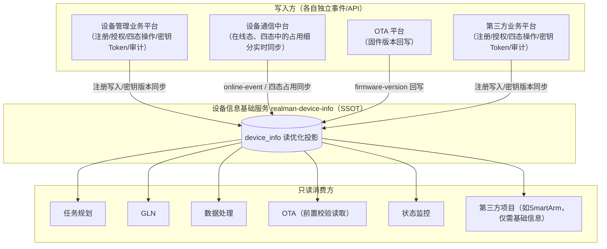
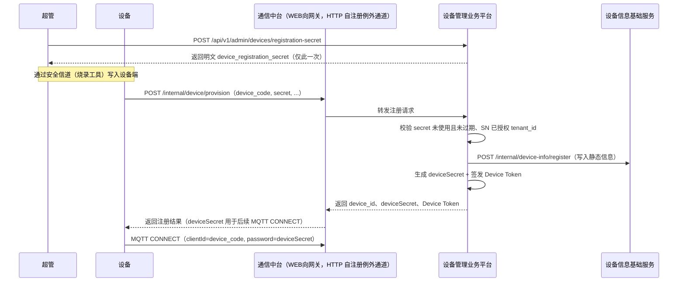
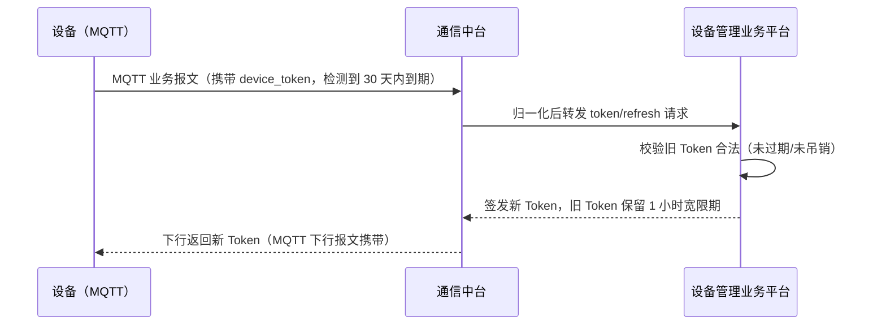
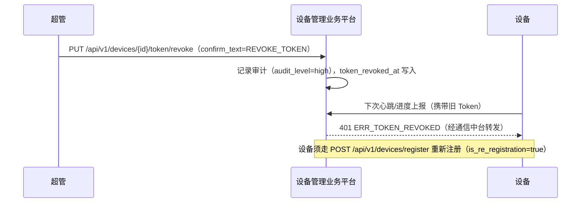
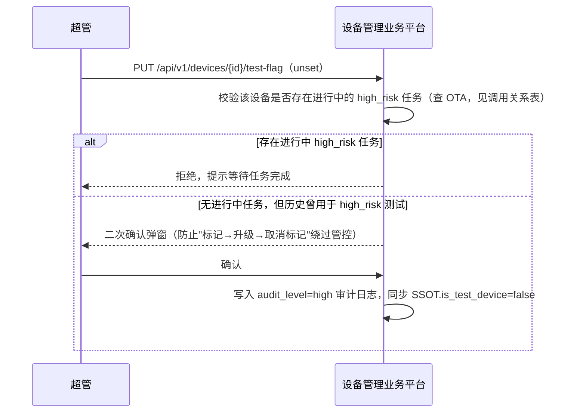

# 设备基座详细设计：设备信息基础服务 + 设备管理业务平台

| 项 | 内容 |
| --- | --- |
| **文档版本** | v1.0 |
| **日期** | 2026-07-08 |
| **状态** | 提议 / 待评审 |
| **上级文档** | [睿尔曼达尔文软件平台 V2 架构升级设计](./2026-07-07-darwin-platform-v2-capability-bus-and-comm-hub.md) 第四章（本文档是该章的详细展开）|
| **姊妹文档** | [设备通信中台详细设计](./2026-07-08-device-comm-hub-detailed-design.md) |
| **依据输入** | 《睿尔曼达尔文软件平台·业务架构 v1.2》"设备管理平台"功能卡片、《达尔文设备升级平台 PRD V1.0.0》第 3/4/9 章（设备角色、设备台账字段、密钥与 Token 接口）|

设备基座是整个 V2 架构的两块基线之一（另一块是设备通信中台）：GLN、数据处理、OTA、任务规划、状态监控对"设备"的全部认知都来自这里，这里设计不清楚，其余模块的接口设计就没有可靠的地基。本文档给出可以直接落地的系统设计与接口清单。

---

## 一、定位复述与分层原则

| 子层 | 服务名 | 定位 | 读写特征 |
| --- | --- | --- | --- |
| **设备信息基础服务** | `realman-device-info` | 唯一设备数据源（SSOT），只读为主，供全平台 Feign 查询 | 读多写少，要求低延迟、高可用 |
| **设备管理业务平台** | `realman-device-mgmt` | 面向运维/租户的业务操作 + 对外 REST + 台账 UI | 写少、强一致、强审计 |

**判断一个能力该放哪一层的简单准则**：如果是"全平台任何服务都可能在处理业务时高频查一下"的字段（IP/MAC/型号/固件版本/在线态/四态/绑定关系），放 SSOT，做成**读优化的投影**；如果是"只有运维/租户管理员才会做、且必须留痕审计"的操作（注册审批、密钥/Token 生命周期、租户授权、测试标记、异常处置），放业务平台。

两层的写入关系是单向的：**设备管理业务平台是 SSOT 的写入方之一**（注册成功后把静态信息写入 SSOT；密钥/Token 变更后同步 SSOT 的凭证版本号），此外通信中台（在线态/四态实时同步）与 OTA（固件版本回写）也是 SSOT 的写入方，但都通过各自独立的内部事件/API，互不经过设备管理业务平台。**其余业务应用只读 SSOT，不必接入设备管理业务平台**——这是"设备基础信息可以单独对第三方项目输出"的关键，例如大洋电机只需要设备信息基础服务的只读查询能力，不需要注册/密钥/审计这套完整业务操作。

---

## 二、设备信息基础服务（`realman-device-info`）详细设计

### 2.1 数据模型

`device_info`（核心表，读优化投影，所有字段都是"全平台高频查询"的候选）：

| 字段 | 类型 | 说明 |
| --- | --- | --- |
| `device_id` | varchar(36), PK | 内部唯一标识（UUID），注册时生成，终身不变 |
| `tenant_id` | varchar(32) | 所属租户，创建后不可变（对齐 OTA PRD 租户约束）|
| `device_code` | varchar(64), unique | 设备序列号，产线生成，全局唯一 |
| `device_type` | varchar(20) | `MASTER` / `SLAVE`（机器人）/ `SMART_ARM` / 其他后续类型，与 OTA PRD 设备角色对齐 |
| `device_model` | varchar(64) | 型号（如 `RealBot-S2`、`GLN-RX75`、`ECO63-标准版`）|
| `device_name` | varchar(128) | 展示名称 |
| `mac_address` | varchar(32) | 网络硬件地址 |
| `ip_address` | varchar(64) | 最近一次上报的 IP（心跳同步）|
| `firmware_version` | varchar(32) | 固件版本（master/slave 单一版本号，统一大写 V 格式）|
| `firmware_components` | json，可空 | 多组件版本（SmartArm 专用：`{"app":"V1.0.0","model":"V1.0.0","fw":"V1.0.0"}`，对齐 OTA PRD 4.1.3）|
| `online_status` | varchar(16) | `UNACTIVATED` / `ONLINE` / `OFFLINE` |
| `occupancy_state` | varchar(16) | 四态之一：`IDLE`（空闲）/ `SLEEP`（休眠）/ `OCCUPIED`（占用）/ `OFFLINE`（离线，与 `online_status=OFFLINE` 联动）|
| `occupancy_detail` | varchar(16)，可空 | `OCCUPIED` 态细分：`TELEOP`（遥操）/ `LOCAL`（本地操作）/ `AUTONOMOUS`（自主控制）|
| `lifecycle_stage` | varchar(16) | 全生命周期阶段：`MANUFACTURED`（出厂）/ `ACTIVATED`（激活）/ `RUNNING`（运行）/ `MAINTENANCE`（维修）/ `RETIRED`（退役）|
| `is_test_device` | boolean | 测试设备标记（由设备管理业务平台写入，供 OTA 高风险升级前置校验等高频读取场景使用，见 4.2 表）|
| `location` | json，可空 | 国家/城市/区/街道/楼宇 + 经纬度 |
| `last_heartbeat_at` | datetime | 最近心跳时间 |
| `last_online_at` / `last_offline_at` | datetime | 最近上下线时间 |
| `offline_reason` | varchar(64)，可空 | 离线原因（如 `KEEPALIVE_TIMEOUT`）|
| `bound_device_ids` | json，可空 | 主控端 ↔ 机器人绑定关系快照（V1 一对一，V2 多对多，权威数据在设备管理业务平台，这里是读优化快照）|
| `component_sn_map` | json，可空 | 部件级 SN（臂/底盘/主控），对应台账"部件级扩展"预留字段 |
| `data_version` | bigint | 乐观锁 / 变更版本号，供下游做增量同步判断 |
| `created_at` / `updated_at` | datetime | — |

**索引**：`device_id`、`device_code` 唯一索引；`(tenant_id, device_type, device_model)` 复合索引（支撑按机型/租户批量查询，服务 OTA 批量升级与版本矩阵）。

### 2.2 对内 API（Feign 契约，`realman-device-info-contract`）

全部为**内部调用**，不经过对外 Gateway，鉴权采用服务间凭证（内网 mTLS 或服务 Token），读接口不强制携带用户身份，但需透传 `tenant_id` 做租户过滤（由能力总线在网关层注入，见主设计文档第七章）。

| 接口 | 方法 | 说明 | 调用方 |
| --- | --- | --- | --- |
| `GET /internal/device-info/{deviceId}` | 查询 | 单设备完整信息 | GLN / 数据处理 / OTA / 状态监控 / 任务规划 |
| `GET /internal/device-info/by-code/{deviceCode}` | 查询 | 按 SN 查询（OTA `by_code` 升级场景）| OTA |
| `POST /internal/device-info/batch-query` | 查询 | 请求体：`{deviceIds?, deviceCodes?, tenantId?, deviceType?, deviceModel?, onlyOnline?}`；用于批量升级选型、版本矩阵 | OTA / 任务规划 |
| `GET /internal/device-info/list` | 分页查询 | 支持按 `tenantId`/`deviceType`/`deviceModel`/`onlineStatus`/`occupancyState`/`isTestDevice` 过滤，供设备管理业务平台台账 UI 代理调用 | 设备管理业务平台（台账页面的数据来源）|
| `POST /internal/device-info/register`（写）| 注册 | 由设备管理业务平台在注册成功后调用，写入 `device_id`/`device_code`/`device_type`/`tenant_id` 等静态字段，`lifecycle_stage` 置为 `ACTIVATED` | 设备管理业务平台 |
| `POST /internal/device-info/online-event`（写）| 状态同步 | 请求体：`{deviceId, eventType: ONLINE|OFFLINE, occurredAt, offlineReason?}`；更新 `online_status`/`last_online_at`/`last_offline_at`/`offline_reason`，`OFFLINE` 时联动 `occupancy_state=OFFLINE` | 设备通信中台 |
| `POST /internal/device-info/occupancy-event`（写）| 四态同步 | 请求体：`{deviceId, occupancyState, occupancyDetail?, occurredAt}` | 设备通信中台（遥操/自主控制状态变化时触发）|
| `POST /internal/device-info/heartbeat-snapshot`（写）| 心跳快照 | 请求体：`{deviceId, ipAddress, heartbeatAt, resourceSnapshot?}`；更新 `ip_address`/`last_heartbeat_at`，`resourceSnapshot` 透传给 OTA 前置资源校验使用（见通信中台文档） | 设备通信中台 |
| `PUT /internal/device-info/{deviceId}/firmware-version`（写）| 固件版本回写 | 请求体：`{firmwareVersion?, firmwareComponents?}`；升级成功后回写，是版本矩阵/版本落后判定的数据来源 | OTA 平台 |
| `PUT /internal/device-info/{deviceId}/test-flag`（写）| 测试标记同步 | 由设备管理业务平台在完成审计/二次确认后调用，同步 `is_test_device` | 设备管理业务平台 |
| `PUT /internal/device-info/{deviceId}/binding`（写）| 绑定关系快照同步 | 由设备管理业务平台在主控-机器人绑定变更后调用，同步 `bound_device_ids` | 设备管理业务平台 |
| `PUT /internal/device-info/{deviceId}/lifecycle`（写）| 生命周期阶段变更 | 请求体：`{lifecycleStage}`（`RUNNING`/`MAINTENANCE`/`RETIRED`），由设备管理业务平台运维操作触发 | 设备管理业务平台 |

### 2.3 一致性与性能设计

- **读路径**：全部基于 `device_info` 单表 + 索引，不做跨服务实时聚合；`batch-query` 上限 500 条一次（对齐 OTA PRD 版本矩阵预检的并发/规模约束），超出分页。
- **写路径**：多个写入方（设备管理业务平台/通信中台/OTA）各自只更新自己负责的字段子集，不存在两个服务同时写同一字段的竞争；`data_version` 乐观锁仅用于检测"客户端缓存过期"场景，不用于解决并发写冲突（因为按字段子集划分写权限后天然不冲突）。
- **缓存策略**：高频只读字段（`online_status`/`occupancy_state`/`firmware_version`）可在服务内维护本地/Redis 二级缓存，TTL 5-10 秒，由 `online-event`/`occupancy-event`/`heartbeat-snapshot` 写入时主动失效，避免读多写少场景下的数据库压力。
- **不做**：不做审计留痕（那是设备管理业务平台的职责），不做权限校验（只做租户过滤），不存储凭证/密钥（那也在设备管理业务平台）。

---

## 三、设备管理业务平台（`realman-device-mgmt`）详细设计

### 3.1 职责边界（对齐产品功能清单）

对照业务架构 v1.2 "设备管理平台"功能卡片，本层承接以下全部业务功能：

1. **设备注册与激活**：在线激活（设备联网后经通信中台的一次性 HTTP 自注册获取密钥）+ 离线注册（工具写入 SN 后上线激活，支持训练场批量离线注册）。
2. **序列号管理**：产线生成唯一 SN，服务端保证不重复；当前 SN 仅产线贴码，与 WMS/ERP 无系统对接（已知缺口，列入待建集成项，见第七章）。
3. **设备生命周期与四态管理**：四态（空闲/休眠/占用/离线，占用细分遥操/本地操作/自主控制）+ 全生命周期（出厂→激活→运行→维修→退役）的**业务操作入口**（状态本身的准实时数据在 SSOT，本层是"谁、何时、为什么"把设备转入维修/退役等需要审批留痕的状态变更）。
4. **设备授权（主控端 ↔ 机器人）**：V1 一对一绑定；V2 支持多对多（一台主控端可配对多台机器人，故障时其他绑定关系的主控端可顶替；任务按任务维度下发到机器人，登录任一有绑定关系的主控端均可操控；操作员不做绑定，按排班凭账号和任务上岗）。
5. **设备密钥管理**：生成/分发设备通信密钥（`deviceSecret`，供通信中台 MQTT 接入子模块做 EMQX 连接鉴权）+ 设备 Token（JWT，业务身份鉴权，见 3.3）。
6. **设备信息总览（机器人台账 UI API）**：IP、MAC、最后登录时间、地点、软件版本、型号、存储空间、采集能力等；预留部件级扩展（臂/底盘/主控部件 SN 可追溯）。
7. **租户授权与隔离**：`tenant_id` 创建时绑定不可变更；超管跨租户操作走 `X-Operator-Tenant-Id` + 双 `tenant_id` 审计（对齐 OTA PRD 9.0）。
8. **测试设备标记（四态之外的运营标记）**：`is_test_device`，超管专属，二次确认防止"标记→升级→取消标记"绕过高风险管控（对齐 OTA PRD 4.1.1）。
9. **三方设备数据定义**：为第三方设备接入统一定义心跳信号（定时在线状态）+ 事件上报（异常/状态变更实时推送）的数据契约，经通信中台上行。
10. **设备异常检测与错误码映射**：机械臂错误码映射到具体部件位置，异常状态同步状态监控平台。
11. **操作审计**：全部写操作留痕（操作人、时间、操作类型、结果），跨租户操作双 `tenant_id`。

### 3.2 数据模型

`device_registration_secret`（一次性注册凭证，对齐 OTA PRD 9.8.5）：

| 字段 | 类型 | 说明 |
| --- | --- | --- |
| `id` | bigint, PK | — |
| `device_code` | varchar(64) | 目标设备 SN |
| `tenant_id` | varchar(32) | 所属租户 |
| `secret_hash` | varchar(128) | 凭证哈希存储，不存明文 |
| `status` | varchar(16) | `UNUSED` / `USED` / `EXPIRED` |
| `expires_at` | datetime | 生成时刻起 `registration_secret_expiry_days`（默认 365 天）|
| `used_at` | datetime，可空 | — |
| `created_by` | varchar(64) | 生成操作人（超管）|
| `created_at` | datetime | — |

`device_credential`（设备双凭证体系，见 3.3）：

| 字段 | 类型 | 说明 |
| --- | --- | --- |
| `device_id` | varchar(36), PK/FK | 关联 `device_info.device_id` |
| `device_secret_hash` | varchar(128) | MQTT 连接层密码（EMQX Auth 用），哈希存储 |
| `device_secret_version` | int | 密钥版本号，重置时递增 |
| `token_jti` | varchar(64)，可空 | 当前有效 Device Token 的 JWT ID |
| `token_issued_at` / `token_expires_at` | datetime | Token 有效期（默认 `device_token_expiry_days=365`）|
| `token_revoked_at` | datetime，可空 | 吊销时间，非空即视为已吊销 |
| `token_revoke_reason` | varchar(128)，可空 | — |

`device_tenant_auth`（租户授权，暂不涉及多租户复杂授权时可与 `device_info.tenant_id` 合一，此表用于记录授权变更历史）：

| 字段 | 类型 | 说明 |
| --- | --- | --- |
| `id` | bigint, PK | — |
| `device_id` | varchar(36) | — |
| `tenant_id` | varchar(32) | — |
| `granted_by` | varchar(64) | 操作人 |
| `granted_at` | datetime | — |
| `valid_until` | datetime，可空 | 有效期（可空表示长期有效）|

`device_binding`（主控端 ↔ 机器人授权绑定）：

| 字段 | 类型 | 说明 |
| --- | --- | --- |
| `id` | bigint, PK | — |
| `master_device_id` | varchar(36) | 主控端 |
| `slave_device_id` | varchar(36) | 机器人 |
| `tenant_id` | varchar(32) | — |
| `bind_mode` | varchar(16) | `V1_ONE_TO_ONE` / `V2_MANY_TO_MANY`（按租户/产品阶段配置）|
| `status` | varchar(16) | `ACTIVE` / `REVOKED` |
| `created_by` / `created_at` | — | — |

`device_operation_audit_log`（操作审计，扩展现有 `IDeviceOperationLogService` 字段）：

| 字段 | 类型 | 说明 |
| --- | --- | --- |
| `id` | bigint, PK | — |
| `device_id` | varchar(36)，可空 | 部分操作（如凭证生成）可能未绑定具体设备 |
| `operation_type` | varchar(32) | `REGISTER`/`TOKEN_ISSUE`/`TOKEN_REVOKE`/`TEST_FLAG`/`TENANT_AUTH`/`BINDING`/`LIFECYCLE_CHANGE`/... |
| `operator` | varchar(64) | 操作人 |
| `operator_tenant_id` | varchar(32) | 操作人所属租户（超管跨租户时与 `target_tenant_id` 不同）|
| `target_tenant_id` | varchar(32) | 操作目标所属租户 |
| `audit_level` | varchar(16) | `normal` / `high` / `critical` |
| `detail` | json | 操作详情快照 |
| `created_at` | datetime | — |

### 3.3 双凭证体系（设备身份鉴权模型）

设备身份鉴权分两条轨道，互不替代：

| 轨道 | 载体 | 用途 | 传输方式 |
| --- | --- | --- | --- |
| **连接层凭证**`deviceSecret` | 密码字符串，哈希存储 | 建立 MQTT 连接（EMQX Auth/ACL）；这是现状 `DeviceSecretService` 的既有机制，**不变** | 仅用于 MQTT CONNECT 报文 |
| **业务身份 Token**`Device Token` | Bearer JWT，含 `device_id`/`device_type`/`tenant_id`/`issued_at`/`expires_at` | 标识"这次业务请求确实来自这台已注册设备"，用于心跳、进度上报等业务语义的身份校验；对齐 OTA PRD 9.7.5-9.7.7 | 对 MQTT 设备：作为 payload 内的 `device_token` 字段随业务报文携带，由通信中台在归一化时校验；对 HTTP 设备（WEB向网关接入）：作为 `Authorization: Bearer` 请求头携带 |

两条轨道解决不同层面的问题：`deviceSecret` 只管"能不能连上"，`Device Token` 管"这条业务消息的发送者身份是否仍然合法（未吊销、未过期）"。**现有 MQTT 设备两者都需要**——先用 `deviceSecret` 连上 MQTT，再在业务报文里带 `device_token` 供上层做身份校验；这不是新增负担，而是把 OTA PRD 里"Token 吊销后设备须重新走注册流程"这类安全语义落到现有 MQTT 报文体里，无需改动连接层。

### 3.4 对外 API（经设备通信中台WEB 端向网关统一路由，见通信中台详细设计第四章）

以下接口是"设备管理业务平台"的服务端点，物理上由通信中台的 WEB 端向网关做统一入口/鉴权/限流后反向代理过来；也包括纯粹面向运维人员的管理端 API（不经过设备协议适配，直接是管理端调用的常规 REST）。

**设备注册与凭证（对齐 OTA PRD 9.8.4-9.8.6，扩展至全部设备类型）**

| 方法 | 路径 | 调用方 | 说明 |
| --- | --- | --- | --- |
| POST | `/api/v1/devices/register` | 设备（经通信中台 HTTP 自注册，或离线注册工具）| 请求体：`device_code`/`device_type`/`tenant_id`/`device_registration_secret`；校验通过后创建 `device_id`、写入 SSOT、签发 `deviceSecret`（MQTT 设备）或 Device Token（HTTP 设备），返回对应凭证 |
| POST | `/api/v1/admin/devices/registration-secret` | 超管 | 生成一次性注册凭证，`device_code`+`tenant_id`，返回明文凭证（仅此一次）|
| GET | `/api/v1/admin/devices/{deviceSn}/registration-secret/status` | 超管 | 查询凭证状态（unused/used/expired）|
| POST | `/api/v1/admin/devices/offline-register/batch` | 超管（训练场批量离线注册）| 请求体：`[{deviceSn, deviceType, deviceModel, tenantId}]`，批量创建待激活设备记录，设备上线时凭 SN 完成激活 |

**Token / 密钥生命周期（对齐 OTA PRD 9.7.5-9.7.7）**

| 方法 | 路径 | 调用方 | 说明 |
| --- | --- | --- | --- |
| POST | `/api/v1/devices/token/issue` | 内部（注册流程触发，非独立对外入口）| 注册/激活时签发 Device Token |
| POST | `/api/v1/devices/token/refresh` | 设备（HTTP 设备直接调用；MQTT 设备通过业务报文携带同等请求语义，由通信中台转发）| Token 到期前 30 天内续签 |
| PUT | `/api/v1/devices/{deviceId}/token/revoke` | 超管 | 吊销 Token；需 `confirm_text=REVOKE_TOKEN` 二次确认 |
| POST | `/api/v1/devices/{deviceId}/secret/reset` | 超管 | 重置 `deviceSecret`（MQTT 连接密码），`device_secret_version` 递增，旧密码保留短宽限期防止连接抖动 |

**四态、生命周期与授权绑定**

| 方法 | 路径 | 调用方 | 说明 |
| --- | --- | --- | --- |
| PUT | `/api/v1/devices/{deviceId}/lifecycle` | 运维人员 | 变更生命周期阶段（`RUNNING`/`MAINTENANCE`/`RETIRED`），敏感操作需二次确认 |
| POST | `/api/v1/devices/bindings` | 运维人员 | 创建主控端 ↔ 机器人绑定（V1 一对一校验，V2 多对多）|
| DELETE | `/api/v1/devices/bindings/{bindingId}` | 运维人员 | 解除绑定 |
| GET | `/api/v1/devices/bindings` | 运维人员 / 任务规划模块 | 查询绑定关系（任务规划下发前核对）|

**租户授权与测试标记**

| 方法 | 路径 | 调用方 | 说明 |
| --- | --- | --- | --- |
| POST | `/api/v1/devices/{deviceId}/tenant-auth` | 超管 | 设备-租户授权/变更 |
| PUT | `/api/v1/devices/{deviceId}/test-flag` | 超管，跨租户须带 `X-Operator-Tenant-Id` | 标记/取消测试设备；取消前校验是否存在进行中的 high_risk 任务 |
| POST | `/api/v1/devices/test-flag/batch` | 超管 | 按 SN 列表批量标记 |

**台账与审计（管理端 UI 直接调用）**

| 方法 | 路径 | 说明 |
| --- | --- | --- |
| GET | `/api/v1/devices` | 台账列表，聚合 SSOT 基础信息 + 本层的四态/生命周期/绑定/测试标记等字段，支持按 SN/型号/名称/状态/租户/测试标记条件查询 |
| GET | `/api/v1/devices/{deviceId}` | 台账详情，含部件级 SN（臂/底盘/主控）|
| GET | `/api/v1/devices/audit-logs` | 操作审计查询，支持按 `deviceId`/`operationType`/时间范围/`auditLevel` 过滤 |

### 3.5 关键业务流程时序图

**注册流程（在线激活，MQTT 设备）**

**Token 续签（MQTT 设备场景）**

**紧急吊销**

**测试设备取消标记（防绕过二次确认）**

### 3.6 与设备信息基础服务的交互契约

- 本层**不直接持有** SSOT 的表结构或数据库连接，一律通过 2.2 节的内部 Feign 接口读写。
- 本层的写操作分两类：一类只更新本层自有表（凭证、审计、绑定关系的权威记录）；另一类在完成本层写入后，**同步调用**一次 SSOT 的对应写接口做投影同步（如 `firmware-version`、`test-flag`、`binding`、`lifecycle`）。因为两者同域同信任域，这个同步调用是普通 Feign 同步调用，失败时按"本层写入成功、SSOT 投影同步失败"记录告警并重试，不做分布式事务（业务上可接受短暂不一致，重试补偿即可）。

---

## 四、与其他模块的调用关系表

| 调用方 | 调用目标 | 场景 |
| --- | --- | --- |
| 任务规划 | SSOT（只读）| 下发任务前查询设备四态、闲时状态、主控-机器人绑定授权、地点信息 |
| GLN | SSOT（只读）| 遥操前查询设备在线态、绑定关系 |
| 数据处理 | SSOT（只读）| 数据入库时核对设备来源、型号、采集能力 |
| OTA | SSOT（只读，批量查询/版本回写）+ 设备管理业务平台（只读 `is_test_device`，仅用于 high_risk 前置校验，不做写操作）| 批量升级选型、版本矩阵、固件版本回写、高风险包前置校验 |
| 状态监控 | SSOT（只读）+ 设备管理业务平台（异常检测结果同步接口，见待建事项）| 全链路事件采集 |
| 设备通信中台 | SSOT（写：online-event/occupancy-event/heartbeat-snapshot）+ 设备管理业务平台（设备端向 HTTP 自注册例外通道的转发目标；MQTT 设备的 Token 续签/吊销语义转发目标）| 实时状态同步、设备注册与凭证生命周期的转发 |
| Web 管理端 | 设备管理业务平台对外 REST（经通信中台WEB 端向网关或直接经 `realman-gateway`，见通信中台详细设计 4.2 节的边界划分）| 台账、审计、注册凭证生成、密钥/Token 管理、绑定管理 UI |

---

## 五、迁移落地计划（细化 V2 主设计文档 Phase 2）

| 步骤 | 内容 | 依赖 |
| --- | --- | --- |
| 1 | 建 `realman-device-info` 服务与 `device_info` 表；从现有 `IotDevice` 等表做只读投影迁移（ETL 一次性 + 增量双写过渡）| 无前置依赖，可先行 |
| 2 | 建 `realman-device-mgmt` 服务；迁移 `DeviceProvisionController`/`DeviceSecretService`/`IDeviceOperationLogService`，改造注册流程对齐 `device_registration_secret` + 双凭证体系 | 依赖步骤 1（注册需要写 SSOT）|
| 3 | 补齐租户隔离（`tenant_id` 贯穿两层表结构与查询过滤），这是存量数据结构性变更，需单独的数据迁移脚本 | 与步骤 2 同期 |
| 4 | 落地四态/生命周期、主控-机器人绑定 V1 一对一（V2 多对多按产品排期后续迭代）| 依赖步骤 2 |
| 5 | 现有 `DeviceOnlineOfflineHandler` 改为调用 SSOT 的 `online-event`/`occupancy-event` 接口，服务本身移交通信中台 | 依赖步骤 1 + 通信中台 Phase 2 |
| 6 | 台账 UI API 上线，替换现状分散在 `RobotDeviceController`/`MasterDeviceController` 的查询接口 | 依赖步骤 1-4 |

---

## 六、开放问题（需产品/运维确认）

- [ ] 序列号与 WMS/ERP 系统对接：现状仅产线贴码，是否本次一并纳入，还是继续作为独立待建集成项？
- [ ] 主控端 ↔ 机器人 V2 多对多绑定的具体排期，是否与本次架构升级同批交付，还是作为后续迭代？
- [ ] 部件级 SN 追溯（换臂后 SN 外贴问题）与售后系统打通的接口契约，需要售后系统侧配合定义。
- [ ] 设备异常检测的错误码映射表（机械臂错误码→部件位置）是产品已有清单还是需要本次一并梳理？
