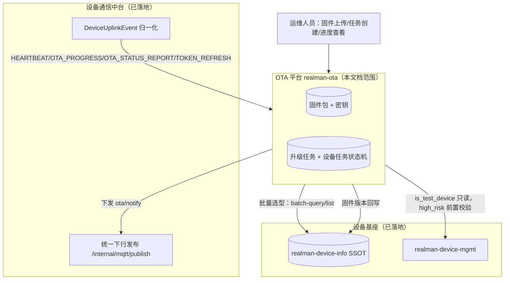
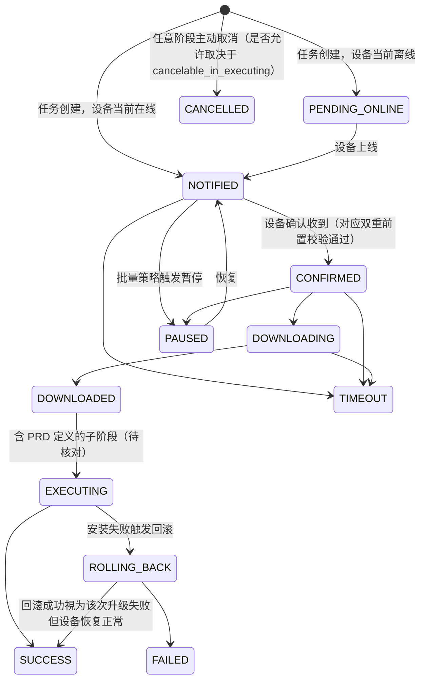

# OTA 平台详细设计（Phase 3 独立化前置评审）

| 项 | 内容 |
| --- | --- |
| **文档版本** | v0.1（草案，需与《达尔文设备升级平台 PRD V1.0.0》原文逐项核对后转正）|
| **日期** | 2026-07-09 |
| **状态** | 提议 / 待评审（本文档本身就是 [V2 主设计文档](./2026-07-07-darwin-platform-v2-capability-bus-and-comm-hub.md) 第十章风险清单里建议的"Phase 3 启动前独立 OTA 详细设计评审"）|
| **上级文档** | [V2 主设计文档](./2026-07-07-darwin-platform-v2-capability-bus-and-comm-hub.md) 第九章 Phase 3 |
| **姊妹文档** | [设备基座详细设计](./2026-07-08-device-foundation-detailed-design.md)、[设备通信中台详细设计](./2026-07-08-device-comm-hub-detailed-design.md) |
| **依据输入** | 《达尔文设备升级平台 PRD V1.0.0》、主设计文档 2.3 节 OTA 能力盘点（本文档写作时无法重新访问 PRD 原文，凡本文档标注"待核对"之处，均以主文档 2.3 节已提炼的差距分析为准，转正前必须回源 PRD 逐条核对，见第十节）|

---

## 一、定位与本文档的性质

OTA 平台（`realman-ota`）是 V2 架构里排在设备基座、设备通信中台两块基线之后的第三块拼图（Phase 3）：给设备做固件升级的全生命周期管理——固件签发、任务下发、批量策略、进度追踪、失败回滚。它是**消费方**而非基线：设备身份、在线状态、协议路由全部依赖前两块已经落地的能力，自己不重新发明这些。

**这份文档目前是草案而非可直接实施的详细设计**，原因是：本次分析未能重新取得《达尔文设备升级平台 PRD V1.0.0》原文，只能依据本次架构升级早期已经产出的《V2 主设计文档》2.3 节差距分析（`docs/design/2026-07-07-darwin-platform-v2-capability-bus-and-comm-hub.md:67-84`）做二次展开。该分析明确指出现有 `OtaController`/`IotOtaServiceImpl`/`OtaProgressHandler` 只覆盖 PRD"固件存储 + 极简任务下发"的一角，且差距清单里的具体数值（15 态状态机的完整状态名与迁移规则、40+ 错误码的完整枚举、17 项系统设置的完整字段）在本次分析中只有**数量与类别**，没有**逐条枚举**。

因此本文档分两部分对待：
1. **可以直接落地的架构/接口设计**（第二至九节）——数据模型骨架、对外 API 轮廓、与设备基座/通信中台的集成契约、状态机的"形状"（阶段划分而非逐态迁移规则）、密钥生命周期、批量策略语义、前置校验分类——这些都是从差距分析可靠推导出的结构性结论，不依赖 PRD 逐字细节。
2. **明确列为开放问题、必须回源 PRD 原文才能定稿的部分**（第十节）——状态机完整状态清单与合法迁移矩阵、错误码完整清单、系统设置完整字段表、断点续传的具体协议细节。**在这些开放问题解决前，不建议开始 Phase 3 编码**，这正是主设计文档风险清单里"OTA 能力差距被低估会导致 Phase 3 排期超期"的风险点。

---

## 二、与设备基座 / 设备通信中台的分层关系

**判断准则复用设备基座文档已确立的分层原则**：OTA 不自建设备表，设备身份/在线态/测试标记等只读 SSOT 与设备管理业务平台；OTA 只新建"固件/密钥/任务"这组自己独有的数据。

---

## 三、数据模型（骨架，字段名待与 PRD 固件上传接口逐字核对）

### 3.1 `ota_firmware`（固件包）

| 字段 | 类型 | 说明 |
| --- | --- | --- |
| `firmware_id` | varchar(36), PK | — |
| `tenant_id` | varchar(32) | 所属租户，跨租户共享固件的场景待与 PRD 确认（差距分析未覆盖此点，标记开放问题）|
| `firmware_name` | varchar(128) | — |
| `version` | varchar(32) | 统一大写 V 格式，对齐设备基座 `device_info.firmware_version` |
| `device_type` | varchar(20) | `MASTER`/`SLAVE`/`SMART_ARM`，对应"master/slave 双通道互不干扰"的差距要求，见四.2 |
| `compatible_models` | json | 兼容型号列表，取代现状"仅 productId"的单一关联，对应差距分析"版本兼容性双重校验"的数据基础 |
| `min_version` | varchar(32)，可空 | 允许升级的最低现有版本，缺失时不做最低版本前置拦截 |
| `risk_level` | varchar(16) | `LOW`/`HIGH`，对应"高风险包"前置管控（is_test_device 二次确认联动，见设备基座文档 3.5）|
| `cancelable_in_executing` | boolean | 是否允许在 `EXECUTING` 阶段取消，语义待与 PRD 核对（尤其"已开始刷写不可中断"这类安全约束是否存在型号例外）|
| `download_url` | varchar(512) | OSS/MinIO 地址，支持预签名 URL 定期刷新（差距分析标注"OSS 预签名 URL 自动刷新"缺失，本设计新增）|
| `file_md5` | varchar(64) | — |
| `file_size` | bigint | — |
| `signature` | varchar(512) | Ed25519 签名（base64），对应"SHA-256/Ed25519 签名缺失"差距 |
| `signing_key_id` | varchar(36) | 关联 `ota_firmware_key`，签名时用哪把密钥签的 |
| `status` | varchar(16) | `DRAFT`/`PUBLISHED`/`REVOKED` |
| `created_by` / `created_at` | — | — |

### 3.2 `ota_firmware_key`（签名密钥生命周期）

| 字段 | 类型 | 说明 |
| --- | --- | --- |
| `key_id` | varchar(36), PK | — |
| `algorithm` | varchar(16) | 固定 `Ed25519`（对齐差距分析明确指名的算法）|
| `public_key` | varchar(256) | 公钥，设备侧固化用于验签，私钥不入库（应走 KMS/HSM，本设计不展开，见开放问题）|
| `status` | varchar(16) | `ACTIVE`/`PENDING_ACTIVATION`/`REVOKED`（差距分析明确的三态）|
| `activated_at` / `revoked_at` | datetime，可空 | — |
| `revoke_reason` | varchar(128)，可空 | — |

**双重校验语义**（差距分析原话"签名吊销校验（双重校验）"）：任务创建时校验一次固件所用密钥未吊销，设备实际执行升级前（收到 `ota/notify` 下行前的最后一刻）再校验一次——因为任务创建到设备真正执行之间可能有较长时间窗口，密钥可能在此期间被吊销。

### 3.3 `ota_task`（升级任务）

| 字段 | 类型 | 说明 |
| --- | --- | --- |
| `task_id` | varchar(36), PK | — |
| `tenant_id` | varchar(32) | — |
| `firmware_id` | varchar(36) | — |
| `upgrade_mode` | varchar(16) | `BY_SN` / `BY_MODEL` / `ALL` / `BY_TENANT_MODEL`（差距分析明确的四种模式，现状只有"指定 deviceIds 列表"一种）|
| `target_selector` | json | 按 `upgrade_mode` 变化的选择器（SN 列表 / 型号 / 租户+型号组合）|
| `batch_strategy` | varchar(16) | `FAIL_THRESHOLD` / `PAUSE` / `STOP_ALL` / `CONTINUE`（差距分析明确的四种批量策略）|
| `fail_threshold_pct` | int，可空 | 仅 `batch_strategy=FAIL_THRESHOLD` 时生效 |
| `status` | varchar(16) | 任务级状态，是设备级状态机的聚合视图，具体聚合规则待细化（开放问题）|
| `created_by` / `created_at` | — | — |

### 3.4 `ota_task_device`（设备级任务状态机）

| 字段 | 类型 | 说明 |
| --- | --- | --- |
| `id` | varchar(36), PK | — |
| `task_id` | varchar(36) | — |
| `device_id` | varchar(36) | 关联 SSOT，不冗余存设备静态信息 |
| `state` | varchar(24) | 见第五章，本设计只给出阶段骨架，完整状态名与迁移矩阵是开放问题 |
| `progress_pct` | int，可空 | 下载/安装进度百分比 |
| `error_code` | varchar(16)，可空 | 见第九章，完整枚举是开放问题 |
| `retry_count` | int | — |
| `state_changed_at` | datetime | — |

---

## 四、前置校验（差距分析明确列出的四类，现状"无"）

| 校验类别 | 内容 | 数据来源 |
| --- | --- | --- |
| 状态检查 | 设备在线、四态为 `IDLE`（非遥操/自主控制中）| SSOT `online_status`/`occupancy_state` |
| 资源检查 | 存储空间/电量是否满足升级前提 | SSOT `heartbeat-snapshot` 写入的 `resourceSnapshot`（见设备基座文档 2.2）|
| 版本兼容性（双重校验）| 任务创建时校验一次目标设备当前版本 ∈ 固件 `min_version`~兼容范围；设备实际执行前再校验一次（避免任务创建到执行之间设备版本已变化，如被其他任务升级过）| `ota_firmware.compatible_models`/`min_version` + SSOT 当前 `firmware_version` |
| 签名吊销校验（双重校验）| 见 3.2 双重校验语义 | `ota_firmware_key.status` |

### 4.1 高风险包前置管控

`risk_level=HIGH` 的固件对 `is_test_device=true` 的设备放开限制（测试设备可以先跑高风险升级验证），对普通设备则需要更严格的确认流程（差距分析未给出具体流程细节，标记开放问题）。测试标记取消时的防绕过校验已经在设备基座文档 3.5 实现（"是否存在进行中的 high_risk 任务"检查点就在这里对接，OTA 需要提供一个只读查询接口供设备管理业务平台回调，见六.3）。

---

## 五、状态机（阶段骨架，完整迁移矩阵是开放问题）

差距分析明确指出现有 8 态（`NOTIFIED→CONFIRMED→DOWNLOADING→DOWNLOADED→INSTALLING→SUCCESS/FAILED/TIMEOUT`）缺少 PRD 要求的：`PENDING_ONLINE`（设备离线时任务排队等待上线）、`EXECUTING` 阶段的三个子阶段（升级执行期间的细粒度追踪，具体三个子阶段名称待核对）、`ROLLING_BACK`（失败后自动/手动回滚）、`PAUSED`（批量策略触发的暂停）、`CANCELLED`（主动取消）。

按这些线索可以确定的**阶段骨架**（不是最终状态机，只是分组）：

**这张图是本文档的推导产物，不是 PRD 原图**——`EXECUTING` 子阶段的具体三态、`ROLLING_BACK` 是否可再次失败进入独立终态、`TIMEOUT` 具体挂在哪些阶段之后，都需要对照 PRD 原始状态机图逐一核实。

---

## 六、对外 API（轮廓，路径前缀已在通信中台详细设计里预留 `/api/v1/ota/**`）

| 分类 | 接口（示意） | 说明 |
| --- | --- | --- |
| 固件管理 | `POST /api/v1/ota/firmwares`（上传，支持分片续传）、`GET /api/v1/ota/firmwares`、`PUT /api/v1/ota/firmwares/{id}/publish`、`PUT /api/v1/ota/firmwares/{id}/revoke` | 分片上传断点续传现状已支持（服务端 MinIO 侧），差距在**设备侧** HTTP Range 下载续传，属于设备固件下载阶段，不是本 API 范畴 |
| 密钥管理 | `POST /api/v1/ota/keys`（生成待激活）、`PUT /api/v1/ota/keys/{id}/activate`、`PUT /api/v1/ota/keys/{id}/revoke` | 超管操作，需二次确认（沿用设备基座已确立的"敏感操作二次确认"约定）|
| 任务管理 | `POST /api/v1/ota/tasks`、`GET /api/v1/ota/tasks/{id}`、`PUT /api/v1/ota/tasks/{id}/pause`、`PUT /api/v1/ota/tasks/{id}/resume`、`PUT /api/v1/ota/tasks/{id}/cancel` | `upgrade_mode=BY_TENANT_MODEL` 时需要超管权限（跨租户批量操作，对齐 `X-Operator-Tenant-Id` 审计约定）|
| 版本矩阵 | `GET /api/v1/ota/version-matrix` | 按型号聚合当前版本分布，用于"版本落后判定"，依赖 SSOT `batch-query`（500 条分页上限） |
| 进度查询 | `GET /api/v1/ota/tasks/{id}/devices`、`GET /api/v1/ota/tasks/{id}/devices/{deviceId}` | 分页查询任务下各设备状态 |
| 高风险任务只读查询（内部）| `GET /internal/ota/devices/{deviceId}/active-high-risk-task` | 供设备管理业务平台"取消测试标记"前置校验回调（见四.1），是设备基座文档 3.5 时序图里"查 OTA"这一步的真正落点 |

---

## 七、与通信中台的集成（复用已落地的统一发布 + 上行事件）

- **下行通知**：调用 `CommHubFeignClient.publish`，`topicSuffix="ota/notify"`，payload 含固件下载地址（建议下发一次性预签名 URL，而不是长期有效地址）、签名、版本号。是否 `waitAck` 待定——如果需要"设备确认收到"驱动 `NOTIFIED→CONFIRMED` 迁移，应该 `waitAck=true`。
- **上行消费**：不直接订阅 MQTT，而是消费通信中台归一化后的 `DeviceUplinkEvent`（`eventKind ∈ {HEARTBEAT, OTA_PROGRESS, OTA_STATUS_REPORT, TOKEN_REFRESH}`），当前通信中台只做了落库 + Webhook 转发（见通信中台详细设计 4.3.2），**OTA 平台需要新增一个内部订阅/查询接口消费这些事件驱动状态机迁移**——这是 OTA 落地时需要在通信中台或 OTA 自身补的集成点，本文档暂定为 OTA 平台反向查询 `GET /api/v1/devices/uplink-events?eventKind=OTA_PROGRESS&since=...` 轮询，长期应改为通信中台主动回调 OTA 内部接口（类似 Webhook 但服务间直连），避免轮询延迟。
- **Token 续签**：`TOKEN_REFRESH` 事件由通信中台负责转发到 `device-mgmt` 完成续签闭环（见通信中台详细设计 mqtt/token-refresh 章节），**这条闭环目前尚未在通信中台实现**（Phase 1 提交时已标注为已知限制），OTA 平台不需要重复处理，只需确保自己签发的 Device Token 校验逻辑与 device-mgmt 一致（即：OTA 不自签 Token，Token 完全是设备基座的能力，OTA 只做业务层的 `validateToken` 调用）。
- **固件版本回写**：升级成功后调用 `DeviceInfoFeignClient.updateFirmwareVersion`。

---

## 八、批量策略语义（差距分析明确的四种）

| 策略 | 语义 |
| --- | --- |
| `FAIL_THRESHOLD` | 失败率超过 `fail_threshold_pct` 时自动暂停后续设备的下发，已下发设备不受影响 |
| `PAUSE` | 每批次（具体批大小待定）下发后暂停，等待运维人员确认再继续 |
| `STOP_ALL` | 任意一台失败立即终止整个任务（含尚未下发的设备）|
| `CONTINUE` | 忽略失败，尽力下发全部目标设备 |

---

## 九、错误码体系（开放问题，本设计只给出分类框架）

差距分析指出 PRD 定义了 40+ 错误码，本文档无法逐条还原，只能给出一个可扩展的分类框架供转正时填充：

| 类别前缀 | 覆盖阶段 |
| --- | --- |
| `PRECHECK_*` | 前置校验失败（状态/资源/版本/签名）|
| `DOWNLOAD_*` | 下载阶段（超时/校验和不匹配/存储空间不足）|
| `INSTALL_*` | 安装阶段（刷写失败/回滚失败）|
| `SIGNATURE_*` | 签名/密钥相关 |
| `NETWORK_*` | 通信超时/设备离线 |

---

## 十、开放问题（转正前必须回源 PRD 原文核实）

- [ ] 15 态状态机的完整状态清单与合法迁移矩阵（本文档第五章是推导骨架，不是权威定义）。
- [ ] 40+ 错误码的完整枚举（本文档第九章只给分类框架）。
- [ ] 17 项系统设置的完整字段表（差距分析提到存在但未展开，本文档未涉及，需要独立小节）。
- [ ] 设备侧 HTTP Range 断点续传的具体协议细节（分片大小、重试策略）。
- [ ] `EXECUTING` 阶段三个子阶段的具体名称与含义。
- [ ] `ota_firmware.tenant_id`：固件是否允许跨租户共享（如平台统一发布的官方固件 vs 租户自定义固件）。
- [ ] 任务级 `status` 相对设备级状态机的聚合规则（如"多少比例设备 SUCCESS 才算任务 SUCCESS"）。
- [ ] Token 续签闭环（`ota/token-refresh` → device-mgmt 续签 → 下行回传新 Token）在通信中台的完整实现——Phase 1 提交时已标注为已知限制，是 Phase 3 启动前需要一并补齐的依赖项。

**建议**：在启动 Phase 3 编码前，安排一次专门针对本文档开放问题的评审会，逐条对照 PRD 原文（尤其第四、八、九章）核实，避免出现主设计文档风险清单里警告的"能力差距被低估导致排期超期"。
