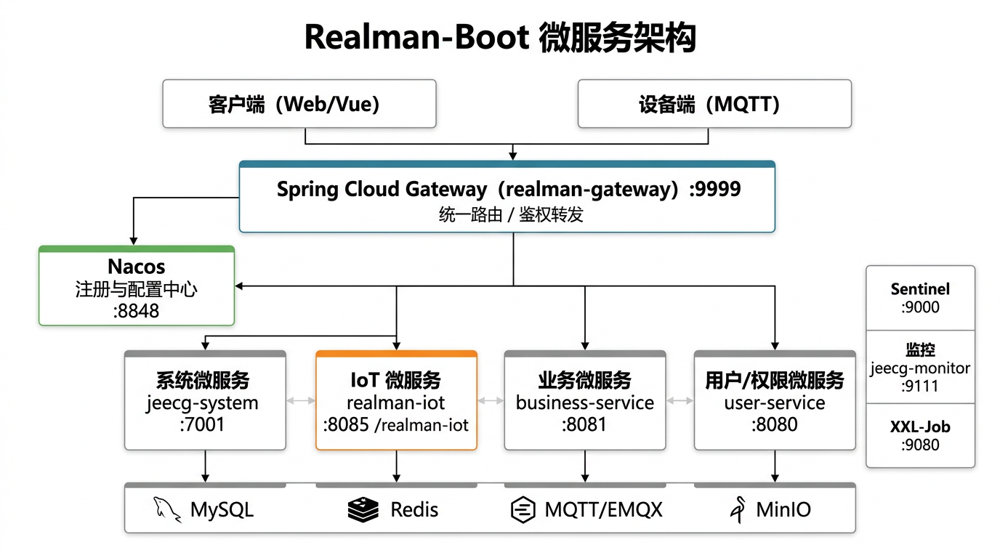
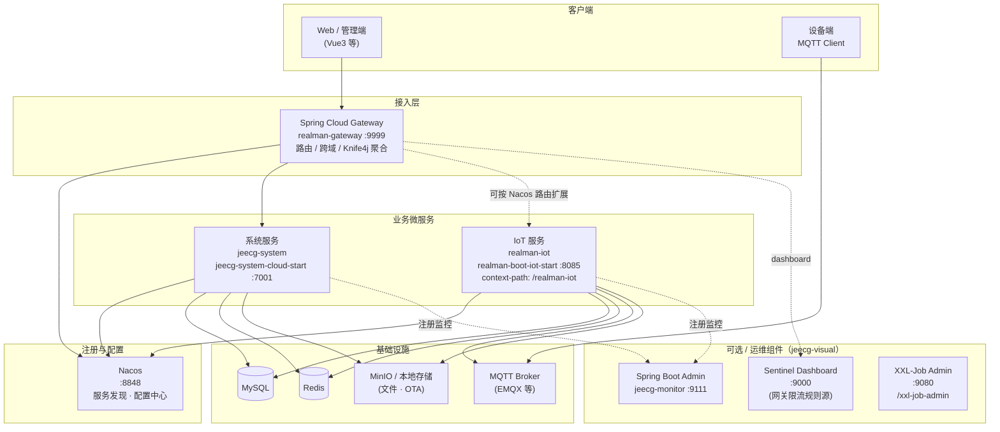

# Realman-Boot 微服务架构图

本文档依据仓库 `jeecg-server-cloud`、`realman-module-system`、`realman-boot-iot` 等模块的 **Maven 结构与默认端口配置** 整理，描述 **Spring Cloud + Nacos** 形态下的微服务拓扑；单体部署形态见 [软件架构设计.md](./软件架构设计.md)。

## 架构总览（图示）

## Mermaid 拓扑（可渲染为图）

## 组件说明

| 组件 | 应用名 / 模块 | 默认端口 | 说明 |
|------|----------------|----------|------|
| API 网关 | `realman-gateway`，`jeecg-cloud-gateway` | 9999 | 统一入口；路由可从 Nacos 动态加载；与 Sentinel 控制台联动（`jeecg-boot-sentinel:9000`） |
| 注册 / 配置中心 | Nacos，`jeecg-cloud-nacos` | 8848 | 服务发现、共享配置（如 `jeecg.yaml`、各服务 `*.yaml`） |
| 系统微服务 | `jeecg-system`，`jeecg-system-cloud-start` | 7001 | 用户、权限、租户、字典、报表等；网关示例路由见 `jeecg-cloud-nacos/docs/config/jeecg-gateway-router.json`（`/sys/**` 等 → `lb://jeecg-system`） |
| IoT 微服务 | `realman-iot`，`realman-boot-iot-start` | 8085 | 设备、MQTT、工单等；`context-path` 为 `/realman-iot`；Feign 调用系统服务时常用 `realman.system.context-path`（默认 `/realman-boot`） |
| Sentinel | `jeecg-cloud-sentinel` | 9000 | 流控控制台；网关 `application.yml` 中 `spring.cloud.sentinel.transport.dashboard` 指向该地址 |
| 监控 | `jeecg-monitor` | 9111 | Spring Boot Admin UI |
| 定时任务 | `jeecg-cloud-xxljob` | 9080 | XXL-Job 管理端，`context-path` `/xxl-job-admin` |

## 与代码中的服务名对照

- **系统服务**：微服务启动模块注册名为 `jeecg-system`（`jeecg-system-cloud-start`）；单体启动模块为 `realman-boot`（`realman-system-start`）。`ServiceNameConstants.SERVICE_SYSTEM` 仍为 `realman-boot`，用于部分 Feign 常量场景，部署时需以 **实际 Nacos 注册名** 为准。
- **IoT 服务**：`ServiceNameConstants.SERVICE_IOT = "realman-iot"`，与 `realman-boot-iot-start` 中 `spring.application.name` 一致。

## 部署提示

- `jeecg-server-cloud/pom.xml` 中 **Demo 微服务**（`jeecg-demo-cloud-start`）默认注释；Nacos 示例路由里仍保留 `jeecg-demo` 相关片段，启用 Demo 时需一并打开模块并部署进程。
- 根目录 `docker-compose.yml` 与 `jeecg-server-cloud/docker-compose.yml` 可能包含 MySQL、Redis、Nacos、Gateway 等组合，以实际运维使用的 Compose 文件为准。

---

**版本信息**：与父 POM `realman-boot-parent` 3.9.1、Spring Cloud 2025.0.0、Spring Cloud Alibaba 2023.0.3.3 一致。
