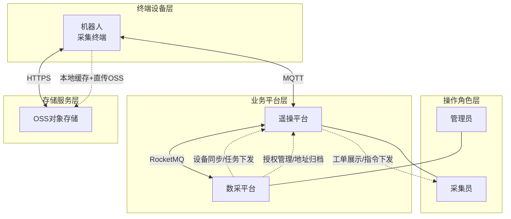
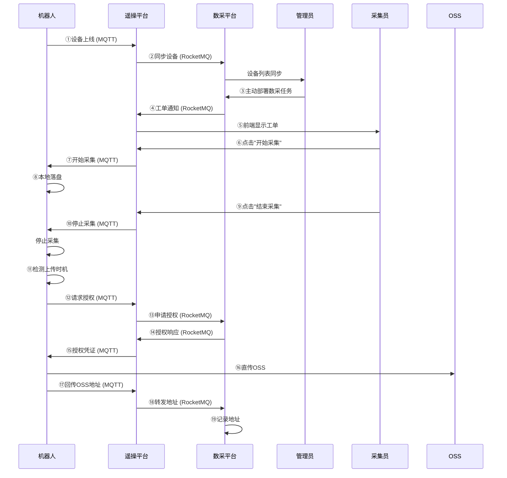
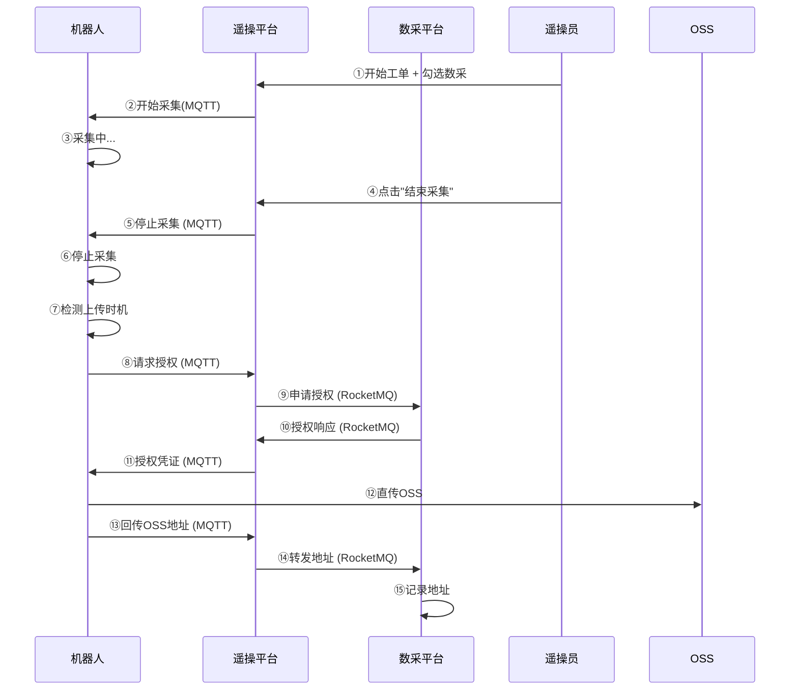

# 远程数采功能设计方案及规划

# 一、项目概述

## 1.1 背景

现有系统包含三大主体：**机器人遥操作平台**、**数据采集平台**、**机器人本体**。随着业务发展，需实现远程数据采集功能。

## 1.2 约束条件

*   设备编码deviceCode统一由遥操平台管理，数采平台需从遥操平台同步；
    
*   数据需先落盘本地，停止遥操且网络带宽足够时，在上传OSS；
    

# 二、系统架构

## 2.1 整体架构



## 三、业务场景时序图

## 3.1 场景一：管理员下发远程数采任务



## 3.2 场景二：遥操员主动触发数据采集



# 四、模块划分

| 序号 | 模块名称 | 归属平台 | 核心职责 |
| --- | --- | --- | --- |
| 1 | 设备管理模块 | 遥操平台 | 设备注册、在线状态、设备ID管理 |
| 2 | 消息通知模块 | 遥操平台 | MQTT/RocketMQ消息转发、凭证推送 |
| 3 | 数采任务模块 | 数采平台 | 任务配置、工单管理、数据地址存储 |
| 4 | 采集触发模块 | 机器人端 | 接收采集指令、本地落盘、异常恢复 |
| 5 | 数据上传模块 | 机器人端 | 上传时机检测、OSS直传、地址回传 |
| 6 | 前端交互模块 | 遥操平台 | 新增"数据采集"勾选框、工单展示 |

# 五、通信接口定义

## 5.1 MQTT 通信接口（机器人 ↔ 遥操平台）

### 5.1.1 ROS Topic 命名规范

```plaintext
格式：/{业务域}/{消息方向}/{消息类型}
```

### 5.1.2 Topic 列表

| Ros2 Topic | Mqtt Topic | 方向 | 说明 |
| --- | --- | --- | --- |
| `/remoteCollection/up/deviceOnline` | `device/{code}/datacollect/deviceOnline` | 机器人 → 遥操平台 | 设备上线 |
| `/remoteCollection/up/collectUrlRequest` | `device/{code}/datacollect/collectUrlRequest` | 机器人 → 遥操平台 | 采集授权请求 |
| `/remoteCollection/up/ossAdressReport` | `device/{code}/datacollect/ossAdressReport` | 机器人 → 遥操平台 | oss上传地址上报 |
| `/remoteCollection/down/startCollect` | `device/{code}/datacollect/startCollect` | 遥操平台 → 机器人 | 开始采集指令 |
| `/remoteCollection/down/stopCollect` | `device/{code}/datacollect/stopCollect` | 遥操平台 → 机器人 | 停止采集指令 |
| `/remoteCollection/down/collectUrlResponse` | `device/{code}/datacollect/collectUrlResponse` | 遥操平台 → 机器人 | 采集授权响应 |

### 5.1.3 上行消息（机器人 → 遥操平台）

#### 5.1.3.1 设备上线（deviceOnline）

**消息用途：** 机器人开机或重连后，向遥操平台注册设备信息

| 字段路径 | 字段名称 | 字段含义 | 字段类型 |
| --- | --- | --- | --- |
| timestamp | 时间戳 | 消息上报的事件时间 | 长整型 |
| deviceSn | 设备序列号 | 机器人 / 设备唯一硬件编码 | 字符串 |
| payload | 业务载荷 | 设备上报的具体业务数据对象 | 对象 |
| payload.deviceType | 设备型号 | 设备硬件产品型号 | 字符串 |
| payload.version | 固件版本 | 设备当前运行的程序 / 固件版本 | 字符串 |
| payload.location | 定位信息 | 设备经纬度位置对象 | 对象 |
| payload.location.latitude | 纬度 | 设备地理位置纬度 | 浮点 / 空 |
| payload.location.longitude | 经度 | 设备地理位置经度 | 浮点 / 空 |

**示例**

```json
{
  "timestamp": 1745393452000,
  "deviceSn": "xxx",
  "payload": {
    "deviceType": "Realbot1.2",
    "version": "v1.0.1",
    "location": {
      "latitude": 0.0,
      "longitude": 0.0
    }
  }
}
```

#### 5.1.3.2 请求oss地址（UploadOssAdressRequest）

**消息用途：** 机器人检测到本地数据已落盘且满足上传条件时，请求OSS上传授权

| 字段名 | 层级 | 数据类型 | 字段含义说明 |
| --- | --- | --- | --- |
| requestId | 根级 | 字符串 | 全局请求唯一 ID，用于接口链路追踪、日志排查、问题溯源 |
| timestamp | 根级 | 长整型 | 毫秒时间戳，代表本条消息生成 / 上报时间 |
| deviceSn | 根级 | 字符串 | 设备唯一序列号，机器人硬件身份标识 |

**示例**

```json
{
  "requestId": "req_084ecb37bbd8",
  "timestamp": 1745393452000,
  "deviceSn": "xxx",
}
```

#### 5.1.3.4 oss上传地址上报（ossAdressReport）

**消息用途：** oss上传成功后，将上传地址报告

| 字段名 | 层级 | 数据类型 | 字段含义说明 |
| --- | --- | --- | --- |
| timestamp | 根级 | 长整型 | 毫秒时间戳，代表本条消息生成 / 上报时间 |
| deviceSn | 根级 | 字符串 | 设备唯一序列号，机器人硬件身份标识 |
| oss | 根级 | 对象 | OSS 上传结果信息结构体 |
| address | oss 内 | 字符串 | OSS 存储桶根路径或目标文件夹地址 |
| list | oss 内 | 数组 | 已成功上传的文件 OSS 地址列表，每项为完整文件 URL |

**示例**

```json
{
  "timestamp": 1745393452000,
  "deviceSn": "xxx",
  "oss": {
    "address": "xxx",
    "list": [
      "xxx",
      "xxx",
      "xxx"
    ]
  }
}
```

### 5.1.4 下行消息（遥操平台 → 机器人）

#### 5.1.4.1 开始采集指令（startCollect）

**消息用途：** 遥操平台下发开始采集指令给机器人

| 字段名 | 层级 | 数据类型 | 字段含义说明 |
| --- | --- | --- | --- |
| timestamp | 根级 | 长整型 | 毫秒时间戳，代表本条消息生成 / 下发时间 |
| deviceSn | 根级 | 字符串 | 目标设备唯一序列号，机器人硬件身份标识 |
| taskId | 根级 | 字符串 | 采集任务唯一 ID，用于关联本次采集任务 |
| params | 根级 | 对象 | 采集任务参数结构体，描述本次采集的业务属性 |
| primary\_scene\_en | params 内 | 字符串 | 主场景英文标识，用于数据分类管理（如 `inspection`） |
| secondary\_scene\_en | params 内 | 字符串 | 子场景英文标识，对主场景的进一步细分 |
| collection\_item\_name\_en | params 内 | 字符串 | 采集项英文名称，标识具体的数据采集内容 |
| operator\_name | params 内 | 字符串 | 操作员姓名，记录本次采集的执行人 |
| tenantId | params 内 | 字符串 | 租户 ID，标识数据归属的业务租户 |

**示例**

```json
{
  "timestamp": 1745393452000,
  "deviceSn": "xxx",
  "taskId": "xxx",
  "params": {
    "primary_scene_en": "xxx",
    "secondary_scene_en": "xxx",
    "collection_item_name_en": "xxx",
    "operator_name": "zhangsan",
    "tenantId": "xxx"
  }
}
```

#### 5.1.4.2 停止采集指令（stopCollect）

**消息用途：** 遥操平台下发停止采集指令给机器人

| 字段名 | 层级 | 数据类型 | 字段含义说明 |
| --- | --- | --- | --- |
| timestamp | 根级 | 长整型 | 毫秒时间戳，代表本条消息生成 / 下发时间 |
| deviceSn | 根级 | 字符串 | 目标设备唯一序列号，机器人硬件身份标识 |
| taskId | 根级 | 字符串 | 采集任务唯一 ID，用于关联本次采集任务 |
| params | 根级 | 对象 | 采集任务参数结构体，与开始采集时保持一致 |
| primary\_scene\_en | params 内 | 字符串 | 一级场景英文标识 |
| secondary\_scene\_en | params 内 | 字符串 | 二级场景英文标识 |
| collection\_item\_name\_en | params 内 | 字符串 | 采集项英文名称 |
| operator\_name | params 内 | 字符串 | 操作员姓名，记录本次停止采集的执行人 |
| tenantId | params 内 | 字符串 | 租户 ID，标识数据归属的业务租户 |

**示例**

```json
{
  "timestamp": 1745393452000,
  "deviceSn": "xxx",
  "taskId": "xxx",
  "params": {
    "primary_scene_en": "xxx",
    "secondary_scene_en": "xxx",
    "collection_item_name_en": "xxx",
    "operator_name": "zhangsan",
    "tenantId": "xxx"
  }
}
```

#### 5.1.4.3 请求oss地址的响应（UploadOssAdresssResponse）

**消息用途：** 遥操平台转发数采平台的OSS授权凭证给机器人

| 字段名 | 层级 | 数据类型 | 字段含义说明 |
| --- | --- | --- | --- |
| requestId | 根级 | 字符串 | 全局请求唯一 ID，与机器人上行授权请求的 requestId 保持一致 |
| timestamp | 根级 | 长整型 | 毫秒时间戳，代表本条消息生成 / 下发时间 |
| deviceSn | 根级 | 字符串 | 目标设备唯一序列号，机器人硬件身份标识 |
| params | 根级 | 对象 | OSS 授权凭证结构体，包含 STS 临时访问密钥及相关配置 |
| endpoint | params 内 | 字符串 | STS 服务端点地址，用于获取临时访问凭证 |
| bucket | params 内 | 字符串 | OSS 存储桶名称，数据上传的目标 Bucket |
| bjExpiration | params 内 | 字符串 | 授权凭证到期时间（北京时间），格式：`yyyy-MM-dd HH:mm:ss` |
| utcExpiration | params 内 | 字符串 | 授权凭证到期时间（UTC），格式：`yyyy-MM-ddTHH:mm:ssZ` |
| accessKeyId | params 内 | 字符串 | STS 临时访问密钥 ID，上传 OSS 时作为身份凭证使用 |
| accessKeySecret | params 内 | 字符串 | STS 临时访问密钥密文，与 accessKeyId 配合鉴权 |
| securityToken | params 内 | 字符串 | STS 安全令牌，上传时需作为附加 Header（x-oss-security-token）传入 |

**示例**

```json
{
  "requestId": "req_084ecb37bbd8",
  "timestamp": 1745393452000,
  "deviceSn": "xxx",
  "params": {
    "endpoint": "sts.cn-beijing.aliyuncs.com",
    "bucket": "embodied-data",
    "bjExpiration": "2026-02-25 17:28:15",
    "utcExpiration": "2026-02-25T09:28:15Z",
    "accessKeyId": "STS.NYx3uEBnMWqC3ogAa14JAFM6y",
    "accessKeySecret": "Ai36sQjvJgoXoyusBkNJCYjAKup9Vy7g7JW2EsQj7v1h",
    "securityToken": "CAISxwJ1q6Ft5B2yfSjIr5rNeM..."
  }
}
```

## 5.2 RocketMQ 通信接口（遥操平台 ↔ 数采平台）

### 5.2.1 Topic 命名规范

定义topic以及多个tag

### 5.2.2 Topic 列表

| Topic | Tag | 生产者 | 消费者 | 说明 |
| --- |--| --- | --- | --- |
| DARWIN_DEVICE_STATUS | ONLINE/OFFLINE |遥操平台 | 数采平台 | 设备状态同步 |
| DARWIN_WORKORDER_IN | CREATE |数采平台 | 遥操平台 | 数采工单下发通知 |
| DARWIN_OSS_AUTH_REQUEST | REQUEST |遥操平台 | 数采平台 | OSS授权申请 |
| DARWIN_OSS_AUTH_RESPONSE | RESPONSE |数采平台 | 遥操平台 | OSS授权响应 |
| DARWIN_FILE_REPORT | UPLOAD |遥操平台 | 数采平台 | 文件地址上报 |

### 5.2.3 业务模块划分

#### 5.2.3.1 设备状态同步

**Topic：**

**用途：** 遥操平台同步机器人设备信息到数采平台

**生产者：** 遥操平台

**消费者：** 数采平台

**消息结构：**

**示例：**

#### 5.2.3.2 工单下发模块

**Topic：** 

**用途：** 数采平台向遥操平台下发采集工单

**生产者：** 数采平台

**消费者：** 遥操平台

**消息结构：**

**示例：**

#### 5.2.3.3 请求OSS上传授权

**用途：** 遥操平台向数采平台申请OSS上传授权，数采平台返回授权凭证

**生产者：** 遥操平台（request）

**消费者：** 数采平台（request）

**消息结构：**

**消息结构：**

#### 5.2.3.4 响应OSS

**Topic：**

**用途：** 遥操平台向数采平台申请OSS上传授权，数采平台返回授权凭证

**生产者：**  数采平台

**消费者：** 遥操平台

**消息结构：**

**消息结构：**

#### 5.3.3.4 文件地址上报模块

**Topic：**

**用途：** 遥操平台将机器人上报的OSS文件地址转发到数采平台

**生产者：** 遥操平台

**消费者：** 数采平台

**消息结构：**

# 六、工作计划

### 项目开发计划表

**总周期**：4月24日 - 5月15日  
**目标**：完成远程数采功能联调测试

#### 阶段一：需求梳理与UI设计

| 截止日期 | 任务描述 | 负责人 | 交付物/备注 |
| --- | --- | --- | --- |
| 4月27日 | 输出RocketMQ 通信接口定义 | ${@之巅}$ | 通信接口 |
| 4月30日 | 启动ROS2进程间通信设计 | ${@Navy}$ | 链路打通 |
| 5月7日 | 任务1：UI框架交付 | ${@Rufus}$ | 原型图 |
| 5月9日 | 任务2：核心需求确认 | ${@Rufus}$  ${@Lorete}$  ${@Cherish}$ | 需求清单确认 |

#### 阶段二：模块开发与联调

| 日期 | 任务名称 | 负责人 | 成果 |
| --- | --- | --- | --- |
| 5月9日 | 任务 3：MQTT 消息对接 | ${@Lorete}$  ${@Kay}$ | 链路打通 |
| 5月9日 | 任务 4：数采平台和遥操平台打通 | ${@Lorete}$  ${@之巅}$ | 平台链路打通 |
| 5月11日 | 任务 5：前端联调测试 | ${@Lorete}$  ${@Cherish}$ | 跨模块数据流验证 |

#### 阶段三：联调

| 日期 | 任务名称 | 负责人 | 成果 |
| --- | --- | --- | --- |
| 5月12-15日 | 全链路测试 | ${@Vera}$ | 测试 |
|  |  |  |  |
|  |  |  |  |
